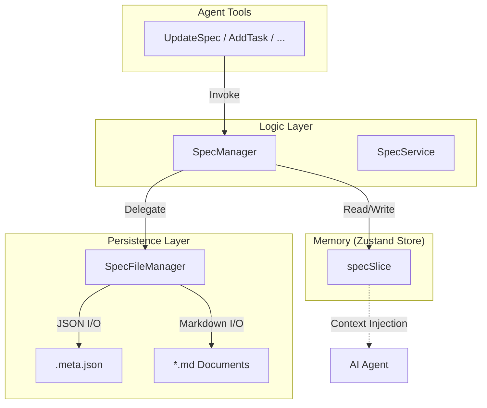
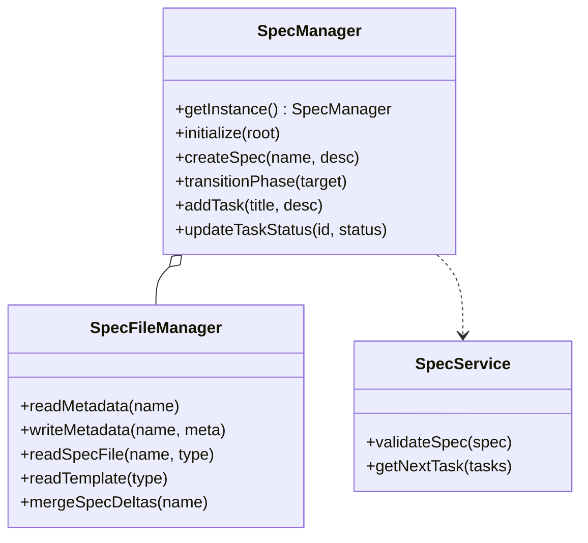
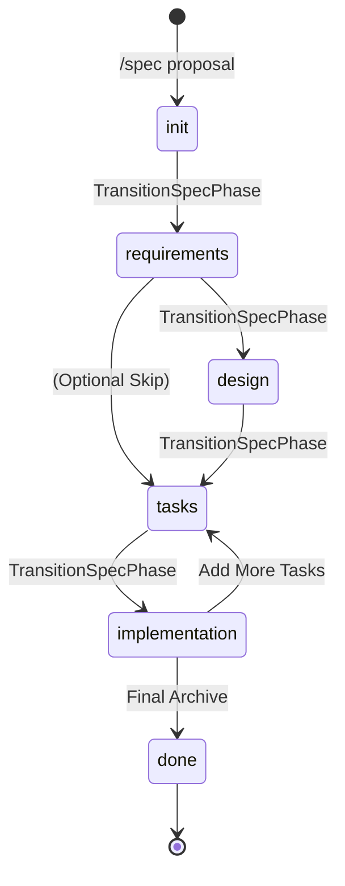
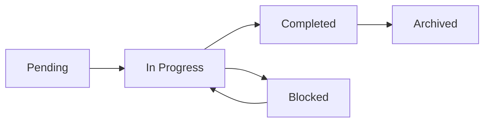
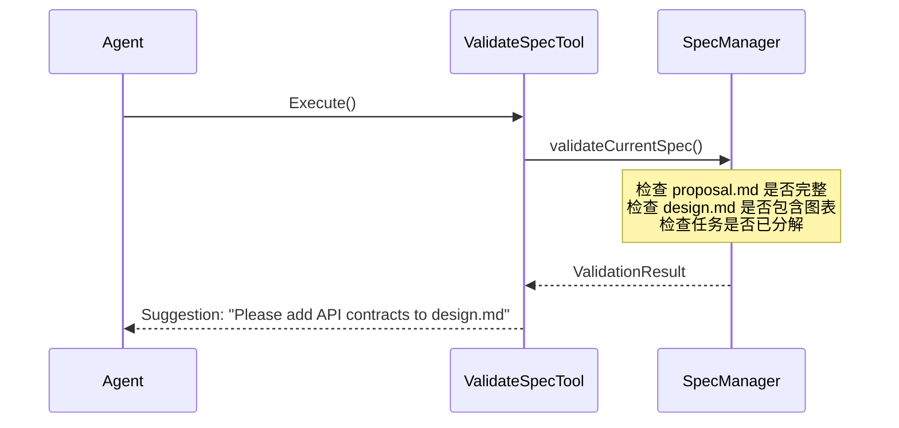

# 规格模式与工程化工作流

## 目录
1. [模块概览](#模块概览)
2. [引言：规格模式（Spec Mode）](#引言规格模式-spec-mode)
3. [核心组件与架构设计](#核心组件与架构设计)
   - [SpecManager：状态管理核心](#specmanager状态管理核心)
   - [SpecFileManager：文件持久化层](#specfilemanager文件持久化层)
   - [SSOT 状态流转架构](#ssot-状态流转架构)
   - [类关系与组件交互](#类关系与组件交互)
4. [Spec 生命周期与阶段转换](#spec-生命周期与阶段转换)
   - [阶段定义与状态机](#阶段定义与状态机)
   - [阶段转换逻辑与指令注入](#阶段转换逻辑与指令注入)
5. [模板系统与工程化准则](#模板系统与工程化准则)
   - [Steering 核心模板：项目宪法与愿景](#steering-核心模板项目宪法与愿景)
   - [阶段驱动模板：从需求到任务](#阶段驱动模板从需求到任务)
   - [模板填充与变量管理](#模板填充与变量管理)
6. [工程化工作流与工具集成](#工程化工作流与工具集成)
   - [任务分解与状态跟踪](#任务分解与状态跟踪)
   - [规格校验与质量守门员](#规格校验与质量守门员)
   - [Spec Delta 与权威规格合并](#spec-delta-与权威规格合并)
7. [降低 AI 幻觉的机制分析](#降低-ai-幻觉的机制分析)
   - [结构化上下文的优势](#结构化上下文的优势)
   - [显式约束与边界定义](#显式约束与边界定义)
8. [核心文件索引](#核心文件索引)

## 模块概览

规格模式（Spec Mode）是 Blade CLI 的灵魂，它不仅是一套工具，更是一套完整的软件工程方法论。该模块通过强制性的文档化流程，解决了 AI 在复杂工程开发中容易迷失方向的问题。

**统计信息**：
- **核心文件数**：13 个 TypeScript 文件。
- **模板文件数**：10 个 Markdown 模板文件。
- **覆盖范围**：涵盖了从需求分析、架构设计到任务执行的全生命周期管理。
- **关键子模块**：
  - `SpecManager`: 负责内存状态与持久化状态的同步。
  - `SpecFileManager`: 负责 `.blade` 目录下的复杂文件布局。
  - `Builtin Tools`: Agent 的操作接口，实现了阶段转换、任务管理等功能。

本页面将深度解析规格模式的实现细节，帮助开发者理解 Blade 如何通过结构化文档驱动 AI 完成高质量的工程任务。

## 引言：规格模式（Spec Mode）

在 AI 辅助开发的实践中，开发者经常面临“AI 生成的代码不符合项目规范”或“AI 无法理解复杂业务逻辑”的挑战。规格模式（Spec Mode）通过引入 **规格驱动开发（Spec-Driven Development, SDD）** 范式来应对这些挑战。

SDD 的核心思想是将“想清楚”和“写代码”明确分开。在 Spec 模式下，AI 首先被要求编写详细的规格说明书（Spec），包括需求、设计和任务列表。只有当这些文档得到开发者的认可后，AI 才开始逐个执行任务并编写代码。这种模式将复杂问题拆解为多个可验证的中间产物，极大地提升了软件开发的确定性。

**核心目标**：
1.  **消除歧义**：通过 EARS 等标准化语法描述需求。
2.  **规范架构**：强制要求在编码前进行架构设计。
3.  **可追踪性**：每一个代码变更都必须对应一个明确的任务和需求。
4.  **减少幻觉**：通过结构化上下文，让 AI 始终处于正确的工程背景中。

## 核心组件与架构设计

Blade 的 Spec 模块采用了高度解耦的架构，确保了状态管理、文件操作和工具逻辑的清晰分离。

### SpecManager：状态管理核心

`SpecManager` 是单例模式的实现，它是整个 Spec 系统的中枢神经。它不直接持有状态，而是作为 **Zustand Store** 的包装器，确保了状态的“单点真理”（SSOT）。

```typescript
// SpecManager.ts 中的状态访问示例
private getStoreState() {
  return vanillaStore.getState().spec;
}

private updateStoreState(updates: Partial<SpecState>): void {
  vanillaStore.setState((state) => ({
    spec: { ...state.spec, ...updates },
  }));
}
```

### SpecFileManager：文件持久化层

`SpecFileManager` 封装了底层的文件系统操作。它不仅负责读写 `.meta.json` 元数据，还管理着复杂的目录结构，包括活跃变更（changes）、权威规格（specs）和归档（archive）。

### SSOT 状态流转架构

理解 Spec 模式的关键在于理解状态如何在内存、文件和 Agent 之间流转。



该架构确保了即使 CLI 重启，Spec 的状态（包括当前阶段、任务进度等）也能从 `.meta.json` 中完美恢复。

### 类关系与组件交互

下面的类图展示了 Spec 模块内部主要类之间的协作关系：



**Section sources**:
- [SpecManager.ts](file:///Users/bytedance/Documents/GitHub/Blade/packages/cli/src/spec/SpecManager.ts)
- [SpecFileManager.ts](file:///Users/bytedance/Documents/GitHub/Blade/packages/cli/src/spec/SpecFileManager.ts)
- [types.ts](file:///Users/bytedance/Documents/GitHub/Blade/packages/cli/src/spec/types.ts)

## Spec 生命周期与阶段转换

Spec 模式将一个功能开发划分为六个严格的阶段，每个阶段都有其特定的产出物和校验规则。

### 阶段定义与状态机



每个阶段的职责如下：
- **init**: 确定功能的初步目标和背景。
- **requirements**: 产出 `requirements.md`，使用 EARS 语法明确“系统应该做什么”。
- **design**: 产出 `design.md`，定义技术架构、接口和数据模型。
- **tasks**: 产出 `tasks.md`，将设计落地为具体的可执行步骤。
- **implementation**: 实际编码阶段，AI 根据任务列表逐一实现功能。
- **done**: 归档当前变更，将 Spec 差异合并到主规格库中。

### 阶段转换逻辑与指令注入

阶段转换不仅是状态的变更，更是 **上下文的刷新**。当 Agent 调用 `TransitionSpecPhase` 工具时，系统会返回下一阶段的详细操作指南。

```typescript
// TransitionSpecPhaseTool.ts 中的指令注入
function getPhaseInstructions(phase: SpecPhase): string {
  switch (phase) {
    case 'requirements':
      return `## Requirements Phase Instructions\n1. Use UpdateSpec to write requirements.md\n2. Use EARS format...`;
    case 'design':
      return `## Design Phase Instructions\n1. Use UpdateSpec to write design.md\n2. Include Mermaid diagrams...`;
    // ...
  }
}
```

这种机制确保了 Agent 在切换到新阶段后，能立即获得该阶段的“工程规范”，从而减少了操作的随意性。

**Section sources**:
- [types.ts](file:///Users/bytedance/Documents/GitHub/Blade/packages/cli/src/spec/types.ts)
- [TransitionSpecPhaseTool.ts](file:///Users/bytedance/Documents/GitHub/Blade/packages/cli/src/tools/builtin/spec/TransitionSpecPhaseTool.ts)

## 模板系统与工程化准则

Blade 的模板系统是其工程化能力的核心载体。模板不仅提供了文档结构，还嵌入了深度的工程实践指导。

### Steering 核心模板：项目宪法与愿景

Steering 文档定义了项目的“元规则”。这些文档（位于 `.blade/steering/`）在 Spec 模式启动时会被读取并注入到 Agent 的系统提示词中。

- **Constitution (宪法)**: 规定了项目的核心原则（如“测试先行”、“文档即代码”）、决策流程和质量门禁。
- **Product (产品愿景)**: 明确了产品要解决的核心痛点和目标用户。
- **Tech (技术标准)**: 锁定了项目允许使用的技术栈、Lint 规则和性能指标。

### 阶段驱动模板：从需求到任务

每个阶段的产出都有对应的 Markdown 模板。以 `requirements.md.template` 为例，它强制要求使用 **EARS (Easy Approach to Requirements Syntax)** 格式：

- **Ubiquitous**: "The system shall [action]"
- **Event-driven**: "When [trigger], the system shall [action]"
- **Unwanted**: "If [condition], then the system shall [action]"

通过这种强制性的语法约束，AI 产出的需求文档具有极高的严谨性。

### 模板填充与变量管理

`SpecFileManager` 负责将模板中的变量（如 `{{name}}`, `{{createdAt}}`）替换为实际值：

```typescript
// SpecFileManager.ts 中的模板填充
fillTemplate(template: string, variables: Record<string, string>): string {
  let result = template;
  for (const [key, value] of Object.entries(variables)) {
    result = result.replace(new RegExp(`\\{\\{${key}\\}\\}`, 'g'), value);
  }
  return result;
}
```

**Section sources**:
- [SpecFileManager.ts](file:///Users/bytedance/Documents/GitHub/Blade/packages/cli/src/spec/SpecFileManager.ts)
- [requirements.md.template](file:///Users/bytedance/Documents/GitHub/Blade/packages/cli/src/spec/templates/requirements.md.template)
- [constitution.md.template](file:///Users/bytedance/Documents/GitHub/Blade/packages/cli/src/spec/templates/steering/constitution.md.template)

## 工程化工作流与工具集成

Spec 模式通过一系列内置工具，将复杂的工程流程简化为 Agent 可理解的操作。

### 任务分解与状态跟踪

在 `tasks` 阶段，Agent 使用 `AddTask` 工具创建任务。`SpecManager` 会为每个任务生成唯一的 ID，并维护其状态。



`SpecManager.buildProgressContext()` 方法会在每一轮对话中为 Agent 生成如下摘要：
> 当前正在执行 Spec: user-auth (implementation 阶段)
> 进度: 3/5 任务已完成
> 当前任务: #4 - 实现 JWT 校验逻辑 (src/middleware/auth.ts)

这种实时的进度反馈，让 Agent 具备了“自我意识”，能够清晰地感知任务边界。

### 规格校验与质量守门员

`ValidateSpecTool` 是一道自动化的防线。它会根据当前阶段检查必要文件的完整性。



### Spec Delta 与权威规格合并

当一个功能开发完成后（进入 `done` 阶段），`SpecFileManager` 会执行 `mergeSpecDeltas` 操作。

Blade 区分了“活跃变更”和“权威规格”：
- 开发者在 `changes/<feature>/specs/` 下编写对现有规格的修改（Delta）。
- 在归档时，这些 Delta 会被追加或合并到 `.blade/specs/` 下的权威文档中。

这实现了 **规格的版本化演进**，确保了项目的“单点真理”始终是最新的。

**Section sources**:
- [ValidateSpecTool.ts](file:///Users/bytedance/Documents/GitHub/Blade/packages/cli/src/tools/builtin/spec/ValidateSpecTool.ts)
- [SpecFileManager.ts](file:///Users/bytedance/Documents/GitHub/Blade/packages/cli/src/spec/SpecFileManager.ts)

## 降低 AI 幻觉的机制分析

规格模式通过以下三种核心机制，从根本上降低了 AI 的生成幻觉。

### 结构化上下文的优势

普通的对话模式下，AI 的上下文是杂乱无章的。而 Spec 模式提供的是经过高度提炼的 **结构化上下文**。
- **需求** 锁定了“做什么”。
- **设计** 锁定了“怎么做”。
- **任务** 锁定了“当前的具体步骤”。

这种分层的信息输入，使得 LLM 在推理时能够基于确定的事实，而不是模糊的猜测。

### 显式约束与边界定义

通过 Steering Documents（宪法、技术栈），系统为 AI 划定了明确的“红线”。
> **例如**：如果宪法规定“禁止使用外部加密库”，那么即使 AI 认为某库更好用，也会因为受到 Steering Context 的约束而放弃该念头，转而寻找项目内的替代方案。

## 核心文件索引

以下是规格模式实现的核心文件，建议开发者深入研究：

- [SpecManager.ts](file:///Users/bytedance/Documents/GitHub/Blade/packages/cli/src/spec/SpecManager.ts): 状态管理与业务逻辑中枢。
- [SpecFileManager.ts](file:///Users/bytedance/Documents/GitHub/Blade/packages/cli/src/spec/SpecFileManager.ts): 持久化层与模板管理。
- [types.ts](file:///Users/bytedance/Documents/GitHub/Blade/packages/cli/src/spec/types.ts): 定义了阶段、任务和元数据模型。
- [TransitionSpecPhaseTool.ts](file:///Users/bytedance/Documents/GitHub/Blade/packages/cli/src/tools/builtin/spec/TransitionSpecPhaseTool.ts): 驱动生命周期流转的关键工具。
- [UpdateSpecTool.ts](file:///Users/bytedance/Documents/GitHub/Blade/packages/cli/src/tools/builtin/spec/UpdateSpecTool.ts): 规格文档更新接口。
- [ValidateSpecTool.ts](file:///Users/bytedance/Documents/GitHub/Blade/packages/cli/src/tools/builtin/spec/ValidateSpecTool.ts): 自动化质量校验逻辑。
- [templates/](file:///Users/bytedance/Documents/GitHub/Blade/packages/cli/src/spec/templates/): 包含所有工程化准则的 Markdown 模板。
