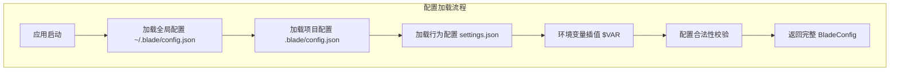
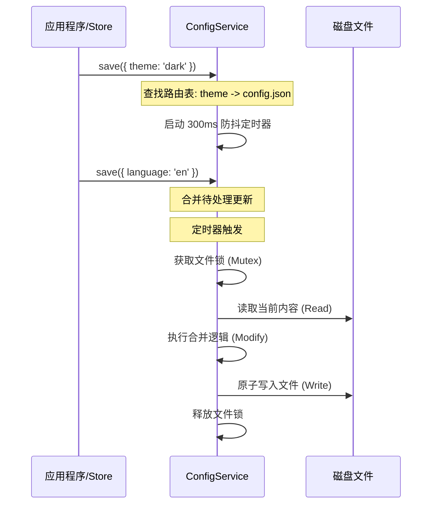
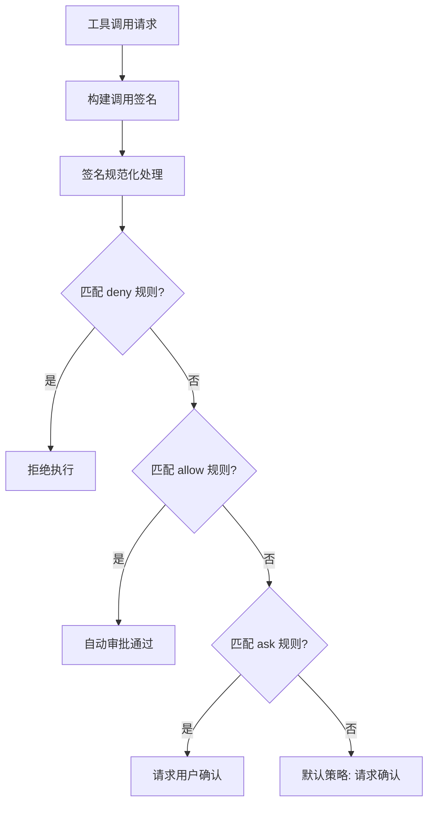
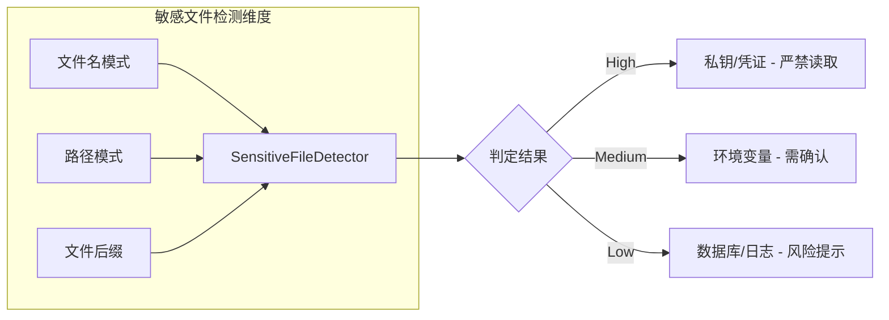

# 配置系统与安全权限管理

## 目录

1. [模块概览](#模块概览)
2. [引言](#引言)
3. [配置系统架构](#配置系统架构)
   - [ConfigManager：配置加载与初始化](#configmanager配置加载与初始化)
   - [ConfigService：持久化与路由](#configservice持久化与路由)
4. [配置文件体系](#配置文件体系)
   - [文件类型与职责](#文件类型与职责)
   - [配置优先级与合并策略](#配置优先级与合并策略)
   - [环境变量插值](#环境变量插值)
5. [权限管理机制](#权限管理机制)
   - [PermissionChecker：规则校验逻辑](#permissionchecker规则校验逻辑)
   - [权限模式（PermissionMode）](#权限模式permissionmode)
   - [工具调用签名与规范化](#工具调用签名与规范化)
6. [安全审计与敏感文件保护](#安全审计与敏感文件保护)
   - [SensitiveFileDetector：风险识别](#sensitivefiledetector风险识别)
   - [敏感度分级](#敏感度分级)
7. [多模型集成与安全存储](#多模型集成与安全存储)
   - [模型配置结构](#模型配置结构)
   - [API Key 安全存储建议](#api-key-安全存储建议)
8. [核心组件](#核心组件)
9. [文件参考](#文件参考)

## 模块概览

本模块负责 Blade 的全局配置管理与执行安全防护。通过分层的配置体系和多级的权限校验，确保 AI Agent 在执行任务时既能保持灵活性，又不会越过安全边界。

- **总文件数**：约 10 个核心文件
- **子模块**：
  - `config/`：配置加载、持久化、权限校验逻辑
  - `tools/validation/`：安全审计与敏感文件检测
- **涵盖范围**：
  - 配置文件的多级加载与合并策略。
  - 运行时权限请求（allow/ask/deny）的判定逻辑。
  - 敏感操作（Shell 命令、敏感文件访问）的拦截机制。
  - 多 LLM 提供商的参数配置与集成。

## 引言

Blade 作为一个强大的 AI Agent 框架，具备执行 Shell 命令、读写文件以及调用外部工具的能力。这种能力在带来便利的同时，也引入了潜在的安全风险。为了平衡效率与安全，Blade 设计了一套严密的配置系统和权限管理机制。

配置系统不仅负责存储用户的偏好设置（如主题、语言），更核心的任务是管理模型参数（API Key、模型 ID）以及 Agent 的行为准则（权限规则、Hooks）。通过支持项目级和本地级的配置覆盖，Blade 允许用户为不同的项目定制不同的安全策略。

权限管理机制则是 Blade 的“防火墙”。它通过对工具调用进行实时审计，根据预设的规则自动审批或拦截操作。这种机制确保了即使 AI 生成了危险代码，在执行前也会经过系统的校验或用户的二次确认。

## 配置系统架构

Blade 的配置系统采用了加载与持久化分离的设计模式。`ConfigManager` 负责在启动时从多个来源汇聚配置，而 `ConfigService` 则负责在运行时安全地将变更写回磁盘。

### ConfigManager：配置加载与初始化

`ConfigManager` 是一个单例类，主要职责是在应用启动时执行“引导（Bootstrap）”过程。它会扫描全局、项目和本地路径下的配置文件，并按照预定义的优先级进行深度合并。



在加载过程中，`ConfigManager` 会处理特殊的合并逻辑。例如，`mcpServers` 字段会进行对象合并，使得项目级的 MCP 服务器可以补充而非完全覆盖全局设置。

### ConfigService：持久化与路由

`ConfigService` 负责配置的运行时更新。它通过“字段路由表（FIELD_ROUTING_TABLE）”决定每个配置项应该保存到哪个文件中，以及使用何种合并策略（替换、去重追加或深度合并）。

为了保证性能和数据一致性，`ConfigService` 实现了以下关键特性：
1. **防抖处理**：默认 300ms 的防抖，避免高频更新导致频繁的磁盘 IO。
2. **原子写入**：使用 `write-file-atomic` 确保文件写入过程不会因意外中断而损坏。
3. **并发安全**：为每个配置文件维护独立的互斥锁（Mutex），防止多个更新请求同时写入同一文件。

**架构设计图解**：



通过这种 Read-Modify-Write 的模式，`ConfigService` 能够保留配置文件中未被 Blade 识别的未知字段，保证了配置文件的向前兼容性。

**Section sources**:
- [ConfigManager.ts](file:///Users/bytedance/Documents/GitHub/Blade/packages/cli/src/config/ConfigManager.ts)
- [ConfigService.ts](file:///Users/bytedance/Documents/GitHub/Blade/packages/cli/src/config/ConfigService.ts)

## 配置文件体系

Blade 的配置分布在多个文件中，每个文件承载不同的职责，并支持多层级的覆盖。

### 文件类型与职责

| 配置文件 | 职责 | 推荐存储位置 |
| :--- | :--- | :--- |
| `config.json` | 基础配置：模型、API Key、UI 设置、MCP 服务器 | `~/.blade/` (全局) |
| `settings.json` | 行为配置：权限规则、Hooks、环境变量 | `.blade/` (项目) |
| `settings.local.json` | 本地覆盖：仅限当前机器的私有行为配置 | `.blade/` (项目) |

### 配置优先级与合并策略

配置的合并遵循 **“越具体越优先”** 的原则：
1. **本地配置 (`settings.local.json`)**：最高优先级，通常用于存放不希望提交到 Git 的私有规则。
2. **项目配置 (`.blade/settings.json`)**：用于定义项目通用的安全边界和 Hooks。
3. **用户配置 (`~/.blade/config.json`)**：全局默认设置。
4. **默认配置 (`defaults.ts`)**：硬编码的底线配置。

在合并 `permissions` 数组时，系统采用“去重追加”策略，确保项目级的允许规则能有效扩展全局规则。

### 环境变量插值

为了支持跨环境部署和敏感信息的动态注入，Blade 支持在配置中使用环境变量插值：
- `$VAR` 或 `${VAR}`：直接引用环境变量。
- `${VAR:-default}`：带默认值的引用。

例如，在 `config.json` 中配置 API Key 时，可以使用 `"apiKey": "${OPENAI_API_KEY}"`，从而避免将明文密钥写入配置文件。

**Section sources**:
- [defaults.ts](file:///Users/bytedance/Documents/GitHub/Blade/packages/cli/src/config/defaults.ts)
- [types.ts](file:///Users/bytedance/Documents/GitHub/Blade/packages/cli/src/config/types.ts)

## 权限管理机制

权限管理是 Blade 安全体系的核心。它通过对工具调用进行签名、匹配和判定，实现了精细化的访问控制。

### PermissionChecker：规则校验逻辑

`PermissionChecker` 接收一个工具调用描述（Descriptor），并根据 `allow`、`ask`、`deny` 三个列表进行判定。



校验逻辑严格遵循 **“拒绝优先”** 原则：即使某个操作符合 `allow` 规则，只要它触碰了任何一条 `deny` 规则，都会被立即拦截。

### 权限模式（PermissionMode）

Blade 预设了多种权限模式，以适应不同的使用场景：

| 模式 | 描述 | 自动审批范围 |
| :--- | :--- | :--- |
| `DEFAULT` | 默认安全模式 | 只读工具 (Read/Glob/Grep) |
| `AUTO_EDIT` | 自动编辑模式 | 只读工具 + 写文件工具 (Edit/Write) |
| `YOLO` | 危险模式 | 所有工具（包括 Bash 执行） |
| `PLAN` | 方案规划模式 | 仅只读工具，禁止任何副作用操作 |
| `SPEC` | 规格驱动模式 | 只读工具 + Spec 专用工具 |

### 工具调用签名与规范化

为了防止通过 Shell 技巧（如环境变量注入、别名绕过）来规避权限检查，`PermissionChecker` 对 `Bash` 工具进行了特殊的规范化处理。

```typescript
// 权限检查中的规范化示例
const command = "FOO=bar git status";
// 规范化后：Bash(git status)
// 这样即使规则只写了 Bash(git status)，也能正确匹配带环境变量的命令
```

系统会生成两种签名变体：
- **保守规范化**：用于 `allow` 规则，仅剥离已知安全的包装。
- **激进规范化**：用于 `deny` 和 `ask` 规则，剥离所有环境变量，防止 `FOO=bar rm -rf /` 这种绕过方式。

**Section sources**:
- [PermissionChecker.ts](file:///Users/bytedance/Documents/GitHub/Blade/packages/cli/src/config/PermissionChecker.ts)

## 安全审计与敏感文件保护

除了对命令执行的限制，Blade 还能识别并保护系统中的敏感文件，防止 AI 意外读取或泄露密钥。

### SensitiveFileDetector：风险识别

`SensitiveFileDetector` 维护了一个庞大的正则表达式库，涵盖了常见的密钥文件、凭证目录和配置文件。



### 敏感度分级

- **HIGH (高度敏感)**：如 `.ssh/id_rsa`、`credentials.json`、`*.pem`。这些文件通常包含身份凭证，AI 几乎不应访问。
- **MEDIUM (中度敏感)**：如 `.env`、`.npmrc`、`docker/config.json`。这些文件包含环境配置，可能含有 Token。
- **LOW (低度敏感)**：如 `*.sqlite`、`*.sql`。这些文件包含业务数据，读取可能导致隐私泄露。

当 Agent 尝试通过 `Read` 或 `Grep` 工具访问这些文件时，系统会根据其敏感度级别触发相应的警告或拦截逻辑。

**Section sources**:
- [SensitiveFileDetector.ts](file:///Users/bytedance/Documents/GitHub/Blade/packages/cli/src/tools/validation/SensitiveFileDetector.ts)

## 多模型集成与安全存储

Blade 支持集成多种 LLM 提供商，所有连接信息均通过配置系统管理。

### 模型配置结构

每个模型配置（`ModelConfig`）包含以下核心字段：
- `provider`：支持 `openai`、`anthropic`、`gemini`、`azure-openai`、`deepseek` 等。
- `apiKey`：访问凭证。
- `baseUrl`：API 端点，支持私有化部署或代理。
- `model`：具体的模型名称（如 `gpt-4o`）。

### API Key 安全存储建议

虽然 Blade 的 `config.json` 权限被限制为 `0o600`（仅当前用户可读写），但仍建议采取以下安全措施：
1. **使用环境变量**：在配置中使用 `${OPENAI_API_KEY}`，并在 Shell 配置中设置该变量。
2. **项目级隔离**：不要在 `.blade/settings.json`（通常会提交到 Git）中存放 API Key，应将其放在全局配置或 `settings.local.json` 中。

**Section sources**:
- [VercelAIChatService.ts](file:///Users/bytedance/Documents/GitHub/Blade/packages/cli/src/services/VercelAIChatService.ts)

## 核心组件

| 组件名称 | 职责描述 |
| :--- | :--- |
| `ConfigManager` | 配置系统的入口，负责多级配置的加载、合并与验证。 |
| `ConfigService` | 配置持久化层，处理字段路由、防抖写入和并发锁。 |
| `PermissionChecker` | 权限执行引擎，实现 allow/ask/deny 逻辑与签名匹配。 |
| `SensitiveFileDetector` | 静态安全审计组件，识别系统中的敏感文件与目录。 |
| `VercelAIChatService` | 模型服务适配器，将配置转换为具体的 LLM 请求参数。 |

## 文件参考

- [ConfigManager.ts](file:///Users/bytedance/Documents/GitHub/Blade/packages/cli/src/config/ConfigManager.ts) - 配置加载逻辑
- [ConfigService.ts](file:///Users/bytedance/Documents/GitHub/Blade/packages/cli/src/config/ConfigService.ts) - 持久化服务
- [PermissionChecker.ts](file:///Users/bytedance/Documents/GitHub/Blade/packages/cli/src/config/PermissionChecker.ts) - 权限校验引擎
- [SensitiveFileDetector.ts](file:///Users/bytedance/Documents/GitHub/Blade/packages/cli/src/tools/validation/SensitiveFileDetector.ts) - 敏感文件检测
- [types.ts](file:///Users/bytedance/Documents/GitHub/Blade/packages/cli/src/config/types.ts) - 配置类型定义
- [defaults.ts](file:///Users/bytedance/Documents/GitHub/Blade/packages/cli/src/config/defaults.ts) - 默认配置与初始权限规则
- [VercelAIChatService.ts](file:///Users/bytedance/Documents/GitHub/Blade/packages/cli/src/services/VercelAIChatService.ts) - 模型集成实现
