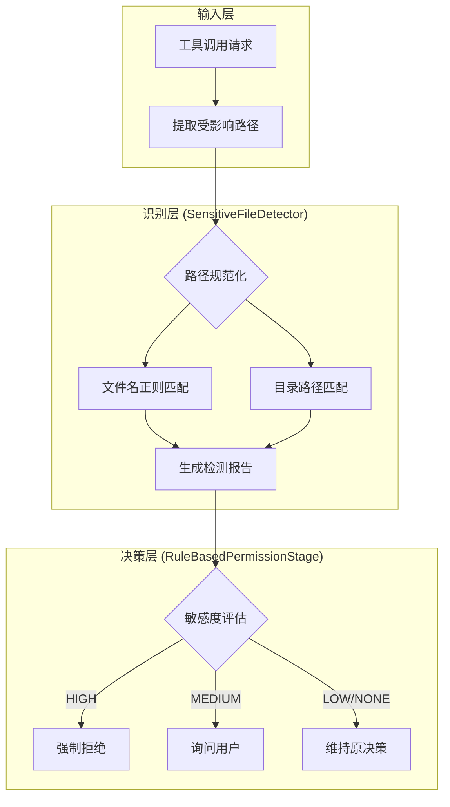
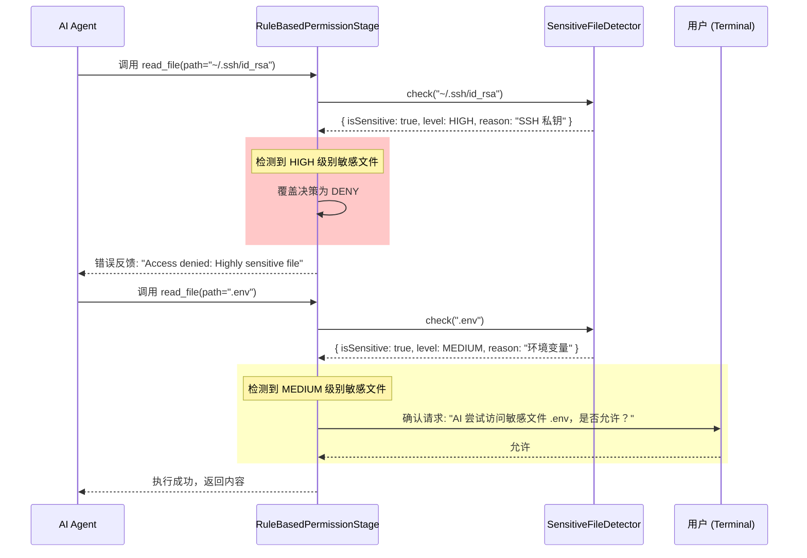
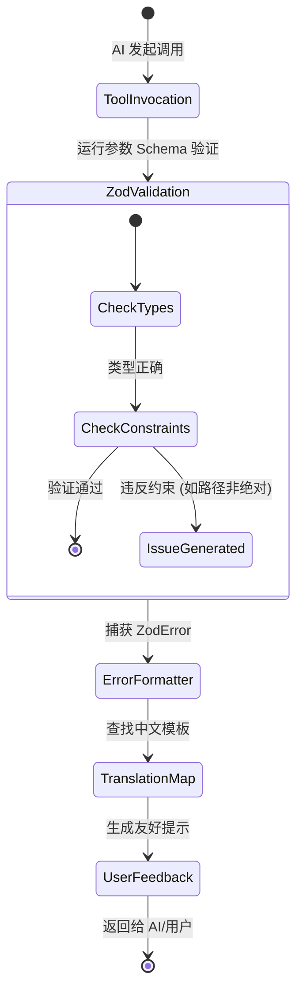

# 敏感文件检测与安全审计

## 目录
1. [模块概览](#模块概览)
2. [核心组件](#核心组件)
   - [SensitiveFileDetector：敏感性识别引擎](#sensitivefiledetector敏感性识别引擎)
   - [RuleBasedPermissionStage：安全审计拦截器](#rulebasedpermissionstage安全审计拦截器)
3. [敏感模式识别规则](#敏感模式识别规则)
   - [内置文件名模式](#内置文件名模式)
   - [内置路径模式](#内置路径模式)
4. [拦截逻辑与安全策略](#拦截逻辑与安全策略)
   - [安全预检流程](#安全预检流程)
   - [敏感度级别处理策略](#敏感度级别处理策略)
5. [参数验证与输入加固](#参数验证与输入加固)
   - [Zod 模式的安全性约束](#zod-模式的安全性约束)
6. [错误处理与用户反馈](#错误处理与用户反馈)
   - [验证错误格式化](#验证错误格式化)
7. [文件引用](#文件引用)

## 模块概览

在 AI 辅助开发工具中，数据安全和隐私保护是至关重要的。Blade 作为一个强大的命令行 AI 代理，拥有读写文件系统、执行终端命令等高权限操作。如果没有严格的审计和拦截机制，AI 可能会在无意中访问或泄露用户的敏感信息，如 API 密钥、SSH 私钥、数据库凭证或环境变量文件。

本模块主要位于 `packages/cli/src/tools/validation/` 目录下，其核心任务是构建一道“安全防火墙”，在 AI 执行任何可能涉及文件访问的工具之前，对目标路径进行深度扫描和合规性审计。

**模块统计信息：**
- **核心文件数**：4 个（`SensitiveFileDetector.ts`, `errorFormatter.ts`, `zodSchemas.ts`, `zodToJson.ts`）
- **主要子模块**：敏感文件检测、参数验证、错误格式化。
- **深度覆盖**：本文将深入探讨敏感文件检测逻辑及其在权限流水线中的集成方式。

该模块不仅定义了什么是“敏感文件”，还规定了当 AI 尝试访问这些文件时系统应如何反应（是直接拒绝、询问用户，还是记录日志）。通过这种多层次的防护机制，Blade 确保了在提升开发效率的同时，不会牺牲用户的核心资产安全。

## 核心组件

本节将详细介绍实现安全审计功能的两个关键组件：负责“识别”的 `SensitiveFileDetector` 和负责“执行策略”的 `RuleBasedPermissionStage`。

### SensitiveFileDetector：敏感性识别引擎

`SensitiveFileDetector` 是一个静态工具类，它封装了 Blade 对敏感文件和路径的所有识别逻辑。它不依赖于具体的业务流程，只负责根据预定义的规则判断一个路径是否具有潜在风险。

该组件将敏感度分为三个级别：
- **HIGH (高度敏感)**：如私钥 (`id_rsa`)、云服务凭证 (`credentials.json`) 等。
- **MEDIUM (中度敏感)**：如环境变量 (`.env`)、配置文件 (`npmrc`) 等。
- **LOW (低度敏感)**：如数据库文件 (`.sqlite`)、SQL 脚本等。

以下是 `SensitiveFileDetector` 的核心实现片段，展示了其如何通过正则表达式和路径规范化来进行检测：

```typescript
export class SensitiveFileDetector {
  /** 敏感文件模式列表 */
  private static readonly SENSITIVE_PATTERNS: SensitivePattern[] = [
    // HIGH: 私钥和密码
    {
      pattern: /^\.?id_rsa$/i,
      level: SensitivityLevel.HIGH,
      description: 'SSH 私钥',
    },
    // MEDIUM: 环境变量和配置
    {
      pattern: /^\.env$/i,
      level: SensitivityLevel.MEDIUM,
      description: '环境变量文件',
    },
    // ... 更多模式
  ];

  /**
   * 检查文件是否敏感
   */
  static check(filePath: string): SensitiveFileCheckResult {
    const normalizedPath = this.normalizePath(filePath);
    const fileName = path.basename(normalizedPath);

    // 1. 检查文件名模式
    for (const pattern of this.SENSITIVE_PATTERNS) {
      if (this.matchPattern(fileName, pattern.pattern)) {
        return {
          isSensitive: true,
          level: pattern.level,
          matchedPattern: pattern.pattern instanceof RegExp ? pattern.pattern.source : pattern.pattern,
          reason: pattern.description,
        };
      }
    }

    // 2. 检查路径模式（如 .ssh/ 目录）
    for (const pathPattern of this.SENSITIVE_PATHS) {
      if (this.matchPattern(normalizedPath, pathPattern.path)) {
        // ... 返回路径匹配结果
      }
    }

    return { isSensitive: false };
  }
}
```

`SensitiveFileDetector` 的设计目标是高性能和可扩展性。它在执行检测前会先调用 `normalizePath` 规范化路径（例如将 `~/` 展开为用户主目录），确保无论 AI 使用何种路径格式，检测结果都是一致且准确的。这种规范化是安全审计的基石，因为它防止了 AI 通过 `../` 或其他相对路径技巧绕过简单的字符串匹配。

**Section sources**:
- [SensitiveFileDetector.ts](file:///Users/bytedance/Documents/GitHub/Blade/packages/cli/src/tools/validation/SensitiveFileDetector.ts)

### RuleBasedPermissionStage：安全审计拦截器

如果说 `SensitiveFileDetector` 是“眼睛”，那么 `RuleBasedPermissionStage` 就是“大脑”和“手”。它是工具执行流水线（Pipeline）中的一个阶段，负责在工具真正运行前拦截不安全的调用。

该阶段会提取工具调用中涉及的 `affectedPaths`（受影响路径），并利用检测器进行评估。其核心逻辑在于 `applySafetyOverrides` 方法，它不仅处理敏感文件，还处理硬编码的“危险系统路径”（如 `/etc/`, `/proc/` 等）。

```typescript
private applySafetyOverrides(
  affectedPaths: string[] | undefined,
  checkResult: PermissionCheckResult,
  execution: ToolExecution
): PermissionCheckResult {
  if (!affectedPaths || affectedPaths.length === 0) return checkResult;

  // 1. 危险路径硬拒绝（如 /etc/, /root/ 等）
  const dangerousPaths = affectedPaths.filter((filePath) => {
    return dangerousSystemPaths.some((d) => filePath.includes(d));
  });

  if (dangerousPaths.length > 0) {
    execution.abort(`Access to dangerous system paths denied: ${dangerousPaths.join(', ')}`);
    return checkResult;
  }

  // 2. 敏感文件检测
  const sensitiveFiles = SensitiveFileDetector.filterSensitive(affectedPaths, SensitivityLevel.MEDIUM);
  if (sensitiveFiles.length === 0) return checkResult;

  // 3. 根据敏感度调整权限决策
  const highSensitiveFiles = sensitiveFiles.filter(({ result }) => result.level === SensitivityLevel.HIGH);

  // 高度敏感且未明确允许 -> 强制拒绝
  if (highSensitiveFiles.length > 0 && checkResult.result !== PermissionResult.ALLOW) {
    return {
      result: PermissionResult.DENY,
      reason: `Access to highly sensitive files denied:\n${warnings.join('\n')}`,
      // ...
    };
  }

  // 中度敏感 -> 降级为 ASK（询问用户）
  if (checkResult.result === PermissionResult.ALLOW) {
    return {
      result: PermissionResult.ASK,
      reason: `Sensitive file access detected. Confirm to proceed?`,
      // ...
    };
  }

  return checkResult;
}
```

这种设计确保了安全策略的“防御性”：即使一个工具在常规规则下是被允许的（例如读取当前目录下的所有文件），一旦其中包含敏感文件，权限就会被自动降级或拒绝。这种“默认拒绝”或“默认询问”的策略极大地降低了数据泄露的风险。

**Section sources**:
- [RuleBasedPermissionStage.ts](file:///Users/bytedance/Documents/GitHub/Blade/packages/cli/src/tools/execution/stages/RuleBasedPermissionStage.ts)

## 敏感模式识别规则

Blade 内置了一套详尽的敏感模式识别规则，涵盖了大多数开发者日常工作中涉及的机密信息。

### 内置文件名模式

下表列出了 `SensitiveFileDetector` 中定义的部分核心匹配规则及其对应的敏感度级别：

| 类别 | 匹配模式 (Regex) | 描述 | 敏感度 |
| :--- | :--- | :--- | :--- |
| **SSH 密钥** | `/^\.?id_(rsa\|ed25519\|ecdsa)$/i` | SSH 私钥文件 | HIGH |
| **通用证书** | `/\.(pem\|key\|p12\|pfx)$/i` | PEM/PKCS 证书与密钥 | HIGH |
| **云服务凭证** | `/(credentials\|service-account.*)\.json$/i` | GCP/AWS 等服务账号凭证 | HIGH |
| **环境变量** | `/^\.env(\..*)?$/i` | 环境变量配置文件 | MEDIUM |
| **包管理器配置** | `/^\.?(npmrc\|pypirc)$/i` | 含认证信息的配置文件 | MEDIUM |
| **数据库** | `/\.(sqlite\|db\|sql)$/i` | 本地数据库或 SQL 导出文件 | LOW |

### 内置路径模式

除了文件名，某些特定目录下的任何文件都被视为高风险。

下图展示了 `SensitiveFileDetector` 与 `RuleBasedPermissionStage` 之间的组件关系及其对路径的评估流程：



该流程图描述了从 AI 发起工具调用到最终权限决策的完整路径。首先，系统从工具参数中提取出所有可能被访问的文件路径。然后，`SensitiveFileDetector` 将这些路径规范化（处理相对路径和 `~` 符号），并并行运行文件名匹配和目录匹配算法。最后，生成的检测报告被送往 `RuleBasedPermissionStage`，根据敏感度级别（HIGH/MEDIUM/LOW）对原始的权限决策进行覆盖或调整。

**Diagram sources**:
- [SensitiveFileDetector.ts:L52-L232](file:///Users/bytedance/Documents/GitHub/Blade/packages/cli/src/tools/validation/SensitiveFileDetector.ts#L52-L232)
- [RuleBasedPermissionStage.ts:L194-L264](file:///Users/bytedance/Documents/GitHub/Blade/packages/cli/src/tools/execution/stages/RuleBasedPermissionStage.ts#L194-L264)

## 拦截逻辑与安全策略

拦截逻辑的核心在于如何平衡“自动化效率”与“安全性”。Blade 采用了一种“动态降级”的策略。

### 安全预检流程

当 AI 尝试执行一个操作（例如 `read_file`）时，拦截逻辑会按照以下顺序进行预检：



在上述序列中，我们可以看到两种典型的处理场景。对于 `HIGH` 级别的敏感文件（如 SSH 私钥），系统采取“零容忍”态度，直接在流水线阶段拦截并向 AI 返回错误，完全不给用户确认的机会（除非用户在配置文件中显式添加了允许规则）。而对于 `MEDIUM` 级别的文件（如 `.env`），系统则表现得更为灵活，它会将原本可能的自动放行降级为人工确认，确保用户知晓 AI 正在触碰敏感区域。

### 敏感度级别处理策略

下表详细说明了 `RuleBasedPermissionStage` 对不同敏感度级别的处理逻辑：

| 敏感度级别 | 默认行为 | 触发条件 | 理由 |
| :--- | :--- | :--- | :--- |
| **危险系统路径** | **ABORT** | 路径包含 `/etc/`, `/proc/` 或 `..` 越权 | 保护操作系统核心文件，防止容器逃逸或系统破坏。 |
| **HIGH** | **DENY** | 匹配到私钥、云凭证等核心机密 | 即使在 YOLO 模式下，也不应允许 AI 自动获取此类信息。 |
| **MEDIUM** | **ASK** | 匹配到环境变量、配置文件等 | 这些文件通常包含 Token，虽不至于导致系统崩溃，但泄露风险极高。 |
| **LOW** | **WARN** | 匹配到数据库文件等 | 提醒用户注意隐私数据泄露，但不强制拦截。 |

这种分层防御机制的设计哲学是：**越是核心的机密，自动化程度越低；越是外围的数据，用户控制权越高。**

**Diagram sources**:
- [RuleBasedPermissionStage.ts:L194-L264](file:///Users/bytedance/Documents/GitHub/Blade/packages/cli/src/tools/execution/stages/RuleBasedPermissionStage.ts#L194-L264)

## 参数验证与输入加固

除了敏感文件检测，Blade 还通过严格的参数验证来防止潜在的安全攻击（如路径穿越）。这一功能主要由 `zodSchemas.ts` 实现。

### Zod 模式的安全性约束

`ToolSchemas` 提供了一系列预定义的验证器，强制要求 AI 提供的参数符合安全规范。例如，所有的文件路径必须是绝对路径，这有效地防止了 AI 使用相对路径进行越权访问。

```typescript
export const ToolSchemas = {
  /**
   * 文件路径 Schema (必须是绝对路径)
   */
  filePath: (options?: { description?: string }) =>
    z
      .string()
      .min(1, 'File path is required')
      .refine((path) => isAbsolute(path), {
        message: 'Path must be absolute',
      })
      .describe(options?.description || 'Absolute file path'),

  /**
   * 端口号 Schema (范围限制)
   */
  port: () =>
    z
      .number()
      .int('Port must be an integer')
      .min(1, 'Port cannot be less than 1')
      .max(65535, 'Port cannot exceed 65535')
      .describe('Port number'),
};
```

通过在工具定义阶段就强制执行这些约束，Blade 能够在 AI 生成的指令到达执行层之前就将其拦截。这种“左移”的安全策略（Security Left-shifting）显著减少了后端服务的安全压力。

**Section sources**:
- [zodSchemas.ts](file:///Users/bytedance/Documents/GitHub/Blade/packages/cli/src/tools/validation/zodSchemas.ts)

## 错误处理与用户反馈

当安全审计拦截了一个请求时，如何向 AI 和用户反馈信息同样重要。如果反馈太模糊，AI 可能无法理解为什么操作失败；如果反馈太详细，可能会泄露路径结构。

### 验证错误格式化

Blade 使用 `errorFormatter.ts` 将底层的验证错误（包括 Zod 验证错误和安全拦截错误）转换为人类可读且 AI 可理解的中文消息。

```typescript
/**
 * 将 Zod 错误代码翻译为中文消息
 */
function translateZodIssue(issue: ZodIssue): string {
  const { code } = issue;
  const extra = issue as ZodIssueExtra;
  
  switch (code) {
    case 'invalid_type': {
      const expected = extra.expected;
      return `类型错误：期望 ${formatUnknown(expected)}，实际收到 ${formatUnknown(extra.received)}`;
    }
    case 'too_small': {
      const minimum = extra.minimum;
      return `值太小，不能小于 ${minimum}`;
    }
    case 'invalid_string':
      if (extra.validation === 'url') return '必须是有效的 URL';
      return '字符串格式不正确';
    // ...
  }
}
```

对于敏感文件拦截，`RuleBasedPermissionStage` 会生成包含具体原因的错误消息。例如，如果 AI 尝试读取 `.env` 文件，错误消息会明确指出：“检测到敏感文件访问：.env (medium: 环境变量文件)。请确认是否继续？”

这种清晰的反馈机制有助于：
1. **引导 AI**：AI 知道是因为安全原因被拒，可能会尝试寻找其他不涉及敏感信息的路径。
2. **告知用户**：用户能清楚地看到 AI 的意图，从而做出正确的安全决策。

下图展示了从参数验证失败到错误消息生成的转换过程：



在这个状态机中，`ErrorFormatter` 起到了翻译官的作用。它不仅处理简单的类型错误，还能处理复杂的约束违反（如 `ToolSchemas.filePath` 要求的绝对路径验证）。通过将技术性的 `ZodIssue` 映射到直观的中文描述，系统极大地降低了用户理解安全拦截原因的门槛。

**Diagram sources**:
- [errorFormatter.ts:L46-L148](file:///Users/bytedance/Documents/GitHub/Blade/packages/cli/src/tools/validation/errorFormatter.ts#L46-L148)
- [zodSchemas.ts:L11-L18](file:///Users/bytedance/Documents/GitHub/Blade/packages/cli/src/tools/validation/zodSchemas.ts#L11-L18)

## 文件引用

以下是本模块涉及的核心源文件，建议在深入研究实现细节时参考：

- [SensitiveFileDetector.ts](file:///Users/bytedance/Documents/GitHub/Blade/packages/cli/src/tools/validation/SensitiveFileDetector.ts)：敏感模式定义与检测逻辑的核心实现。
- [RuleBasedPermissionStage.ts](file:///Users/bytedance/Documents/GitHub/Blade/packages/cli/src/tools/execution/stages/RuleBasedPermissionStage.ts)：将敏感检测集成到权限流水线中的关键阶段。
- [zodSchemas.ts](file:///Users/bytedance/Documents/GitHub/Blade/packages/cli/src/tools/validation/zodSchemas.ts)：定义了工具参数的通用验证规则（如绝对路径要求）。
- [errorFormatter.ts](file:///Users/bytedance/Documents/GitHub/Blade/packages/cli/src/tools/validation/errorFormatter.ts)：负责将底层验证错误转换为用户友好的反馈。
- [FileSystemService.ts](file:///Users/bytedance/Documents/GitHub/Blade/packages/cli/src/services/FileSystemService.ts)：底层文件系统抽象，虽然不直接处理敏感逻辑，但所有受审计的访问最终都通过它执行。
