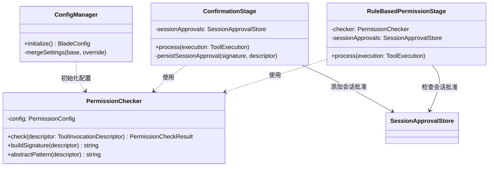
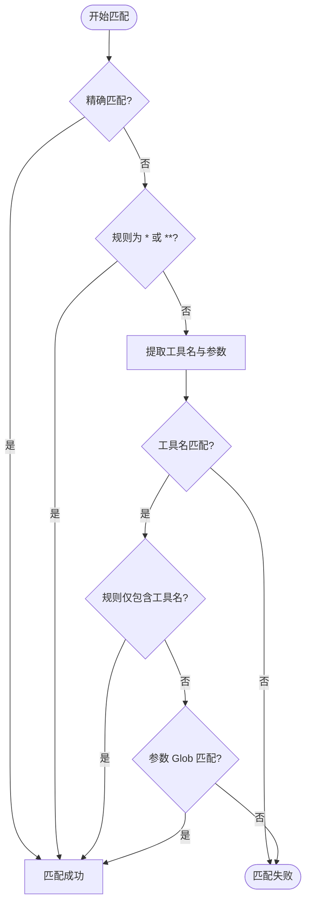

# 权限校验与安全策略

## 目录
1. [模块概览](#模块概览)
2. [引言](#引言)
3. [核心组件架构](#核心组件架构)
   - [类关系图](#类关系图)
   - [PermissionChecker：权限校验核心](#permissionchecker权限校验核心)
   - [PermissionMode：预定义权限模式](#permissionmode预定义权限模式)
   - [Pipeline 阶段：RuleBasedPermissionStage 与 ConfirmationStage](#pipeline-阶段rulebasedpermissionstage-与-confirmationstage)
4. [架构设计与工作流](#架构设计与工作流)
   - [权限校验时序](#权限校验时序)
   - [决策优先级](#决策优先级)
5. [关键算法与逻辑](#关键算法与逻辑)
   - [工具签名与规范化](#工具签名与规范化)
   - [规则匹配算法流程](#规则匹配算法流程)
   - [安全覆盖策略（Safety Overrides）](#安全覆盖策略safety-overrides)
6. [权限持久化与白名单机制](#权限持久化与白名单机制)
   - [会话级批准](#会话级批准)
   - [配置持久化](#配置持久化)
7. [配置指南](#配置指南)
8. [文件引用](#文件引用)

## 模块概览

本模块负责 Blade 的安全权限校验机制，确保 AI 在执行敏感操作（如文件修改、命令执行）时受到严格控制。系统通过多层过滤和动态模式切换，在保证安全的前提下最大化开发效率。

- **总文件数**: 约 10 个核心文件（涉及配置、校验逻辑与执行流）。
- **子模块**:
  - `config/`: 包含 `PermissionChecker.ts`（核心校验器）和 `types.ts`（类型定义）。
  - `tools/execution/stages/`: 包含 `RuleBasedPermissionStage.ts` 和 `ConfirmationStage.ts`（执行流水线阶段）。
  - `utils/shell/`: 包含 `commandNormalizer.ts`（命令规范化工具）。
  - `validation/`: 包含 `SensitiveFileDetector.ts`（敏感文件检测）。

本 Wiki 将重点涵盖权限等级定义、白名单匹配、运行时交互及持久化机制。

## 引言

在 AI Agent 系统中，安全是核心挑战之一。Blade 作为一个能够执行 Bash 命令和修改代码的工具，必须在“自动化效率”与“系统安全性”之间取得平衡。如果权限控制过严，会频繁打断用户的思路；如果权限控制过松，可能会导致系统文件被误删或敏感信息泄露。

Blade 的权限系统旨在解决以下核心问题：
1. **防止非预期操作**：通过 `ask` 模式，确保关键操作（如 `rm -rf`）必须经过用户确认。
2. **提升自动化体验**：通过 `allow` 模式和白名单，允许用户信任的工具或目录自动执行。
3. **防御绕过攻击**：通过命令规范化（Normalization），防止 AI 通过环境变量注入等手段绕过黑名单。
4. **灵活的模式切换**：支持从保守的 `PLAN` 模式到激进的 `YOLO` 模式的无缝切换。
5. **上下文感知**：系统不仅检查工具本身，还会检查受影响的文件路径，自动识别 API Key 或 SSH 密钥等敏感信息。

## 核心组件架构

### 类关系图

权限系统的核心组件之间存在紧密的协作关系。下图展示了主要类及其交互方式：



该架构将“规则判定”（Checker）、“流程编排”（Stage）和“持久化管理”（ConfigManager）解耦。`PermissionChecker` 作为一个纯粹的逻辑引擎，不感知 UI 或文件系统，而 `RuleBasedPermissionStage` 则负责将上下文信息（如受影响路径）注入校验流程。

**Diagram sources**:
- [PermissionChecker.ts](file:///Users/bytedance/Documents/GitHub/Blade/packages/cli/src/config/PermissionChecker.ts)
- [PipelineStages.ts](file:///Users/bytedance/Documents/GitHub/Blade/packages/cli/src/tools/execution/PipelineStages.ts)

### PermissionChecker：权限校验核心

`PermissionChecker` 是整个安全系统的核心类，负责根据配置的规则库（`allow`/`ask`/`deny`）对工具调用进行实时审计。

其核心职责包括：
- **签名构建**：将复杂的工具调用（如 `Read(path='/etc/passwd')`）转换为可匹配的字符串签名。
- **匹配计算**：利用 `picomatch` 支持精确匹配、前缀匹配、通配符和 Glob 模式。
- **状态管理**：维护当前生效的权限规则库。

```typescript
// PermissionChecker.ts 核心接口
export enum PermissionResult {
  ALLOW = 'allow', // 始终允许
  ASK = 'ask',     // 询问用户
  DENY = 'deny',   // 始终拒绝
}

export interface PermissionCheckResult {
  result: PermissionResult;
  matchedRule?: string;
  matchType?: 'exact' | 'prefix' | 'wildcard' | 'glob';
  reason?: string;
}
```

**Section sources**:
- [PermissionChecker.ts](file:///Users/bytedance/Documents/GitHub/Blade/packages/cli/src/config/PermissionChecker.ts)

### PermissionMode：预定义权限模式

为了简化用户配置，Blade 提供了多种预定义的权限模式（`PermissionMode`），这些模式定义了不同类型工具的默认行为。

| 模式 | 描述 | 行为细节 |
| :--- | :--- | :--- |
| `DEFAULT` | 默认模式 | 只读工具（Read/Glob/Grep）自动放行，写入和执行工具需要确认。 |
| `AUTO_EDIT` | 自动编辑模式 | 只读和写入工具（Edit/Write）自动放行，执行工具（Bash）需要确认。 |
| `YOLO` | 危险模式 | 所有工具自动放行，跳过所有确认。适用于高度受控的环境。 |
| `PLAN` | 方案模式 | 仅允许只读工具，禁止所有修改操作。适用于生成方案阶段。 |
| `SPEC` | 规格驱动模式 | 允许只读工具和 Spec 专用工具，其他修改操作需要确认。 |

用户可以通过命令行参数 `--permission-mode <mode>` 或在交互模式下使用 `Shift+Tab` 快速切换模式。

**Section sources**:
- [types.ts](file:///Users/bytedance/Documents/GitHub/Blade/packages/cli/src/config/types.ts)

### Pipeline 阶段：RuleBasedPermissionStage 与 ConfirmationStage

权限校验集成在工具执行流水线（Execution Pipeline）中，分为两个主要阶段：

1. **RuleBasedPermissionStage**：
   - 负责调用 `PermissionChecker` 进行初步判定。
   - 应用 `PermissionMode` 的覆盖逻辑。
   - 执行安全硬不变量检查（如禁止访问系统敏感目录）。
   - 检查 `SessionApprovalStore`，对于当前会话已批准的操作直接放行。
2. **ConfirmationStage**：
   - 如果前置阶段判定为 `ASK`，则负责触发 UI 交互请求用户批准。
   - 展现风险提示（如“此命令可能删除文件”）和变更预览。
   - 处理用户的批准范围（单次、会话级、永久）。
   - 负责将用户的“永久批准”抽象为模式规则并持久化。

**Section sources**:
- [RuleBasedPermissionStage.ts](file:///Users/bytedance/Documents/GitHub/Blade/packages/cli/src/tools/execution/stages/RuleBasedPermissionStage.ts)
- [PipelineStages.ts](file:///Users/bytedance/Documents/GitHub/Blade/packages/cli/src/tools/execution/PipelineStages.ts)

## 架构设计与工作流

### 权限校验时序

下面的时序图展示了一个工具调用如何穿过多个安全屏障，最终获得执行权限或被拦截。理解这一流程对于调试权限被拒的问题至关重要。

```mermaid
sequenceDiagram
    participant Agent
    participant Pipeline as ExecutionPipeline
    participant RuleStage as RuleBasedPermissionStage
    participant Checker as PermissionChecker
    participant ConfirmStage as ConfirmationStage
    participant User as 用户 (UI)

    Agent->>Pipeline: 执行工具 (params)
    Pipeline->>RuleStage: process()
    RuleStage->>Checker: check(descriptor)
    Checker-->>RuleStage: PermissionResult (ALLOW/ASK/DENY)
    
    alt 结果为 DENY
        RuleStage-->>Pipeline: abort(拒绝执行)
        Pipeline-->>Agent: 返回错误
    else 结果为 ASK
        RuleStage->>Pipeline: 标记需要确认
        Pipeline->>ConfirmStage: process()
        ConfirmStage->>User: 请求确认 (展示风险/预览)
        User-->>ConfirmStage: 批准 / 拒绝
        if 批准
            ConfirmStage-->>Pipeline: 继续执行
        else 拒绝
            ConfirmStage-->>Pipeline: abort(用户拒绝)
        end
    else 结果为 ALLOW
        RuleStage-->>Pipeline: 继续执行
    end
```

在上述流程中，`RuleBasedPermissionStage` 充当了“智能预审员”，它不仅查看静态规则，还会根据当前的 `PermissionMode` 和 `SessionApprovalStore` 进行动态调整。例如，如果用户在当前会话中已经批准过相同的操作，该阶段会将其从 `ASK` 升级为 `ALLOW`。

**Diagram sources**:
- [ExecutionPipeline.ts](file:///Users/bytedance/Documents/GitHub/Blade/packages/cli/src/tools/execution/ExecutionPipeline.ts)
- [RuleBasedPermissionStage.ts](file:///Users/bytedance/Documents/GitHub/Blade/packages/cli/src/tools/execution/stages/RuleBasedPermissionStage.ts)

### 决策优先级

Blade 遵循“最小特权原则”，在冲突时采用最保守的策略。决策优先级如下：
1. **硬拒绝（Hard Abort）**：如访问系统敏感目录（`/etc/`）或路径中包含 `..` 尝试越权访问，不可被任何规则覆盖。
2. **显式拒绝（Deny Rules）**：配置在 `permissions.deny` 中的规则，优先级高于允许规则。
3. **显式允许（Allow Rules）**：配置在 `permissions.allow` 中的规则。
4. **显式确认（Ask Rules）**：配置在 `permissions.ask` 中的规则。
5. **模式覆盖（Mode Overrides）**：如 `YOLO` 模式强制 `ALLOW`，`PLAN` 模式强制拦截所有写操作。
6. **默认策略**：如果无任何匹配，默认为 `ASK`。

## 关键算法与逻辑

### 工具签名与规范化

为了实现精确的权限控制，Blade 为每个工具调用生成一个“签名”。签名的格式通常为 `ToolName(params)`。例如，读取文件的签名可能是 `Read(file_path:/path/to/file.txt)`。

对于 `Bash` 工具，为了防止攻击者通过环境变量注入绕过校验，系统实现了两种规范化策略：
- **保守规范化（Safe Normalization）**：剥离已知的安全环境变量（如 `PATH`, `PWD`）和安全包装器（如 `sh -c`）。用于 `allow` 规则匹配，确保常用命令能正确匹配。
- **激进规范化（Aggressive Normalization）**：剥离**所有**环境变量。用于 `deny` 和 `ask` 规则匹配，防止 AI 通过 `FOO=bar rm -rf /` 这种变体绕过对 `rm` 的拦截。

```typescript
// PermissionChecker.ts 中的规范化逻辑片段
if (isBash) {
  // 激进规范化：剥离所有环境变量，防范绕过
  const aggressive = stripAllEnvVars(stripSafeWrappers(command));
  if (aggressive !== command) {
    aggressiveSignature = `Bash(${aggressive})`;
  }
}
```

### 规则匹配算法流程

Blade 的规则匹配算法不仅支持简单的字符串比较，还支持复杂的参数解析和 Glob 匹配。下图展示了单条规则的匹配逻辑：



匹配逻辑会递归解析签名中的参数对（Key-Value），并对每个值进行 Glob 校验。例如，规则 `Write(path:src/**/*.ts)` 会检查 `Write` 工具调用的 `path` 参数是否符合该 Glob 模式。

### 安全覆盖策略（Safety Overrides）

除了用户定义的规则外，Blade 还内置了一套安全硬约束，由 `RuleBasedPermissionStage.applySafetyOverrides` 执行。

- **系统路径保护**：禁止任何工具访问 `/etc/`, `/sys/`, `/proc/`, `/dev/`, `/boot/`, `/root/` 等目录。
- **敏感文件检测**：利用 `SensitiveFileDetector` 扫描受影响的路径。
  - **高敏感**（如 `.env`, `id_rsa`, `*.pem`）：如果没有显式 `allow` 规则，直接 `DENY`。
  - **中敏感**（如 `config.yaml`, `package-lock.json`）：即使处于 `AUTO_EDIT` 模式，也会降级为 `ASK`。

**Section sources**:
- [RuleBasedPermissionStage.ts:L194-L263](file:///Users/bytedance/Documents/GitHub/Blade/packages/cli/src/tools/execution/stages/RuleBasedPermissionStage.ts#L194-L263)

## 权限持久化与白名单机制

### 会话级批准

当用户在 UI 中选择“允许此会话中的所有类似操作”时，签名会被添加到 `SessionApprovalStore`（内存中的 `Set`）。后续相同的签名将自动通过 `RuleBasedPermissionStage` 的校验。这种机制在处理大规模重构时非常有用，避免了对每个文件的修改都进行确认。

### 配置持久化

如果用户选择“永久允许”，`ConfirmationStage` 会调用 `PermissionChecker.abstractPattern` 将具体的调用抽象为通用的模式规则，并持久化到 `~/.blade/settings.json`。

例如，用户批准了 `Write(path:/home/user/project/README.md)`，系统可能会将其抽象为 `Write(path:/home/user/project/**)` 并保存。这种抽象能力是由各个工具自行定义的（通过 `abstractPermissionRule` 方法），确保生成的规则既安全又具有普适性。

```typescript
// PipelineStages.ts 中的持久化逻辑
private async persistSessionApproval(signature: string, descriptor: ToolInvocationDescriptor) {
  const pattern = PermissionChecker.abstractPattern(descriptor);
  await configActions().appendLocalPermissionAllowRule(pattern, { immediate: true });
}
```

## 配置指南

用户可以通过修改 `settings.json` 手动配置权限白名单。系统会自动合并全局配置和项目本地配置。

```json
{
  "permissionMode": "default",
  "permissions": {
    "allow": [
      "Read",
      "Glob",
      "Grep",
      "Bash(ls *)",
      "Write(path:src/test/**)"
    ],
    "deny": [
      "Bash(rm -rf /)",
      "Write(path:.env)"
    ],
    "ask": [
      "Bash"
    ]
  }
}
```

> **💡 提示**：
> - **规则优先级**：系统始终先检查 `deny`。即使一个操作匹配了 `allow` 规则，如果它也匹配了 `deny` 规则，它仍会被拒绝。
> - **Glob 语法**：使用 `**` 匹配多级目录，使用 `*` 匹配单级文件名。
> - **环境变量**：规则支持环境变量插值，例如 `Write(path:${HOME}/.ssh/*)`。

## 文件引用

以下是实现权限校验与安全策略的关键源文件：

- [PermissionChecker.ts](file:///Users/bytedance/Documents/GitHub/Blade/packages/cli/src/config/PermissionChecker.ts): 核心匹配引擎与签名生成。
- [types.ts](file:///Users/bytedance/Documents/GitHub/Blade/packages/cli/src/config/types.ts): 权限模式与配置结构定义。
- [RuleBasedPermissionStage.ts](file:///Users/bytedance/Documents/GitHub/Blade/packages/cli/src/tools/execution/stages/RuleBasedPermissionStage.ts): 运行时权限判定逻辑。
- [PipelineStages.ts](file:///Users/bytedance/Documents/GitHub/Blade/packages/cli/src/tools/execution/PipelineStages.ts): 包含 `ConfirmationStage`，处理用户交互与规则持久化。
- [ConfigManager.ts](file:///Users/bytedance/Documents/GitHub/Blade/packages/cli/src/config/ConfigManager.ts): 处理多层级配置文件的合并逻辑。
- [commandNormalizer.ts](file:///Users/bytedance/Documents/GitHub/Blade/packages/cli/src/utils/shell/commandNormalizer.ts): Bash 命令规范化工具。
- [SensitiveFileDetector.ts](file:///Users/bytedance/Documents/GitHub/Blade/packages/cli/src/tools/validation/SensitiveFileDetector.ts): 敏感文件识别逻辑。
- [SessionApprovalStore.ts](file:///Users/bytedance/Documents/GitHub/Blade/packages/cli/src/tools/execution/SessionApprovalStore.ts): 会话级批准存储。
