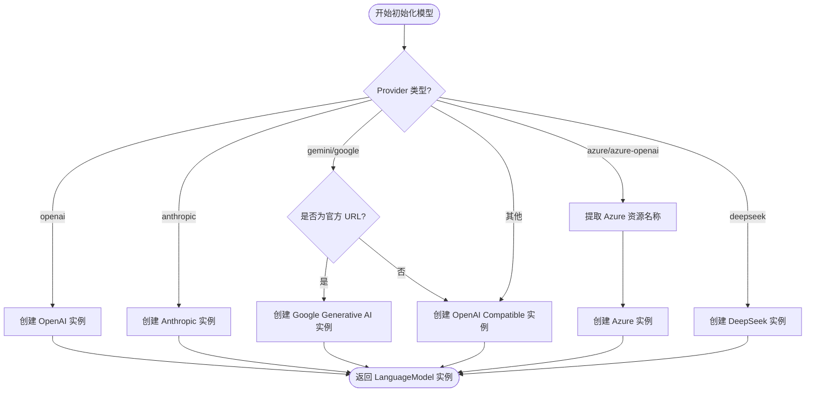
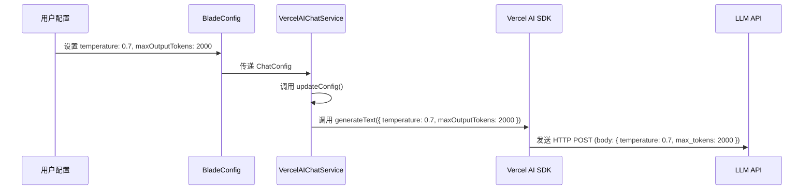
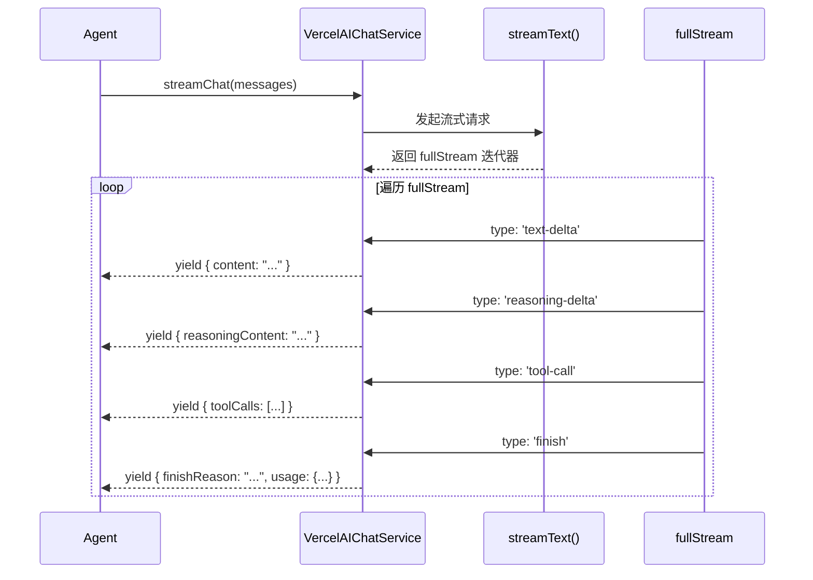

# 模型提供商与 AI 服务集成

## 目录
1. [引言](#引言)
2. [模块概览](#模块概览)
3. [架构设计](#架构设计)
4. [核心组件](#核心组件)
5. [多模型提供商支持](#多模型提供商支持)
6. [模型参数配置与生效机制](#模型参数配置与生效机制)
7. [流式响应处理逻辑](#流式响应处理逻辑)
8. [动态模型切换与容错机制](#动态模型切换与容错机制)
9. [特定厂商优化：Anthropic 与 DeepSeek](#特定厂商优化-anthropic-与-deepseek)
10. [文件参考](#文件参考)

## 引言

Blade 作为一个先进的 AI 辅助开发工具，其核心竞争力之一在于其强大的模型适配能力。在当前大语言模型（LLM）市场百花齐放的背景下，Blade 设计了一套高度抽象且可扩展的 AI 服务集成框架，旨在为用户提供统一的交互体验，同时屏蔽底层不同模型提供商（如 OpenAI, Anthropic, Google, Azure 等）在 API 协议、参数结构及响应格式上的差异。

本模块的核心目标是实现“一次编写，处处运行”的 AI 调用逻辑。通过引入 `IChatService` 接口和基于 Vercel AI SDK 的 `VercelAIChatService` 实现，Blade 能够轻松集成 80 多个主流及长尾 LLM 提供商。无论是支持多模态输入的 GPT-4o，还是具备强大推理链能力的 DeepSeek R1，亦或是支持大规模 Prompt Caching 的 Claude 3.5，都能通过统一的配置接口接入 Blade 的工作流中。

此外，本模块还承担了复杂的流式响应处理、工具调用（Tool Calling）转换、运行时模型动态切换以及特定厂商的性能优化任务，确保在各种复杂的网络环境和业务场景下，AI 服务都能保持高效、稳定且智能。

## 模块概览

在 `packages/cli/src/services/` 目录下，AI 服务集成模块由 7 个核心文件组成，涵盖了从接口定义到具体实现，再到模型发现与配置的完整链路。

### 模块规模与范围
- **总文件数**: 7 个（位于 `services/` 目录）
- **子模块划分**:
    - **接口定义层**: `ChatServiceInterface.ts`（定义统一契约）
    - **核心实现层**: `VercelAIChatService.ts`（基于 Vercel AI SDK 的多提供商适配）
    - **模型发现层**: `ModelsDevService.ts`（对接 models.dev 动态获取模型列表）
    - **配置模型层**: `packages/cli/src/config/types.ts`（定义模型配置结构）

### 覆盖深度
本章节将深入探讨 `VercelAIChatService` 的内部实现机制，详细解析其如何处理复杂的流式数据流以及如何针对不同厂商进行差异化优化。对于 `ModelsDevService` 等辅助服务，我们将重点介绍其在模型选择和动态配置中的作用。

## 架构设计

Blade 的 AI 服务架构采用典型的“接口-实现”分离模式，并利用 Vercel AI SDK 作为底层的跨平台抽象层。这种设计不仅提高了代码的可测试性，还使得未来切换底层 SDK 或增加原生提供商支持变得异常简单。

### 整体架构图

下面的架构图展示了 Blade 如何通过 `IChatService` 接口屏蔽底层差异，并利用 Vercel AI SDK 连接各种云端模型服务。

```mermaid
graph TB
    subgraph "应用逻辑层"
        Agent[Agent/Command Handler]
        UI[UI Components]
    end

    subgraph "抽象服务层"
        IChatService["interface IChatService"]
        Factory[createChatServiceAsync]
    end

    subgraph "具体实现层"
        VercelService[VercelAIChatService]
        VercelSDK["Vercel AI SDK (ai)"]
    end

    subgraph "模型提供商适配器"
        OpenAIAdapter["@ai-sdk/openai"]
        AnthropicAdapter["@ai-sdk/anthropic"]
        GoogleAdapter["@ai-sdk/google"]
        AzureAdapter["@ai-sdk/azure"]
        DeepSeekAdapter["@ai-sdk/deepseek"]
        GenericAdapter["@ai-sdk/openai-compatible"]
    end

    subgraph "外部 AI 服务"
        OpenAIAPI[OpenAI API]
        AnthropicAPI[Anthropic API]
        GoogleAPI[Gemini API]
        AzureAPI[Azure OpenAI]
        DeepSeekAPI[DeepSeek API]
    end

    Agent --> IChatService
    UI --> IChatService
    IChatService <|.. VercelService
    Factory --> VercelService
    VercelService --> VercelSDK
    VercelSDK --> OpenAIAdapter
    VercelSDK --> AnthropicAdapter
    VercelSDK --> GoogleAdapter
    VercelSDK --> AzureAdapter
    VercelSDK --> DeepSeekAdapter
    VercelSDK --> GenericAdapter

    OpenAIAdapter --> OpenAIAPI
    AnthropicAdapter --> AnthropicAPI
    GoogleAdapter --> GoogleAPI
    AzureAdapter --> AzureAPI
    DeepSeekAdapter --> DeepSeekAPI
    GenericAdapter --> OpenAIAPI
```

**架构解析**:
该架构图清晰地描绘了从高层业务逻辑到底层 API 调用的数据流向。`Agent` 和 `UI` 组件仅依赖于 `IChatService` 接口，这保证了业务逻辑与具体供应商的解耦。`VercelAIChatService` 作为核心实现类，通过 `Vercel AI SDK` 提供的统一接口，调用相应的供应商适配器。特别值得注意的是 `GenericAdapter`（OpenAI-compatible），它为那些遵循 OpenAI 规范的第三方供应商（如 Groq, Together AI 等）提供了通用的接入路径。

**Diagram sources**:
- [ChatServiceInterface.ts](file:///Users/bytedance/Documents/GitHub/Blade/packages/cli/src/services/ChatServiceInterface.ts)
- [VercelAIChatService.ts](file:///Users/bytedance/Documents/GitHub/Blade/packages/cli/src/services/VercelAIChatService.ts)

## 核心组件

了解 Blade 的 AI 集成，必须掌握以下三个核心组件：接口定义、配置模型以及工厂函数。

### 1. IChatService 接口
这是整个 AI 服务的灵魂，定义了 Blade 与 AI 交互的标准方式。

```typescript
export interface IChatService {
  /**
   * 发送聊天请求（非流式）
   */
  chat(
    messages: Message[],
    tools?: Array<{
      name: string;
      description: string;
      parameters: unknown;
    }>,
    signal?: AbortSignal
  ): Promise<ChatResponse>;

  /**
   * 发送聊天请求（流式）
   */
  streamChat(
    messages: Message[],
    tools?: Array<{
      name: string;
      description: string;
      parameters: unknown;
    }>,
    signal?: AbortSignal
  ): AsyncGenerator<StreamChunk, void, unknown>;

  /**
   * 获取当前配置
   */
  getConfig(): ChatConfig;

  /**
   * 更新配置
   */
  updateConfig(newConfig: Partial<ChatConfig>): void;
}
```

**组件解析**:
`IChatService` 接口不仅支持基本的对话（`chat`），还通过 `AsyncGenerator` 完美支持了流式输出（`streamChat`）。同时，它还允许在运行时动态更新配置（`updateConfig`），这为 Blade 的模型热切换功能提供了基础支持。

### 2. ChatConfig 配置模型
`ChatConfig` 封装了发起 AI 请求所需的所有元数据。

```typescript
export interface ChatConfig {
  provider: ProviderType;
  apiKey: string;
  baseUrl: string;
  model: string;
  temperature?: number;
  maxContextTokens?: number; // 上下文窗口大小
  maxOutputTokens?: number; // 输出 token 限制
  timeout?: number;
  apiVersion?: string; // Azure/OpenAI 专用
  supportsThinking?: boolean; // 是否支持推理模式
  customHeaders?: Record<string, string>; // 自定义 HTTP Headers
  fallbackModel?: string; // 备用模型 ID
}
```

**组件解析**:
该配置结构不仅包含了基础的连接信息（`apiKey`, `baseUrl`），还包含了高级控制参数（`supportsThinking`, `fallbackModel`）。这些参数直接决定了 `VercelAIChatService` 如何初始化底层的模型实例。

### 3. VercelAIChatService 实现类
这是 `IChatService` 的主实现，负责将 Blade 的消息格式转换为 Vercel AI SDK 所需的格式，并处理复杂的供应商逻辑。

**Section sources**:
- [ChatServiceInterface.ts:L137-L173](file:///Users/bytedance/Documents/GitHub/Blade/packages/cli/src/services/ChatServiceInterface.ts#L137-L173)
- [ChatServiceInterface.ts:L77-L90](file:///Users/bytedance/Documents/GitHub/Blade/packages/cli/src/services/ChatServiceInterface.ts#L77-L90)

## 多模型提供商支持

Blade 通过 `VercelAIChatService` 的 `createModel` 私有方法，实现了对多种模型提供商的精细化支持。

### 模型初始化流程

下面的流程图展示了 `VercelAIChatService` 如何根据配置中的 `provider` 字段，选择并配置正确的 SDK 适配器。



**流程解析**:
在初始化过程中，Blade 表现出了极高的灵活性：
1. **官方适配器优先**: 对于 OpenAI, Anthropic, Google, Azure, DeepSeek 等主流厂商，使用专门的 SDK 适配器以获得最佳性能和特性支持（如 Anthropic 的 Prompt Caching）。
2. **智能 URL 识别**: 对于 Google/Gemini，会根据 `baseUrl` 自动判断是使用官方 SDK 还是通过 OpenAI 兼容协议连接。
3. **Azure 特殊处理**: 自动从 URL 中提取资源名称（Resource Name），并处理复杂的部署名（Deployment Name）映射逻辑。
4. **兜底策略**: 任何未知的 `provider` 都会被视为 `openai-compatible`，这确保了 Blade 可以连接到任何支持 OpenAI 协议的本地模型（如 Ollama, LocalAI）或第三方云服务。

### 配置示例代码

```typescript
// VercelAIChatService.ts 中的核心逻辑片段
private createModel(config: ChatConfig): LanguageModel {
  const { provider, apiKey, baseUrl, model, customHeaders, apiVersion } = config;

  switch (provider) {
    case 'openai':
      return createOpenAI({ apiKey, baseURL: baseUrl, headers: customHeaders })(model);
    case 'anthropic':
      return createAnthropic({ apiKey, baseURL: baseUrl, headers: customHeaders })(model);
    case 'azure-openai':
      const resourceName = this.extractAzureResourceName(baseUrl);
      return createAzure({ apiKey, resourceName, apiVersion })(model);
    // ... 其他厂商
    default:
      return createOpenAICompatible({ name: provider, apiKey, baseURL: baseUrl, headers: customHeaders })(model);
  }
}
```

**Section sources**:
- [VercelAIChatService.ts:L130-L259](file:///Users/bytedance/Documents/GitHub/Blade/packages/cli/src/services/VercelAIChatService.ts#L130-L259)

## 模型参数配置与生效机制

Blade 不仅仅是简单的转发请求，它还负责将用户的配置参数（如 `temperature`, `maxTokens` 等）精确地传递给底层模型，并确保这些参数在不同供应商之间的一致性。

### 参数传递链路



**机制解析**:
1. **配置注入**: 在 `createChatServiceAsync` 工厂函数中，Blade 会自动注入供应商特定的 HTTP Headers（如 OpenRouter 的引用来源）。
2. **参数映射**: `VercelAIChatService` 将 `ChatConfig` 中的参数映射到 Vercel AI SDK 的统一参数名上。例如，`maxOutputTokens` 会被映射为 SDK 的 `maxOutputTokens`，而 SDK 最终会根据供应商将其转换为 `max_tokens` (OpenAI) 或 `max_tokens_to_sample` (Anthropic)。
3. **动态生效**: 每次调用 `updateConfig` 时，`VercelAIChatService` 都会重新调用 `createModel` 创建一个新的 `LanguageModel` 实例。这意味着用户在 UI 中更改参数后，下一次对话会立即应用新配置，无需重启服务。

**Section sources**:
- [ChatServiceInterface.ts:L182-L206](file:///Users/bytedance/Documents/GitHub/Blade/packages/cli/src/services/ChatServiceInterface.ts#L182-L206)
- [VercelAIChatService.ts:L872-L878](file:///Users/bytedance/Documents/GitHub/Blade/packages/cli/src/services/VercelAIChatService.ts#L872-L878)

## 流式响应处理逻辑

流式输出是提升 AI 交互体验的关键。Blade 实现了高效的流式处理链路，能够实时处理文本、推理内容（Reasoning）以及工具调用（Tool Calls）。

### 流式处理时序图



**逻辑解析**:
`streamChat` 方法利用了 `AsyncGenerator` 模式，这使得上层调用者（如 UI）可以使用 `for await...of` 语法实时获取 AI 的输出。
- **多类型 Delta 处理**: 内部通过 `switch (part.type)` 区分不同类型的增量。特别是 `reasoning-delta`，它专门用于处理像 DeepSeek R1 这样具有“思考过程”的模型。
- **工具调用转换**: 当模型决定调用工具时，`VercelAIChatService` 会捕获 `tool-call` 事件，并将其转换为 Blade 统一的 `StreamToolCall` 格式。
- **Usage 统计**: 在流结束（`finish`）时，服务会提取并转换 Token 使用量（Usage），包括提示词 Token、补全 Token 以及总 Token。

**Section sources**:
- [VercelAIChatService.ts:L689-L774](file:///Users/bytedance/Documents/GitHub/Blade/packages/cli/src/services/VercelAIChatService.ts#L689-L774)

## 动态模型切换与容错机制

在实际生产环境中，LLM API 经常会遇到限流（429）或服务不可用（503）的情况。Blade 内置了智能的模型备用（Fallback）机制。

### 容错处理流程

```mermaid
flowchart TD
    Request[发起 AI 请求] --> Success{请求成功?}
    Success -- "是" --> Return[返回响应]
    Success -- "否" --> CheckError{是否为可重试错误?\n(429/503/529)}
    
    CheckError -- "否" --> Throw[抛出异常]
    CheckError -- "是" --> HasFallback{是否有备用模型?}
    
    HasFallback -- "否" --> Throw
    HasFallback -- "是" --> Switch[切换到备用模型]
    
    Switch --> Retry[使用备用模型重试]
    Retry --> Success2{重试成功?}
    Success2 -- "是" --> Return
    Success2 -- "否" --> Throw
```

**机制解析**:
1. **错误识别**: `isFallbackableError` 方法会检查错误消息或状态码。目前支持对 429（Too Many Requests）、503（Service Unavailable）和 529（Overloaded）进行自动重试。
2. **静默切换**: 如果配置了 `fallbackModel`，服务会在主模型失败后立即初始化备用模型并重新发起请求。对于流式请求，它还会通过 `yield { modelFallback: true }` 通知上层，以便 UI 可以向用户显示提示（例如：“当前模型繁忙，已自动切换到备用模型”）。
3. **递归保护**: 备用模型重试失败后将不再继续 Fallback，而是抛出最终异常，防止无限循环。

**Section sources**:
- [VercelAIChatService.ts:L556-L564](file:///Users/bytedance/Documents/GitHub/Blade/packages/cli/src/services/VercelAIChatService.ts#L556-L564)
- [VercelAIChatService.ts:L629-L684](file:///Users/bytedance/Documents/GitHub/Blade/packages/cli/src/services/VercelAIChatService.ts#L629-L684)

## 特定厂商优化：Anthropic 与 DeepSeek

为了充分发挥不同厂商的特性，Blade 在 `VercelAIChatService` 中加入了一系列针对性优化。

### 1. Anthropic Prompt Caching
对于 Claude 系列模型，Blade 支持“提示词缓存”功能，这能显著降低长上下文对话的成本。
- **逻辑**: 在 `convertMessages` 中，Blade 会识别带有 `cacheControl` 标记的消息部分，并将其转换为 Anthropic SDK 所需的 `providerOptions`。
- **统计**: 在 `convertUsage` 中，特别处理了 `cacheCreationInputTokens` 和 `cacheReadInputTokens`，让用户清楚了解节省了多少 Token。

### 2. DeepSeek 推理与工具调用优化
DeepSeek 模型（尤其是 Reasoner 系列）在处理工具调用时有特殊的行为。
- **思考过程处理**: Blade 能够提取并流式传输 DeepSeek 的 `reasoning_content`，并在 UI 中以“思考中...”的形式展示。
- **上下文展平 (Flattening)**: DeepSeek 在进行多轮工具调用时，有时不支持复杂的 Assistant 消息结构。`flattenDeepSeekThinkingToolHistory` 方法会将复杂的工具历史展平为 User/Assistant 交替的简单文本格式，从而提高工具调用的成功率。

```typescript
// DeepSeek 上下文展平逻辑片段
private flattenDeepSeekThinkingToolHistory(messages: Message[]): Message[] {
  // ... 将 system/assistant/tool 消息序列转换为 DeepSeek 更易理解的格式
  // 核心思路是将工具结果包装在 user 消息中，并提示模型“继续”
}
```

**Section sources**:
- [VercelAIChatService.ts:L291-L363](file:///Users/bytedance/Documents/GitHub/Blade/packages/cli/src/services/VercelAIChatService.ts#L291-L363)
- [VercelAIChatService.ts:L544-L553](file:///Users/bytedance/Documents/GitHub/Blade/packages/cli/src/services/VercelAIChatService.ts#L544-L553)

## 文件参考

以下是本模块涉及的核心源文件，建议在进行相关开发或调试时重点阅读：

- [ChatServiceInterface.ts](file:///Users/bytedance/Documents/GitHub/Blade/packages/cli/src/services/ChatServiceInterface.ts): 核心接口定义与工厂函数。
- [VercelAIChatService.ts](file:///Users/bytedance/Documents/GitHub/Blade/packages/cli/src/services/VercelAIChatService.ts): 多供应商集成的主实现类。
- [ModelsDevService.ts](file:///Users/bytedance/Documents/GitHub/Blade/packages/cli/src/services/ModelsDevService.ts): 模型发现与元数据获取服务。
- [config/types.ts](file:///Users/bytedance/Documents/GitHub/Blade/packages/cli/src/config/types.ts): 模型配置与全局设置的类型定义。
- [ui/components/model-config/types.ts](file:///Users/bytedance/Documents/GitHub/Blade/packages/cli/src/ui/components/model-config/types.ts): 供应商特定的 Headers 和默认 URL 配置。
- [logging/Logger.ts](file:///Users/bytedance/Documents/GitHub/Blade/packages/cli/src/logging/Logger.ts): 用于调试 AI 请求流的日志服务。
