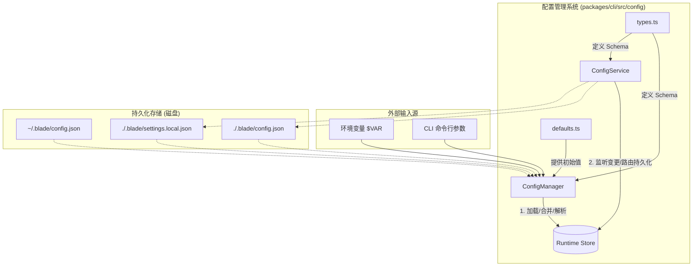
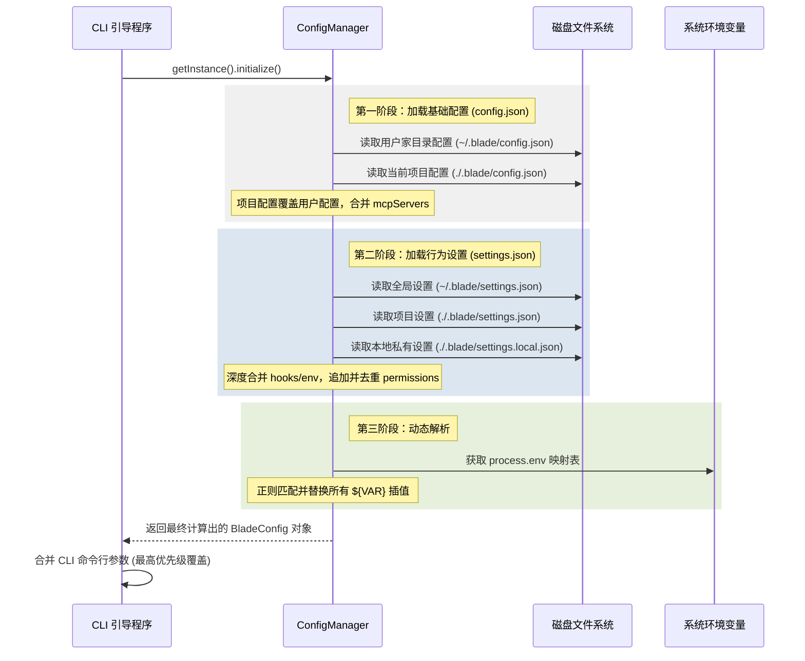
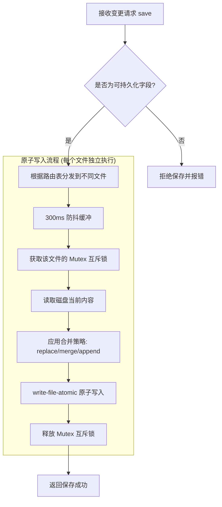

# 配置管理系统架构

## 目录
1. [模块概览](#模块概览)
2. [引言](#引言)
3. [系统架构设计](#系统架构设计)
4. [核心组件解析](#核心组件解析)
   - [ConfigManager：配置加载与初始化](#configmanager配置加载与初始化)
   - [ConfigService：配置持久化与路由](#configservice配置持久化与路由)
   - [类型系统与安全模型](#类型系统与安全模型)
5. [配置加载流程与优先级](#配置加载流程与优先级)
6. [配置持久化机制与安全保障](#配置持久化机制与安全保障)
7. [设计权衡与最佳实践](#设计权衡与最佳实践)
8. [核心配置项详述](#核心配置项详述)
9. [文件引用](#文件引用)

## 模块概览

Blade 的配置管理系统位于 `packages/cli/src/config/` 目录下，是一个高度模块化、类型安全且支持多层级覆盖的复杂系统。该系统不仅负责简单的键值对存储，还承担了权限控制规则、模型连接参数以及 Agent 运行时行为的协调工作。

- **总文件数**: 6 个核心 TypeScript 文件。
- **核心子模块**:
  - **加载器 (Loader)**: 由 `ConfigManager.ts` 负责，处理启动时的多源配置读取、深度合并以及环境变量插值解析。
  - **持久化层 (Persistence)**: 由 `ConfigService.ts` 负责，处理运行时的配置修改、字段路由分发以及磁盘原子写入。
  - **定义层 (Definitions)**: 由 `types.ts` 和 `defaults.ts` 提供严格的 TypeScript 类型约束和详尽的初始默认值。
- **覆盖范围**: 本文档涵盖了从磁盘文件加载配置、环境变量动态解析、运行时多级合并到最终并发安全持久化回磁盘的全生命周期管理逻辑。

## 引言

在现代复杂的 CLI 应用中，配置管理往往面临多层级覆盖（全局 vs 项目）、类型安全、并发写入冲突以及环境变量集成等诸多挑战。Blade 的配置管理系统旨在通过一套严谨的架构解决以下核心问题：

1. **多层级配置覆盖**: 开发者通常需要在全局范围内定义通用的 API Key，但在特定项目中又需要覆盖某些模型参数或权限规则。Blade 支持用户全局配置、项目共享配置以及项目本地私有配置的无缝叠加。
2. **职责的高度解耦**: 系统将“启动时的加载合并”与“运行时的持久化写入”完全解耦。`ConfigManager` 专注于如何构建初始快照，而 `ConfigService` 则专注于如何安全地将变更写回磁盘，这种设计极大提高了代码的可维护性和测试性。
3. **端到端的类型安全**: 整个系统基于 TypeScript 构建，所有的配置项都有明确的类型定义。这意味着在代码的任何角落访问配置，都能获得完整的智能提示、类型检查和重构支持，有效避免了拼写错误导致的运行时崩溃。
4. **并发写入与原子性保障**: 在 Agent 并发执行任务或用户通过 UI 频繁修改设置的场景下，配置文件的写入安全至关重要。系统通过引入异步互斥锁（Mutex）和原子写入（Atomic Write）机制，确保即使在极端情况下（如写入时突然掉电），配置文件也不会出现损坏或半截数据的情况。

该系统采用了创新的“双文件”策略，将基础连接配置（`config.json`）与行为/权限配置（`settings.json`）分开管理。这种分离不仅让文件结构更清晰，也方便了 `settings.json` 在团队间共享，而将敏感的 `config.json` 留在本地。

## 系统架构设计

Blade 配置系统的架构建立在单例模式之上，确保在整个应用生命周期中，配置的加载和持久化逻辑是统一且一致的。它不仅仅是一个静态的数据结构，而是一个动态的、响应式的管理层。

以下图表展示了配置系统的核心组件及其交互关系：



该架构将配置的生命周期分为三个关键阶段：
1. **静态定义阶段**: 开发者在 `defaults.ts` 中定义了系统默认的行为，这是所有配置的底座。
2. **初始化加载阶段**: `ConfigManager` 作为启动引导器，从多个预定义的磁盘位置读取 JSON 文件。它遵循“就近原则”，即项目级配置覆盖全局配置。在此阶段，系统还会扫描所有字符串字段，利用正则表达式将环境变量（如 `$OPENAI_API_KEY`）注入到配置中。
3. **运行时管理阶段**: 合并后的配置被注入到全局状态管理中心（Store）。此时，如果用户通过 CLI 命令行传入了参数（如 `--debug` 或 `--yolo`），这些参数将作为最高优先级覆盖内存中的值。

**架构设计深度说明**:
- **职责分明**: `ConfigManager` 是“无状态”的，它只负责计算最终配置。`ConfigService` 则是“有状态”的，它维护着待写入的队列和文件锁。
- **单例保证**: 通过 `getInstance()` 方法，系统确保不会因为多次实例化而导致配置文件被重复读取或竞争写入。
- **解耦存储**: 通过将 `BladeConfig` 拆分为 `config.json` 和 `settings.json`，系统实现了“连接信息”与“行为逻辑”的分离，这为未来的多项目配置共享打下了基础。

## 核心组件解析

### ConfigManager：配置加载与初始化

`ConfigManager` 是系统的“首席加载官”。它的核心职责是在应用启动的毫秒级时间内，从复杂的层级结构中梳理出最终的配置对象。

**核心逻辑深度解析**:
- **多层级优先级策略**: 它不仅支持简单的覆盖，还支持复杂的合并逻辑。例如，对于 `mcpServers`，项目级的配置会与全局配置合并，而不是简单的替换，这允许开发者在不修改全局设置的情况下为特定项目增加 MCP 工具。
- **环境变量插值引擎**: 这是一个强大的特性。它支持 `$VAR`、`${VAR}` 以及 `${VAR:-default}` 语法。这使得配置文件可以安全地提交到 Git（只包含变量名），而敏感的 API Key 则通过环境变量注入。
- **配置校验 (Validation)**: 在加载完成后，`ConfigManager` 会执行 `validateConfig` 方法。它会检查模型列表是否为空、当前模型 ID 是否有效等核心字段。如果校验失败，它会提供极其详尽的错误提示，甚至包含一个示例 JSON 模板，引导用户完成初始化。

```typescript
// ConfigManager.ts 中的环境变量解析逻辑
private resolveEnvInterpolation(config: BladeConfig): void {
  // 支持 $VAR, ${VAR}, ${VAR:-default}
  const envPattern = /\$\{?([A-Z_][A-Z0-9_]*)(:-([^}]+))?\}?/g;
  const resolve = (value: unknown): unknown => {
    if (typeof value === 'string') {
      return value.replace(envPattern, (match, varName, _, defaultValue) => {
        return process.env[varName] || defaultValue || match;
      });
    }
    return value;
  };
  // 遍历配置项进行动态替换
  for (const [key, value] of Object.entries(config)) {
    if (typeof value === 'string') {
      (config as any)[key] = resolve(value);
    }
  }
}
```

**Section sources**:
- [ConfigManager.ts](file:///Users/bytedance/Documents/GitHub/Blade/packages/cli/src/config/ConfigManager.ts)

### ConfigService：配置持久化与路由

如果说 `ConfigManager` 负责“读”，那么 `ConfigService` 则负责“写”。它是 Blade 配置系统的持久化路由层，确保每一条配置变更都能准确无误地落到正确的文件中。

**关键机制深度解析**:
- **字段路由表 (`FIELD_ROUTING_TABLE`)**: 这是系统的“交通指挥中心”。它详细规定了每一个配置项的归宿。例如，`models` 默认保存到全局 `config.json`，而 `permissions` 默认保存到本地 `settings.local.json`。这种细粒度的控制确保了配置的物理存储与其逻辑意义相匹配。
- **防抖与批量处理**: `ConfigService` 内部实现了一个 300ms 的防抖机制。当用户在 UI 上快速切换多个开关时，系统不会立即发起多次磁盘写入，而是将这些变更缓存起来，在 300ms 后一次性写入。这不仅保护了磁盘寿命，也提升了应用的响应速度。
- **并发写入安全 (Mutex)**: 这是最核心的安全特性。系统为每个目标文件维护了一个异步互斥锁。当一个写入操作正在进行时，后续的写入请求必须排队等待。这彻底杜绝了多个异步任务同时修改同一个文件导致的竞争条件。

```typescript
// ConfigService.ts 中的保存逻辑
async save(updates: Partial<BladeConfig>, options: SaveOptions = {}): Promise<void> {
  // 1. 验证字段是否允许持久化（过滤掉运行时临时字段）
  this.validatePersistableFields(updates);
  // 2. 根据路由表按目标文件分组
  const grouped = this.groupUpdatesByTarget(updates, options.scope);
  // 3. 进入防抖调度或立即执行
  if (options.immediate) {
    await Promise.all(Array.from(grouped.entries()).map(([path, upd]) => this.flushTarget(path, upd)));
  } else {
    for (const [path, upd] of grouped) { this.scheduleSave(path, upd); }
  }
}
```

**Section sources**:
- [ConfigService.ts](file:///Users/bytedance/Documents/GitHub/Blade/packages/cli/src/config/ConfigService.ts)

### 类型系统与安全模型

Blade 的配置系统不仅仅是数据的集合，它还承载了系统的安全哲学。

1. **三层配置接口**:
   - `BladeConfig`: 定义了磁盘上持久化的核心字段。
   - `RuntimeConfig`: 扩展了 `BladeConfig`，增加了如 `allowedTools`、`systemPrompt` 等仅在当前 CLI 运行期间有效的字段。这些字段永远不会被 `ConfigService` 写回磁盘。
   - `SetupConfig`: 用于初始化向导的精简接口。
2. **权限模式 (`PermissionMode`)**:
   - `DEFAULT`: 传统的“读操作自动通过，写操作需确认”模式。
   - `AUTO_EDIT`: 允许 Agent 自动修改代码，但执行命令仍需确认，适合高效开发。
   - `YOLO`: 完全信任模式，跳过所有确认，仅建议在受控环境使用。
   - `PLAN/SPEC`: 专门为方案设计和规格驱动开发设计的受限模式。

**Section sources**:
- [types.ts](file:///Users/bytedance/Documents/GitHub/Blade/packages/cli/src/config/types.ts)

## 配置加载流程与优先级

配置加载遵循一个严格的从“远”到“近”的合并过程。理解这个流程对于开发者调试复杂的配置覆盖问题至关重要。



**优先级详解**:
1. **CLI 参数**: `--debug`, `--yolo`, `--max-turns` 等参数拥有最高优先级，它们会覆盖所有配置文件中的设置。
2. **本地私有设置 (`settings.local.json`)**: 专门用于存放个人偏好或不便提交的 Key，优先级高于项目共享设置。
3. **项目共享设置 (`settings.json`)**: 随代码库提交，确保团队成员拥有一致的 Agent 行为和权限基准。
4. **用户全局配置**: 存储在用户家目录，作为所有项目的兜底配置。
5. **系统默认值 (`defaults.ts`)**: 最后的防线，确保系统在没有任何配置文件的情况下也能基本运行。

## 配置持久化机制与安全保障

当配置发生变更时，`ConfigService` 启动一套严密的持久化流程。这套流程的设计目标是“绝对安全”和“最小干扰”。



**安全保障技术细节**:
- **Read-Modify-Write (RMW) 模式**: 系统在写入前会先读取磁盘上的原始 JSON。这非常关键，因为它允许系统保留它当前不认识的字段。这意味着如果你在配置文件中添加了自定义注释或未来版本的字段，当前的 `ConfigService` 不会将其抹除，实现了良好的向前兼容性。
- **权限规则的特殊处理**: 对于权限数组（`allow`, `ask`, `deny`），简单的覆盖是不够的。`ConfigService` 提供了 `appendPermissionRule` 方法，它在互斥锁的保护下执行“读取-追加-去重-写入”操作，确保权限规则的修改是幂等且安全的。
- **文件模式保护**: 所有生成的配置文件默认权限设为 `0o600`（仅当前用户可读写），这在多用户系统中保护了 API Key 等敏感信息的安全。

## 设计权衡与最佳实践

在构建这套配置系统时，Blade 团队做出了一些关键的设计权衡：

**1. 为什么拆分 config.json 和 settings.json？**
- **权衡**: 增加了一个文件的管理成本，但换取了更好的关注点分离。
- **理由**: `config.json` 包含的是“连接性”数据（如模型 API 地址），这些数据通常是跨项目通用的。而 `settings.json` 包含的是“行为性”数据（如权限规则），这些数据往往与特定项目紧密相关。拆分后，开发者可以轻松地将 `settings.json` 提交到 Git 仓库，而保持 `config.json` 的私有性。

**2. 为什么使用防抖而不是立即写入？**
- **权衡**: 引入了极短的数据不一致窗口（300ms），但换取了显著的性能提升。
- **理由**: 在 UI 交互中，用户可能会连续点击多个复选框。如果每次点击都触发一次磁盘 I/O，会导致明显的界面卡顿。300ms 的防抖对人类来说是不可感知的，但对系统来说却能将多次写入合并为一次，极大优化了体验。

**3. 为什么坚持使用 Mutex 锁？**
- **权衡**: 增加了代码复杂度。
- **理由**: 在 Node.js 的异步环境中，如果两个 `fs.writeFile` 同时操作一个文件，结果是不可预测的。虽然 Blade 目前是单进程 CLI，但内部的 Agent 循环和 UI 事件是高度异步的，Mutex 是保证数据一致性的唯一可靠手段。

**开发者最佳实践**:
- **优先使用环境变量**: 对于 API Key，尽量在配置文件中使用 `${MY_KEY}` 语法，并通过系统环境变量传入。
- **善用 settings.local.json**: 如果你需要为某个项目开启特殊的调试开关，但又不希望影响其他同事，请将这些设置写在本地私有文件中。
- **保持配置扁平化**: 除非必要，否则尽量避免过度嵌套配置项，这会让层级覆盖变得难以理解。

## 核心配置项详述

以下表格列出了 Blade 系统中最重要的配置项及其详细行为：

| 配置项 | 物理归宿 | 合并策略 | 作用描述 |
| :--- | :--- | :--- | :--- |
| `models` | `config.json` | `replace` (按 ID 覆盖) | 定义 LLM 提供商、模型名称、API Key 和 Base URL。 |
| `currentModelId` | `config.json` | `replace` | 指定当前激活的模型，必须在 `models` 列表中存在。 |
| `permissions` | `settings.json` | `append-dedupe` | 存储工具调用的白名单和黑名单规则。 |
| `mcpServers` | `config.json` | `deep-merge` | 配置外部 MCP 服务器的连接方式（stdio/http）。 |
| `hooks` | `settings.json` | `deep-merge` | 注册在 Agent 运行各阶段触发的自定义脚本或命令。 |
| `temperature` | `config.json` | `replace` | 控制模型生成的随机性，默认为 0.0 以获得确定性输出。 |
| `maxTurns` | `settings.json` | `replace` | 限制单个任务的最大自动迭代次数，防止 Token 浪费。 |
| `debug` | `config.json` | `replace` | 控制调试信息的输出，支持细粒度的模块过滤。 |

## 文件引用

以下是构建 Blade 配置管理系统的核心源文件，建议开发者在深入研究前先行阅读：

- [packages/cli/src/config/types.ts](file:///Users/bytedance/Documents/GitHub/Blade/packages/cli/src/config/types.ts): 配置系统的“宪法”，定义了所有的接口、枚举和数据结构。
- [packages/cli/src/config/defaults.ts](file:///Users/bytedance/Documents/GitHub/Blade/packages/cli/src/config/defaults.ts): 系统的初始基准，包含了默认的权限规则和模型参数。
- [packages/cli/src/config/ConfigManager.ts](file:///Users/bytedance/Documents/GitHub/Blade/packages/cli/src/config/ConfigManager.ts): 负责复杂的初始化加载逻辑，是理解配置优先级的关键。
- [packages/cli/src/config/ConfigService.ts](file:///Users/bytedance/Documents/GitHub/Blade/packages/cli/src/config/ConfigService.ts): 负责运行时的持久化安全，包含了字段路由和并发控制逻辑。
- [packages/cli/src/config/index.ts](file:///Users/bytedance/Documents/GitHub/Blade/packages/cli/src/config/index.ts): 统一的导出入口。
- [packages/cli/src/config/PermissionChecker.ts](file:///Users/bytedance/Documents/GitHub/Blade/packages/cli/src/config/PermissionChecker.ts): 展示了配置项（尤其是权限规则）在实际业务逻辑中是如何被消费的。
