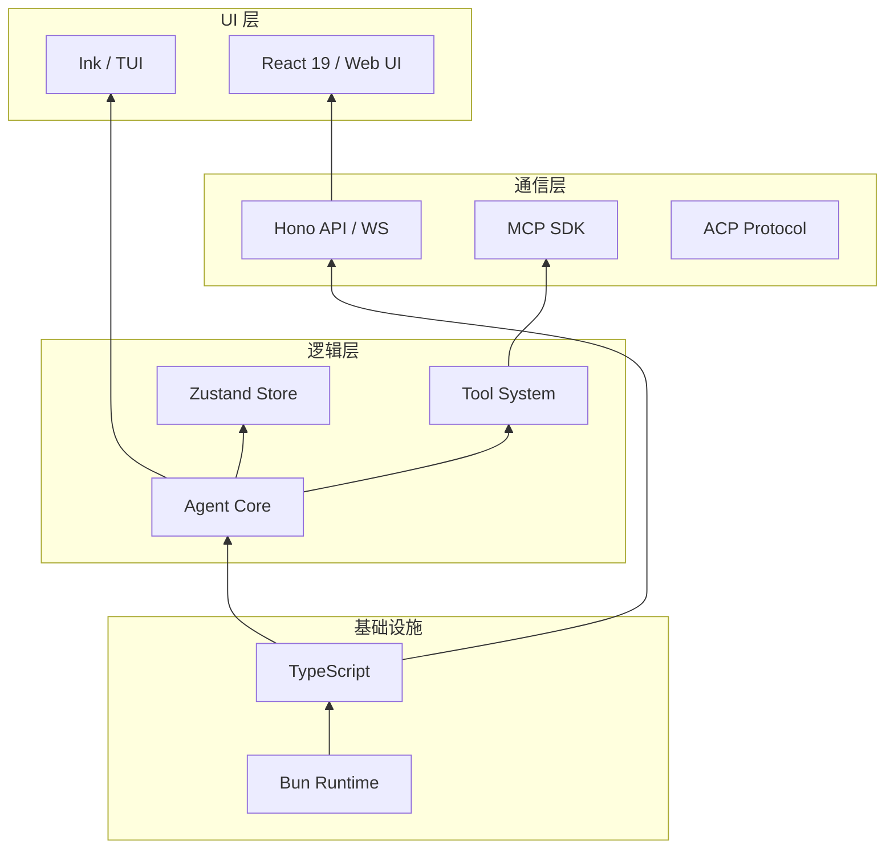
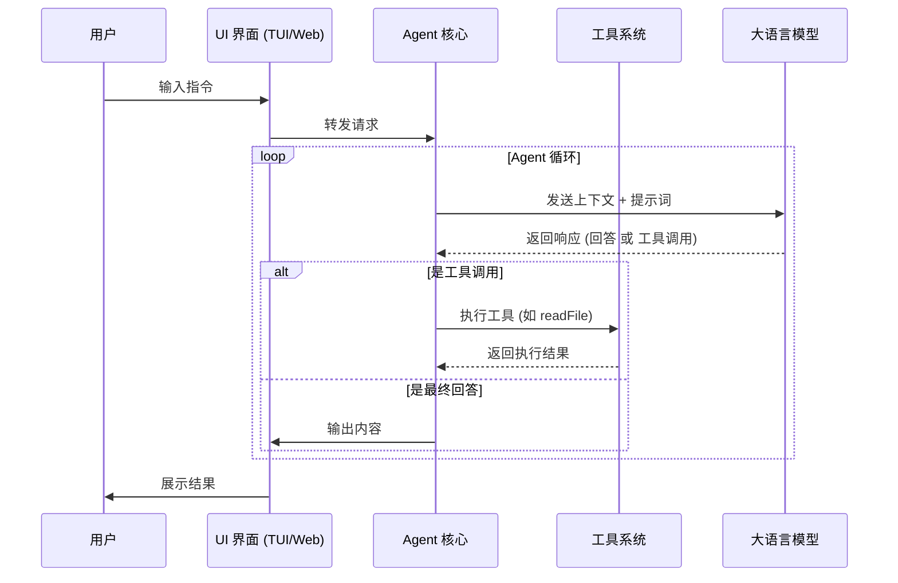
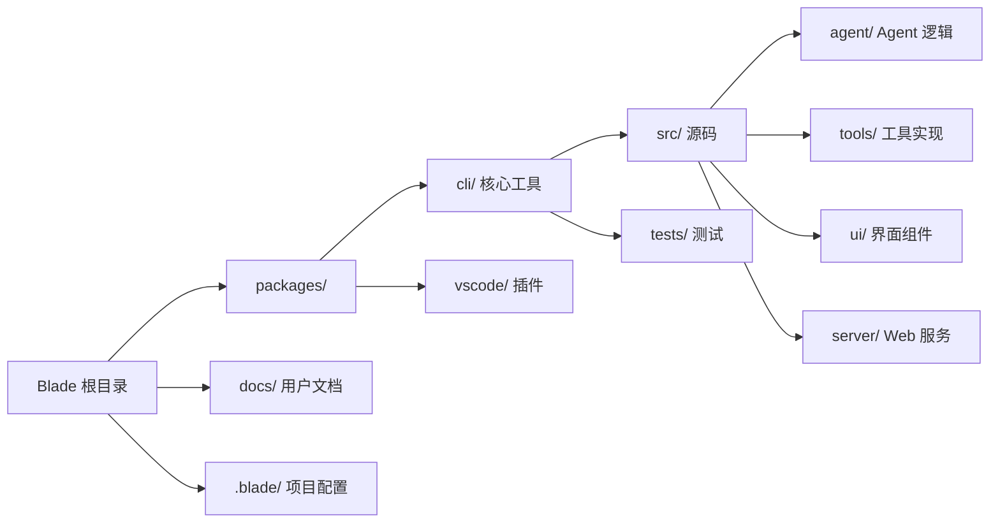

# 项目概览与技术架构简介

## 目录
1. [模块概览](#模块概览)
2. [项目背景与愿景](#项目背景与愿景)
3. [核心功能特性](#核心功能特性)
4. [技术栈选型解析](#技术栈选型解析)
5. [系统架构概览](#系统架构概览)
6. [仓库目录结构导航](#仓库目录结构导航)
7. [核心组件说明](#核心组件说明)
8. [文件参考](#文件参考)

## 模块概览

本章节作为 Blade 项目维基的入口，旨在提供项目的全景视图。Blade 是一个复杂的多模态 AI 编程助手，其代码库涵盖了从底层 Agent 运行时到上层 TUI/Web UI 的完整链路。

在对 `/packages/cli` 目录的初步扫描中，我们发现了以下关键指标：
- **文件总数**：核心源码目录下约有 100+ 个 TypeScript/TSX 文件。
- **子模块分布**：
  - `agent/`：Agent 核心逻辑与循环控制。
  - `tools/`：内置工具集与执行管道。
  - `ui/`：基于 React + Ink 的终端界面组件。
  - `server/`：基于 Hono 的 Web 服务器。
  - `mcp/`：Model Context Protocol 实现。
  - `spec/` & `prompts/`：结构化工作流与提示词工程。

本章节将重点介绍项目的宏观设计与技术选型，而具体的实现细节将在后续章节中深入探讨。

## 项目背景与愿景

Blade Code（简称 Blade）被定位为**新一代 AI 编程助手**。在 AI 辅助开发工具（如 GitHub Copilot, Cursor, Claude Dev 等）百花齐放的背景下，Blade 的核心目标是提供一个**高度可定制、安全透明且具备结构化协作能力**的开源解决方案。

### 核心定位
Blade 不仅仅是一个简单的对话框，它是一个具备“手”和“眼”的智能代理（Agent）。它能够感知项目上下文，执行 Shell 命令，读写文件，甚至通过 MCP 协议与外部服务（如 GitHub, Google Search）交互。

### 愿景目标
1. **深度集成工作流**：通过 Spec 和 Plan 模式，将复杂的开发任务拆解为可跟踪的状态流，而非单一的对话。
2. **跨平台一致性**：无论是在终端（TUI）还是浏览器（Web UI），提供一致的智能体验。
3. **安全第一**：引入多级权限模式（yolo/plan/autoEdit），确保 AI 的每一个高危操作都处于人类的监督之下。
4. **可扩展性**：通过 Skills 系统和插件机制，开发者可以轻松为 Blade 增加特定领域的专业能力。

## 核心功能特性

Blade 的强大源于其精心设计的功能矩阵，这些特性共同构成了一个闭环的 AI 开发环境。

### 1. 双模交互界面
Blade 提供了两种截然不同的用户体验：
- **CLI (TUI)**：基于 React + Ink 构建，适合习惯于终端操作的开发者，提供沉浸式的命令行交互。
- **Web UI**：基于 React 19 构建，提供更丰富的可视化展示，如 Diff 预览、多窗口布局等。

| 特性 | CLI (TUI) | Web UI |
| :--- | :--- | :--- |
| **渲染引擎** | Ink (Terminal) | Vite + React |
| **交互方式** | 键盘驱动 / Slash 命令 | 鼠标 + 键盘 / 拖拽 |
| **适用场景** | 快速开发、远程 SSH、CI/CD | 复杂重构、代码审查、配置管理 |
| **性能** | 极低延迟，轻量级 | 资源占用略高，展示能力强 |

### 2. 结构化工作流 (Spec / Plan)
Blade 引入了“模式”的概念来处理不同复杂度的任务：
- **Plan 模式**：在执行前先生成计划，用户确认后再分步执行。这是一种“先思考，后行动”的模式。
- **Spec 模式**：基于文档驱动的开发。Blade 会根据需求生成技术方案（Spec），并将其拆解为具体的任务清单（Tasks）。

### 3. 扩展体系 (MCP & Skills)
- **MCP (Model Context Protocol)**：支持接入任何兼容 MCP 协议的服务器，即刻获得数以百计的外部工具能力。
- **Skills**：项目特定的“技能包”，可以包含自定义的提示词、脚本和工具，存储在 `.blade/skills` 目录下。

## 技术栈选型解析

Blade 的技术栈选型体现了对开发效率和现代运行时特性的追求。

### 核心技术矩阵
- **运行时 (Runtime)**：**Bun**。选择 Bun 是因为其极快的启动速度、内置的 TypeScript 支持以及优秀的包管理性能。虽然生产环境支持 Node.js，但开发流程完全围绕 Bun 构建。
- **语言**：**TypeScript**。全量使用 TS，利用其严格的类型系统确保 Agent 逻辑的健壮性。
- **UI 框架**：**React 19**。这是 Blade 的一大特色——在终端中使用 React。通过 **Ink** 库，Blade 将 React 的组件化思想带入了命令行界面。
- **Web 服务器**：**Hono**。一个轻量级、高性能的 Web 框架，负责驱动 Web UI 的 API 和 WebSocket 通信。
- **状态管理**：**Zustand**。用于处理跨组件的复杂状态，如会话历史、配置信息和 Agent 运行状态。

以下图表展示了 Blade 的核心技术层级：



该架构图展示了 Blade 如何从底层的 Bun 运行时向上构建。逻辑层是整个系统的核心，它通过 Zustand 进行状态同步，并同时驱动 TUI 和 Web UI 两个展示层。通信层则负责与外部协议（如 MCP）和前端（通过 Hono）进行数据交换。

### 代码示例 1：核心依赖项 (package.json)
从 `package.json` 中可以看到 Blade 使用了现代 AI 开发的核心库，包括 Vercel AI SDK 和 MCP SDK。

```json
// packages/cli/package.json
{
  "dependencies": {
    "react": "^19.1.1",
    "ink": "npm:@jrichman/ink@6.4.10",
    "ai": "^6.0.39",
    "@ai-sdk/openai": "^3.0.26",
    "@modelcontextprotocol/sdk": "^1.17.4",
    "hono": "^4.7.10",
    "zustand": "^5.0.9",
    "zod": "^3.24.2"
  }
}
```

## 系统架构概览

Blade 的架构遵循“核心轻量化，功能插件化”的原则。

### Agent 循环 (Agent Loop)
Blade 的核心是一个无状态的 Agent 循环。每一次用户输入都会触发一个循环，Agent 根据当前的上下文（Context）决定是直接回答，还是调用工具（Tool Use）。



在这个序列中，`Agent` 充当了协调者的角色。它不断地在 `LLM` 和 `Tools` 之间进行迭代，直到任务完成或需要用户干预。这种设计保证了 Blade 能够处理复杂的、需要多步操作的任务。

## 仓库目录结构导航

Blade 采用 **Bun Workspace Monorepo** 结构，方便管理 CLI 和可能的其他包（如 VSCode 插件）。



### 关键目录功能说明
- **`packages/cli/src/agent/`**：包含 Agent 的状态机实现、子代理管理（Subagents）以及会话持久化逻辑。
- **`packages/cli/src/tools/`**：这是 Blade 的“武器库”，包含了文件操作、代码搜索、Shell 执行等内置工具。
- **`packages/cli/src/ui/`**：存放所有的 React 组件。你会发现这里既有用于终端渲染的 Ink 组件，也有处理 Web 交互的逻辑。
- **`packages/cli/src/server/`**：定义了 Hono 路由，处理来自 Web UI 的请求，并管理 WebSocket 连接以实现实时流式输出。

## 核心组件说明

在深入代码之前，了解以下核心类和接口至关重要。

### 1. `BladeAgent` (入口组件)
位于 `packages/cli/src/agent/Agent.ts`，它是整个系统的指挥官，负责初始化模型连接、加载工具并启动执行循环。

### 2. `ExecutionPipeline` (执行管道)
位于 `packages/cli/src/tools/execution/ExecutionPipeline.ts`，负责工具执行的生命周期管理，包括权限校验、验证阶段和并发调度。

### 3. 工具工厂 (`createTool`)
Blade 使用统一的工厂函数来定义工具。每个工具都必须通过 Zod 定义其参数 Schema，这确保了 LLM 调用时的参数准确性。

#### 代码示例 2：工具定义模式
```typescript
// packages/cli/src/tools/core/createTool.ts (简化)
export function createTool<TSchema extends z.ZodSchema>(
  config: ToolConfig<TSchema, z.infer<TSchema>>
): Tool<z.infer<TSchema>> {
  return {
    name: config.name,
    kind: config.kind,
    getFunctionDeclaration() {
      const jsonSchema = zodToFunctionSchema(config.schema);
      return {
        name: config.name,
        description: config.description.short,
        parameters: jsonSchema,
      };
    },
    async execute(params, signal, context) {
      // 执行逻辑...
    }
  };
}
```

### 4. 提示词工程 (Prompts)
Blade 的提示词系统是模块化的。它根据当前的模式（如 Plan 模式或 Spec 模式）动态组装系统提示词。

#### 代码示例 3：Plan 模式提示词
```typescript
// packages/cli/src/prompts/default.ts (片段)
export const PLAN_MODE_SYSTEM_PROMPT = `You are in **PLAN MODE** - a read-only research phase for designing implementation plans.

## Core Objective
Research the codebase thoroughly, then create a detailed implementation plan. No file modifications allowed until plan is approved.

## Key Constraints
1. **Read-only tools only**: File readers, search tools, web fetchers...
2. **Write tools prohibited**: File editors, shell commands...
`;
```

### 5. CLI 启动逻辑
`blade.tsx` 是 CLI 的总入口，它负责解析参数并决定启动哪种 UI 模式。

#### 代码示例 4：CLI 入口分发
```typescript
// packages/cli/src/blade.tsx (简化)
export async function main() {
  // 初始化环境
  const detectedRoot = findProjectRoot(process.cwd());
  setCwd(detectedRoot);

  // 模式分发
  if (hasFlag(rawArgs, '--headless')) {
    const { handleHeadlessMode } = await import('./commands/headless.js');
    await handleHeadlessMode();
    return;
  }

  if (rawArgs.includes('web')) {
    const { webCommand } = await import('./commands/web.js');
    // 启动 Web 服务器模式
    return;
  }

  // 默认启动 TUI (Ink)
  const { render } = await import('ink');
  const { App } = await import('./ui/App.js');
  render(<App />);
}
```

## 文件参考

以下是本章节涉及的核心源文件，建议在阅读完概览后优先查阅：

**项目声明与愿景**:
- [README.md](file:///Users/bytedance/Documents/GitHub/Blade/README.md) - 项目主页与特性介绍
- [BLADE.md](file:///Users/bytedance/Documents/GitHub/Blade/BLADE.md) - 技术栈与架构简述

**核心元数据**:
- [packages/cli/package.json](file:///Users/bytedance/Documents/GitHub/Blade/packages/cli/package.json) - 依赖项与技术栈定义
- [packages/cli/README.md](file:///Users/bytedance/Documents/GitHub/Blade/packages/cli/README.md) - CLI 包说明

**关键入口点**:
- [packages/cli/src/blade.tsx](file:///Users/bytedance/Documents/GitHub/Blade/packages/cli/src/blade.tsx) - 命令行入口逻辑
- [packages/cli/src/ui/App.tsx](file:///Users/bytedance/Documents/GitHub/Blade/packages/cli/src/ui/App.tsx) - TUI 根组件
- [packages/cli/src/agent/Agent.ts](file:///Users/bytedance/Documents/GitHub/Blade/packages/cli/src/agent/Agent.ts) - Agent 核心类
- [packages/cli/src/tools/core/createTool.ts](file:///Users/bytedance/Documents/GitHub/Blade/packages/cli/src/tools/core/createTool.ts) - 工具工厂

**Section sources**:
- [README.md](file:///Users/bytedance/Documents/GitHub/Blade/README.md)
- [BLADE.md](file:///Users/bytedance/Documents/GitHub/Blade/BLADE.md)
- [packages/cli/package.json](file:///Users/bytedance/Documents/GitHub/Blade/packages/cli/package.json)
- [packages/cli/src/blade.tsx](file:///Users/bytedance/Documents/GitHub/Blade/packages/cli/src/blade.tsx)
- [packages/cli/src/prompts/default.ts](file:///Users/bytedance/Documents/GitHub/Blade/packages/cli/src/prompts/default.ts)
