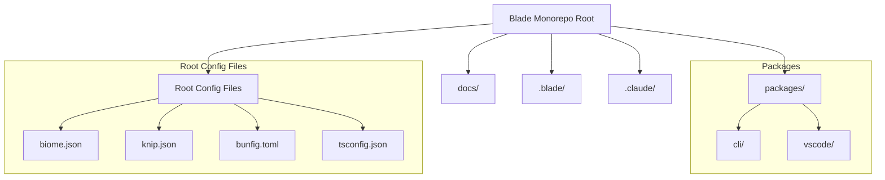
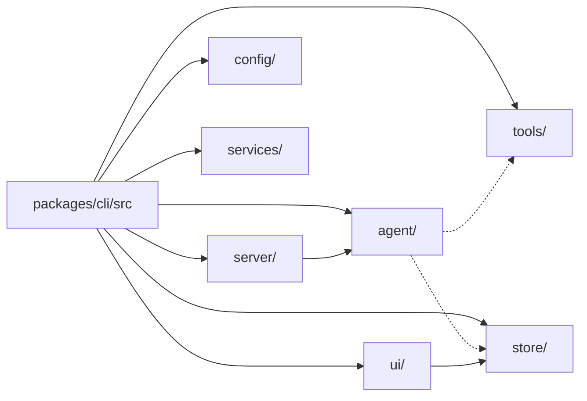
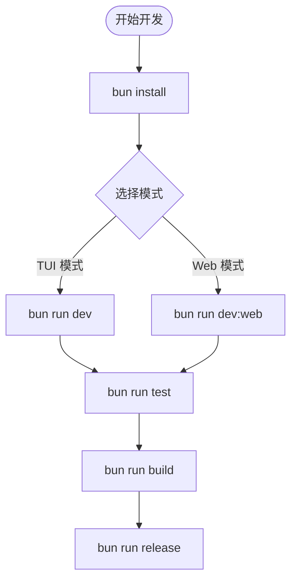

# 仓库结构说明

## 目录
1. [模块概览](#模块概览)
2. [引言](#引言)
3. [Monorepo 根目录与全局配置](#monorepo-根目录与全局配置)
4. [核心包：packages/cli 深度解析](#核心包packagescli-深度解析)
5. [主要功能区域划分](#主要功能区域划分)
   - [Agent 运行循环与执行引擎](#agent-运行循环与执行引擎)
   - [内置工具集 (Tools) 与执行流水线](#内置工具集-tools-与执行流水线)
   - [用户界面 (UI) 与 Ink 架构](#用户界面-ui-与-ink-架构)
   - [后端服务 (Server) 与 Hono 路由](#后端服务-server-与-hono-路由)
   - [配置管理与权限校验](#配置管理与权限校验)
   - [全局状态管理 (Store)](#全局状态管理-store)
6. [扩展性与自定义：.blade 与 .claude](#扩展性与自定义blade-与-claude)
7. [开发工作流与脚本命令](#开发工作流与脚本命令)
8. [文档系统](#文档系统)
9. [核心文件引用](#核心文件引用)

## 模块概览

在深入探讨 Blade 的代码库之前，了解其整体规模和模块分布至关重要。Blade 采用 Monorepo 架构，旨在将核心逻辑、用户界面和各种扩展插件整合在一个统一的仓库中，以便于版本管理和跨模块协作。

通过对仓库的初步扫描，我们识别出以下核心指标：

- **总文件数**：约 450+ 个源文件（主要为 TypeScript 和 TSX）。
- **核心包**：`packages/cli` 是整个项目的重心，承载了 80% 以上的业务逻辑。
- **子目录分布**：
    - `packages/cli/src/agent`: Agent 核心逻辑（覆盖深度：高）
    - `packages/cli/src/tools`: 内置工具集（覆盖深度：高）
    - `packages/cli/src/ui`: TUI 与 Web UI 组件（覆盖深度：高）
    - `packages/cli/src/server`: 后端 API 路由（覆盖深度：中）
    - `packages/cli/src/config`: 配置与安全（覆盖深度：中）
    - `packages/cli/src/context`: 上下文管理（覆盖深度：中）
    - `packages/cli/src/hooks`: 钩子系统（覆盖深度：低）
    - `packages/cli/src/mcp`: MCP 协议集成（覆盖深度：低）
    - `docs/`: 基于 Docsify 的文档系统（覆盖深度：低）

本页面将重点解析 `packages/cli/src` 内部的模块划分逻辑，并指导开发者如何在复杂的目录树中快速定位目标代码。

## 引言

Blade 是一个基于 AI 驱动的编程助手，其核心设计目标是提供一个高度可扩展、安全且响应迅速的开发环境。为了实现这一目标，Blade 采用了 Monorepo（单仓）结构。这种结构允许我们将 CLI 工具、Web UI、VSCode 插件（未来规划）以及各种内置工具集放在同一个仓库中，共享类型定义、配置和工具函数。

Blade 的架构不仅仅是代码的堆砌，它反映了“Agent-First”的设计理念。每一层目录都对应着 Agent 能力的一个维度：从最底层的工具执行（Tools），到中间层的运行循环（Agent Loop），再到最顶层的交互界面（UI）。通过这种清晰的分层，开发者可以像拼积木一样为 Blade 增加新的能力，而无需担心破坏核心系统的稳定性。

## Monorepo 根目录与全局配置

Monorepo 的根目录是整个项目的“控制中心”，包含了所有子包共享的元数据、构建工具配置和全局约束。Blade 选择了现代化的工具链，以确保在处理数以百计的文件时依然保持极速。

下图展示了 Blade 仓库的顶层结构及其相互关系：

**图表说明**：此图展示了 Monorepo 的层级结构。根目录通过 `packages/` 目录管理多个子项目，同时通过各种 `.json` 和 `.toml` 文件定义全局的开发标准。这种结构确保了即使项目规模扩大，代码风格和依赖管理也能保持一致。

### 关键配置文件解析

1.  **`package.json`**: 定义了 Monorepo 的工作区（Workspaces）和全局脚本。Blade 使用 Bun 作为包管理器，通过 `workspaces` 字段将 `packages/*` 纳入管理。根目录的脚本通常是跨包的（如 `build:all`），而具体的业务逻辑脚本则留在各自的子包中。
2.  **`biome.json`**: Blade 放弃了传统的 ESLint 和 Prettier 组合，转而使用 Biome 进行代码格式化和静态分析。Biome 的 Rust 实现提供了极快的处理速度，这在 Monorepo 这种文件密集的场景下尤为重要。
3.  **`knip.json`**: 随着项目演进，Monorepo 容易产生“僵尸代码”。Knip 帮助我们识别未使用的文件、过时的依赖以及没有外部引用的导出，保持仓库的精简。
4.  **`bunfig.toml`**: 配置 Bun 运行时的行为，例如包下载设置、环境变量注入以及对 `node_modules` 的处理策略。

**Section sources**:
- [package.json](file:///Users/bytedance/Documents/GitHub/Blade/package.json)
- [biome.json](file:///Users/bytedance/Documents/GitHub/Blade/biome.json)
- [knip.json](file:///Users/bytedance/Documents/GitHub/Blade/knip.json)

## 核心包：packages/cli 深度解析

`packages/cli` 是 Blade 的灵魂。它不仅是一个命令行界面，更是一个完整的 Agent 执行引擎。其内部的 `src` 目录按照功能领域进行了严密的划分，体现了高度的模块化。

**图表说明**：此图描绘了 `packages/cli/src` 内部核心模块的依赖关系。`agent` 模块是中心枢纽，它调用 `tools` 执行任务，并与 `store` 同步状态。`ui` 模块则通过订阅 `store` 来渲染界面。这种“单向数据流”架构（Redux）确保了界面状态与 Agent 内部状态的严格同步。

### 模块划分逻辑

Blade 遵循 **“领域驱动”** 的划分原则：
- **核心逻辑层** (`agent/`, `context/`, `prompts/`)：负责 AI 的思考、记忆和提示词构建。这里是算法和策略的所在地。
- **能力输出层** (`tools/`, `skills/`, `slash-commands/`)：负责将 AI 的意图转化为实际的操作。这部分代码直接与文件系统、网络或 Shell 交互。
- **表现层** (`ui/`, `server/`)：负责与用户或外部系统进行交互。Blade 同时支持 TUI 和 Web 两种展示形式。
- **基础设施层** (`config/`, `services/`, `store/`, `logging/`)：提供底层的支撑能力，如配置读取、文件操作、状态管理和日志记录。

**Section sources**:
- [packages/cli/src/index.ts](file:///Users/bytedance/Documents/GitHub/Blade/packages/cli/src/index.ts)
- [packages/cli/package.json](file:///Users/bytedance/Documents/GitHub/Blade/packages/cli/package.json)

## 主要功能区域划分

### Agent 运行循环与执行引擎

`agent/` 目录包含了 Blade 最核心的“大脑”逻辑。其中 `loop/` 子目录定义了 Agent 的思考-行动循环（Reasoning Loop）。

- **`executeLoopGenerator.ts`**: 这是 Agent 运行的主入口，采用异步生成器（Async Generator）模式。它逐步产出 Agent 的状态变化（如“正在思考”、“正在调用工具”、“收到结果”），这种模式允许 UI 实时地流式展示 Agent 的心路历程。
- **`consumeLoop.ts`**: 负责消费生成器产出的事件。它不仅要将事件推送到 UI，还要处理循环的终止条件和错误恢复。
- **`ExecutionEngine.ts`**: 协调者。它负责选择合适的模型、构建上下文、调用工具并对结果进行初步验证。

> 💡 **提示**：如果你想了解 Blade 是如何处理 AI 响应并决定下一步行动的，请从 `packages/cli/src/agent/loop/index.ts` 开始阅读。

### 内置工具集 (Tools) 与执行流水线

`tools/` 目录定义了 Agent 可以使用的“手脚”。Blade 对工具的管理非常严谨，不仅有丰富的内置工具，还有一套完整的执行框架。

- **`builtin/`**: 包含文件操作 (`file/`)、Shell 执行 (`shell/`)、搜索 (`search/`)、任务管理 (`task/`) 等。
- **`execution/PipelineStages.ts`**: 工具执行不是简单的函数调用，而是一个经过多个“阶段”的流水线。包括：
    - **验证阶段** (Validation)：检查参数是否符合 Zod Schema。
    - **权限阶段** (Permission)：根据用户配置判断工具是否被允许运行。
    - **执行阶段** (Execution)：实际运行逻辑。
    - **验证结果阶段** (AutoVerify)：检查执行结果是否达到了预期目标。

### 用户界面 (UI) 与 Ink 架构

Blade 提供了独特的 TUI（终端用户界面）体验，基于 React 和 Ink 构建。Ink 允许我们像写网页一样使用 React 组件来构建终端界面。

- **`ui/components/`**: 包含大量的 UI 组件。例如 `BladeInterface.tsx` 是整个界面的容器，而 `ThinkingBlock.tsx` 专门负责展示 Agent 复杂的思考链路。
- **`ui/hooks/`**: 提供了一系列处理终端特有逻辑的 Hook，如 `useTerminalWidth`（响应式布局）和 `useInputBuffer`（处理复杂的键盘快捷键）。
- **`blade.tsx`**: TUI 的启动入口。它使用 `ink.render()` 将 React 树挂载到终端的 stdout 上。

### 后端服务 (Server) 与 Hono 路由

为了支持 Web UI 和远程调用，Blade 内置了一个基于 Hono 的高性能后端。Hono 的轻量级特性使其非常适合嵌入到 CLI 工具中。

- **`server/server.ts`**: 服务器的启动配置。它整合了中间件（如 CORS、日志）并挂载路由。
- **`server/routes/`**: 采用模块化路由。例如 `session.ts` 处理会话的创建与恢复，`models.ts` 返回可用的模型列表。
- **`bus.ts`**: 事件总线。它作为 Agent 循环和 Web 客户端之间的桥梁，通过 WebSocket 或 SSE 将实时事件推送到前端。

### 配置管理与权限校验

安全性是 Blade 的重中之重。`config/` 目录不仅管理用户偏好，还负责严格的权限控制。

- **`ConfigManager.ts`**: 负责配置的持久化。它会读取 `~/.blade/config.json` 并将其合并到全局状态中。
- **`PermissionChecker.ts`**: 这是 Blade 的“守门员”。每当 Agent 尝试执行敏感操作（如删除文件或执行 Shell 命令）时，它都会根据当前的权限策略（如“始终允许”、“每次询问”、“禁止”）做出裁决。

### 全局状态管理 (Store)

Blade 使用 Redux Toolkit 管理整个应用的复杂状态。

- **`store/slices/`**: 将状态划分为多个切片，如 `sessionSlice`（管理对话历史）、`configSlice`（管理配置）、`appSlice`（管理 UI 状态）。
- **`store/selectors/`**: 提供高效的状态查询方法，确保 UI 只在必要时重新渲染。

**Section sources**:
- [packages/cli/src/agent/loop/index.ts](file:///Users/bytedance/Documents/GitHub/Blade/packages/cli/src/agent/loop/index.ts)
- [packages/cli/src/tools/builtin/index.ts](file:///Users/bytedance/Documents/GitHub/Blade/packages/cli/src/tools/builtin/index.ts)
- [packages/cli/src/ui/components/BladeInterface.tsx](file:///Users/bytedance/Documents/GitHub/Blade/packages/cli/src/ui/components/BladeInterface.tsx)
- [packages/cli/src/server/server.ts](file:///Users/bytedance/Documents/GitHub/Blade/packages/cli/src/server/server.ts)
- [packages/cli/src/config/PermissionChecker.ts](file:///Users/bytedance/Documents/GitHub/Blade/packages/cli/src/config/PermissionChecker.ts)
- [packages/cli/src/store/index.ts](file:///Users/bytedance/Documents/GitHub/Blade/packages/cli/src/store/index.ts)

## 扩展性与自定义：.blade 与 .claude

除了核心代码库，Blade 还预留了两个重要的目录供用户和开发者进行自定义扩展。这种设计实现了“核心稳定，周边活跃”。

1.  **`.blade/`**: 用户的“私人定制”空间。
    - **`skills/`**: 存放用户自定义的 Skill。每个 Skill 都是一个独立的文件夹，包含逻辑脚本和元数据。Agent 可以像调用内置工具一样调用这些 Skill。
    - **`commands/`**: 存放自定义的斜杠命令（Slash Commands）。通过 Markdown 模板，用户可以定义复杂的 Agent 任务流，例如“一键生成 PR 说明”。
2.  **`.claude/`**: Agent 的“灵魂仓库”。
    - **`agents/`**: 存放 Agent 的角色定义（System Prompts）。Blade 预置了数十种专业角色（如 `architect-review.md`, `python-pro.md`）。这些文件直接决定了 Agent 的专业知识背景和对话风格。

## 开发工作流与脚本命令

Blade 充分利用了 Bun 的性能优势，在根目录的 `package.json` 中定义了一系列便捷的开发脚本。这些脚本隐藏了复杂的构建细节，让开发者专注于代码逻辑。

**图表说明**：此流程图展示了从安装依赖到发布版本的完整开发生命周期。重点在于 `dev` 脚本的两种变体，分别对应 TUI 和 Web UI 的开发环境。

### 常用命令深度解析

| 命令 | 描述 | 内部逻辑 |
| :--- | :--- | :--- |
| `bun run dev` | 启动 CLI 开发模式 | 进入 `packages/cli` 并使用 `bun --hot` 启动，支持热重载。 |
| `bun run build` | 构建整个项目 | 调用 `esbuild` 编译 TypeScript，并处理 CSS 和静态资产。 |
| `bun run test` | 运行单元测试 | 使用 Vitest 并行执行测试。支持 `--coverage` 生成覆盖率报告。 |
| `bun run lint` | 代码风格检查 | 调用 Biome 进行全量扫描。速度比传统工具快 10 倍以上。 |
| `bun run check:fix` | 自动修复代码问题 | 自动应用 Biome 的修复建议，包括代码格式和简单的逻辑错误。 |

**Section sources**:
- [package.json:L11-L44](file:///Users/bytedance/Documents/GitHub/Blade/package.json#L11-L44)

## 文档系统

Blade 的文档存放在 `docs/` 目录下，采用 Docsify 框架。这意味着文档本身就是 Markdown 文件，且无需预编译即可在浏览器中展示。

- **`docs/README.md`**: 文档主页，通常包含项目的愿景和快速导航。
- **`docs/_sidebar.md`**: 核心配置文件，定义了文档的层级结构和侧边栏链接。
- **目录结构**：
    - `getting-started/`: 包含安装环境要求、快速启动步骤。
    - `guides/`: 针对高级特性的专题教程，如“如何编写自定义 Skill”。
    - `configuration/`: 详细列出了所有可用的配置项及其含义。
    - `reference/`: 为资深用户准备的 API 和命令参考手册。

## 核心文件引用

以下是探索 Blade 仓库结构时推荐优先阅读的关键文件，它们是理解系统运作的“地图点”：

- **项目入口**: [packages/cli/src/blade.tsx](file:///Users/bytedance/Documents/GitHub/Blade/packages/cli/src/blade.tsx) —— 了解 TUI 是如何启动的。
- **Agent 循环**: [packages/cli/src/agent/loop/executeLoopGenerator.ts](file:///Users/bytedance/Documents/GitHub/Blade/packages/cli/src/agent/loop/executeLoopGenerator.ts) —— 深入 Agent 的思考核心。
- **工具注册**: [packages/cli/src/tools/registry/ToolRegistry.ts](file:///Users/bytedance/Documents/GitHub/Blade/packages/cli/src/tools/registry/ToolRegistry.ts) —— 了解如何扩展 Agent 的能力。
- **主界面组件**: [packages/cli/src/ui/components/BladeInterface.tsx](file:///Users/bytedance/Documents/GitHub/Blade/packages/cli/src/ui/components/BladeInterface.tsx) —— 掌握 TUI 的布局逻辑。
- **配置管理**: [packages/cli/src/config/ConfigManager.ts](file:///Users/bytedance/Documents/GitHub/Blade/packages/cli/src/config/ConfigManager.ts) —— 学习 Blade 如何处理持久化设置。
- **根配置**: [package.json](file:///Users/bytedance/Documents/GitHub/Blade/package.json) —— 宏观把握 Monorepo 的组织方式。
