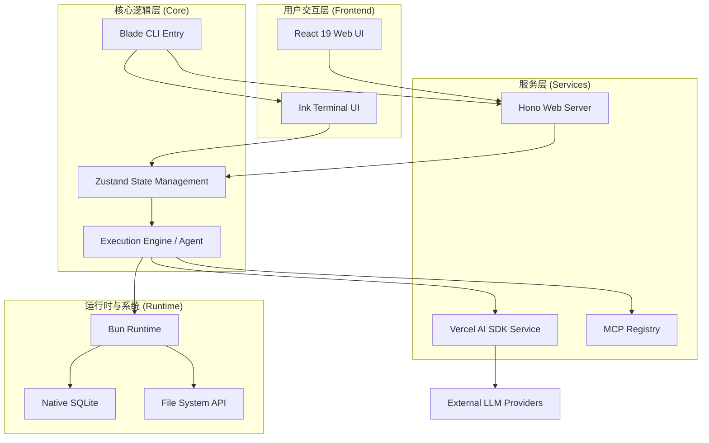
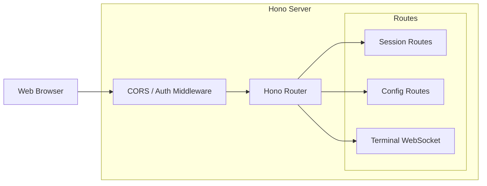
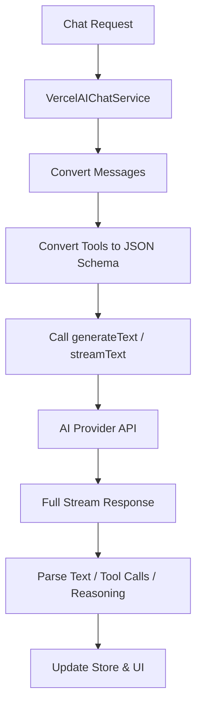
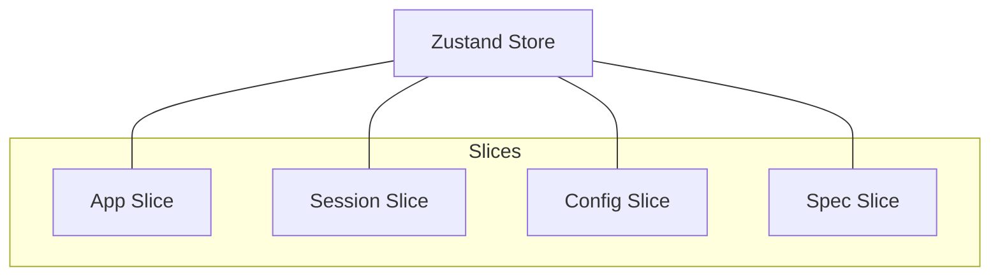

# 技术栈解析

## 目录
1. [模块概览](#模块概览)
2. [引言](#引言)
3. [技术架构概览](#技术架构概览)
4. [语言与运行时：TypeScript & Bun](#语言与运行时typescript--bun)
5. [终端 UI 框架：Ink & React](#终端-ui-框架ink--react)
6. [Web 架构：Hono & React 19](#web-架构hono--react-19)
7. [AI 集成层：Vercel AI SDK](#ai-集成层vercel-ai-sdk)
8. [状态管理：Zustand](#状态管理zustand)
9. [核心组件解析](#核心组件解析)
10. [性能考量与原生优化](#性能考量与原生优化)
11. [文件引用](#文件引用)

## 模块概览

本页面对 Blade 项目的核心技术栈进行了深度解析。Blade 作为一个高性能、可扩展的智能代码助手，其技术选型直接决定了其在复杂开发环境下的表现。

在对 `packages/cli/src` 目录的探索中，我们发现了超过 250 个源码文件，涵盖了从底层运行时到顶层 UI 的完整链路。以下是主要子模块的分布情况：

- **核心架构层**: `agent/`, `acp/`, `context/` (约 60 个文件)
- **UI 与交互层**: `ui/`, `prompts/`, `slash-commands/` (约 80 个文件)
- **服务与集成层**: `services/`, `mcp/`, `plugins/`, `skills/` (约 50 个文件)
- **基础设施层**: `config/`, `store/`, `logging/`, `utils/` (约 40 个文件)
- **工具链集成**: `tools/`, `ide/`, `hooks/` (约 30 个文件)

本页面将重点分析 `blade.tsx` 入口、`server/` 后端架构、`ui/` 终端渲染逻辑以及 `services/VercelAIChatService.ts` 的 AI 集成实现。

## 引言

Blade 的设计目标是提供一个既能深度集成到终端环境，又能通过 Web 界面提供丰富交互体验的 AI 助手。为了实现这一目标，Blade 并没有采用传统的 Node.js 架构，而是选择了以 **Bun** 为核心的现代 JavaScript 运行时。

技术栈的选择遵循以下三个原则：
1.  **极致性能**: 毫秒级的启动速度和极低的内存占用。
2.  **开发效率**: 利用 TypeScript 的强类型检查和 React 的声明式 UI 提升维护性。
3.  **高度可扩展**: 通过插件化架构和标准的 AI SDK 确保能够快速接入最新的 AI 模型和工具。

通过将 React 渲染到终端（Ink）以及在后端使用轻量级的 Hono 框架，Blade 成功地在 CLI 工具中实现了 Web 级别的交互复杂度，同时保持了命令行工具的简洁与高效。

## 技术架构概览

Blade 的整体架构是一个典型的多模式（Hybrid）结构，支持 TUI（终端用户界面）和 Web UI 两种交互方式。

下列图表展示了 Blade 的核心组件及其交互关系：



在上述架构中，`Bun` 充当了整个系统的底座，提供了高性能的 JS 运行时和原生 API 支持。`Zustand` 作为状态中心，协调 TUI、Web UI 和 Agent 之间的状态同步。`Hono` 则负责将核心功能暴露给 Web 界面，实现了前后端逻辑的高度复用。

**Diagram sources**:
- [blade.tsx](file:///Users/bytedance/Documents/GitHub/Blade/packages/cli/src/blade.tsx)
- [server.ts](file:///Users/bytedance/Documents/GitHub/Blade/packages/cli/src/server/server.ts)
- [App.tsx](file:///Users/bytedance/Documents/GitHub/Blade/packages/cli/src/ui/App.tsx)

## 语言与运行时：TypeScript & Bun

Blade 全面采用 **TypeScript** 编写，并选择了 **Bun** 作为主要的运行时和构建工具。

### 为什么选择 Bun？
1.  **原生 TypeScript 支持**: Bun 无需复杂的转译配置（如 ts-node 或 esbuild），可以直接运行 `.ts` 和 `.tsx` 文件，这极大地简化了开发和调试流程。
2.  **极速启动**: 对于 CLI 工具来说，启动时间至关重要。Bun 的冷启动速度远超 Node.js，使得 `blade` 命令能够即时响应。
3.  **单文件打包**: Blade 利用 `bun build` 的原生能力，可以将复杂的 Monorepo 依赖打包成单个可执行文件，方便分发。
4.  **内置 API**: Blade 深度利用了 Bun 的原生 API，如 `Bun.serve` 处理 Web 服务，`Bun.sql` 处理本地 SQLite 存储，以及高性能的文件系统操作。

### 运行时切换逻辑
虽然 Blade 针对 Bun 进行了优化，但它也保留了对 Node.js 的兼容性支持。在 `server.ts` 中，系统会根据当前环境自动选择启动方式：

```typescript
// server.ts 中的运行时检测与启动
function isBunRuntime(): boolean {
  return typeof (globalThis as Record<string, unknown>).Bun !== 'undefined';
}

export function listen(opts: ServerOptions): ServerHandle {
  if (isBunRuntime()) {
    // 使用 Bun.serve 启动，享受极致性能
    return startWithBun(getApp(), opts);
  } else {
    // 降级到 Node.js 运行，确保兼容性
    throw new Error('Blade web server requires Bun runtime...');
  }
}
```

**Section sources**:
- [package.json](file:///Users/bytedance/Documents/GitHub/Blade/packages/cli/package.json)
- [server.ts](file:///Users/bytedance/Documents/GitHub/Blade/packages/cli/src/server/server.ts)

## 终端 UI 框架：Ink & React

Blade 的命令行界面并非传统的字符串拼接，而是基于 **Ink** 框架构建的响应式 UI。

### Ink 的角色
Ink 将 React 的组件化模型引入了终端开发。它允许开发者使用 JSX 语法定义终端界面，并将 React 的状态管理（useState, useEffect）应用于命令行输出。

下列序列图描述了从 CLI 启动到 TUI 渲染的过程：

```mermaid
sequenceDiagram
    participant User
    participant CLI as blade.tsx
    participant React as React 19
    participant Ink as Ink Renderer
    participant App as App.tsx

    User->>CLI: 执行 blade 命令
    CLI->>CLI: 解析参数 & 初始化环境
    CLI->>React: createElement(AppWrapper, props)
    CLI->>Ink: render(App)
    Ink->>App: 挂载组件
    App->>App: 初始化 Store, Hooks, Skills
    App->>User: 渲染交互式终端界面
```



### 响应式渲染
通过 Ink，Blade 实现了复杂的终端交互，如：
- **动态布局**: 使用 `Flexbox`（基于 Yoga 引擎）实现终端内的自适应布局。
- **实时更新**: 当 AI 正在生成回复时，UI 会根据流式数据实时重绘，无需手动清除屏幕。
- **丰富的交互组件**: 使用了 `@inkjs/ui` 提供的文本输入、选择列表和加载动画。

**Section sources**:
- [blade.tsx](file:///Users/bytedance/Documents/GitHub/Blade/packages/cli/src/blade.tsx)
- [App.tsx](file:///Users/bytedance/Documents/GitHub/Blade/packages/cli/src/ui/App.tsx)

## Web 架构：Hono & React 19

除了终端模式，Blade 还提供了一个功能完备的 Web 界面。这一部分采用了 **Hono** 后端与 **React 19** 前端的组合。

### Hono：轻量级高性能后端
Hono 是一个为边缘计算设计的 Web 框架，其核心优势在于极小的体积和极快的路由匹配速度。在 Blade 中，Hono 负责：
- **RESTful API**: 提供会话管理、配置修改、文件树访问等接口。
- **WebSocket**: 通过 `/terminal/ws` 提供实时的终端模拟器支持。
- **静态资源托管**: 在生产环境下托管 React 打包后的静态文件。



### React 19 前端
前端部分采用了最新的 React 19，利用其并发渲染和改进的 Hooks API。通过与 Hono 后端的配合，实现了与 TUI 完全同步的交互体验。

**Section sources**:
- [server.ts](file:///Users/bytedance/Documents/GitHub/Blade/packages/cli/src/server/server.ts)
- [package.json](file:///Users/bytedance/Documents/GitHub/Blade/packages/cli/package.json)

## AI 集成层：Vercel AI SDK

Blade 的 AI 能力核心建立在 **Vercel AI SDK**（即 `ai` 包）之上。这使得 Blade 能够以统一的接口支持多种模型提供商。

### 多模型支持
在 `VercelAIChatService.ts` 中，Blade 封装了对 OpenAI、Anthropic、Google (Gemini)、Azure 和 DeepSeek 的支持。

```typescript
// VercelAIChatService.ts 中的模型创建逻辑
private createModel(config: ChatConfig): LanguageModel {
  switch (config.provider) {
    case 'openai': return createOpenAI({...})(config.model);
    case 'anthropic': return createAnthropic({...})(config.model);
    case 'deepseek': return createDeepSeek({...})(config.model);
    // ... 其他提供商
  }
}
```

### 核心功能实现
1.  **流式传输 (Streaming)**: 利用 `streamText` API，Blade 实现了低延迟的打字机输出效果。
2.  **工具调用 (Tool Use)**: 完美集成 AI SDK 的 `tools` 机制，允许模型调用本地文件读写、搜索和 Shell 执行工具。
3.  **推理过程 (Reasoning)**: 特别针对 DeepSeek 等模型支持了 `reasoning_content` 的解析与展示，让用户能看到 AI 的“思考过程”。

下列流程图展示了 AI 请求的处理路径：



**Section sources**:
- [VercelAIChatService.ts](file:///Users/bytedance/Documents/GitHub/Blade/packages/cli/src/services/VercelAIChatService.ts)
- [ChatServiceInterface.ts](file:///Users/bytedance/Documents/GitHub/Blade/packages/cli/src/services/ChatServiceInterface.ts)

## 状态管理：Zustand

在复杂的 Monorepo 项目中，状态管理需要兼顾简洁性与高性能。Blade 选择了 **Zustand**。

### 为什么选择 Zustand？
- **无样板代码**: 相比 Redux，Zustand 的定义非常简洁，适合快速迭代。
- **原生支持 Vanilla JS**: Zustand 不仅能用于 React 组件，还能在普通的 TS 函数中使用（通过 `getState()`），这对于 CLI 逻辑至关重要。
- **切片 (Slices) 模式**: Blade 将状态拆分为多个切片，如 `appSlice`（应用状态）、`sessionSlice`（会话数据）、`configSlice`（配置信息），确保了逻辑的模块化。



**Section sources**:
- [store/index.ts](file:///Users/bytedance/Documents/GitHub/Blade/packages/cli/src/store/index.ts)
- [store/vanilla.ts](file:///Users/bytedance/Documents/GitHub/Blade/packages/cli/src/store/vanilla.ts)

## 核心组件解析

### 1. `blade.tsx` (CLI 入口)
这是整个应用的总入口。它负责：
- 解析命令行参数（使用 `yargs`）。
- 初始化全局 Logger 和优雅退出机制。
- 根据参数决定是启动 TUI、Web Server 还是执行 Headless 任务。

### 2. `server.ts` (Web 服务核心)
基于 Hono 构建的服务器，实现了跨平台的运行时兼容性。它不仅是 Web 界面的后端，也是 Blade 插件系统与外部通信的桥梁。

### 3. `VercelAIChatService.ts` (AI 适配器)
这是 AI 能力的具体实现层。它处理了复杂的模型协议转换，特别是针对不同厂商在流式返回和工具调用格式上的差异进行了平滑处理。

**Section sources**:
- [blade.tsx](file:///Users/bytedance/Documents/GitHub/Blade/packages/cli/src/blade.tsx)
- [server.ts](file:///Users/bytedance/Documents/GitHub/Blade/packages/cli/src/server/server.ts)
- [VercelAIChatService.ts](file:///Users/bytedance/Documents/GitHub/Blade/packages/cli/src/services/VercelAIChatService.ts)

## 性能考量与原生优化

Blade 充分利用了 Bun 的原生能力来提升效率：

1.  **本地存储**: 使用 Bun 原生的 SQLite 支持（`bun:sqlite`）来存储会话历史和配置，相比传统的 JSON 文件存储，读写性能提升了数倍，且支持复杂的 SQL 查询。
2.  **文件系统**: 利用 `Bun.file` 和 `Bun.write` 进行高性能的文件操作，减少了 Node.js 中常见的 Buffer 转换开销。
3.  **并发处理**: 利用 Bun 的高效事件循环处理大量的并发工具调用请求，特别是在执行大规模代码搜索（ripgrep）时。

> **Note**: 虽然 Blade 优先支持 Bun，但在 Node.js 环境下也会自动降级到兼容模式，确保在未安装 Bun 的环境中也能基本运行。

## 文件引用

以下是本页面涉及的核心源码文件：

- [package.json](file:///Users/bytedance/Documents/GitHub/Blade/packages/cli/package.json): 项目依赖与构建脚本
- [blade.tsx](file:///Users/bytedance/Documents/GitHub/Blade/packages/cli/src/blade.tsx): CLI 启动入口
- [server.ts](file:///Users/bytedance/Documents/GitHub/Blade/packages/cli/src/server/server.ts): Hono 服务端实现
- [App.tsx](file:///Users/bytedance/Documents/GitHub/Blade/packages/cli/src/ui/App.tsx): TUI 根组件与初始化逻辑
- [VercelAIChatService.ts](file:///Users/bytedance/Documents/GitHub/Blade/packages/cli/src/services/VercelAIChatService.ts): AI SDK 集成实现
- [store/index.ts](file:///Users/bytedance/Documents/GitHub/Blade/packages/cli/src/store/index.ts): Zustand 状态中心
- [ChatServiceInterface.ts](file:///Users/bytedance/Documents/GitHub/Blade/packages/cli/src/services/ChatServiceInterface.ts): AI 服务接口定义
- [bootstrap/state.ts](file:///Users/bytedance/Documents/GitHub/Blade/packages/cli/src/bootstrap/state.ts): 全局状态初始化
