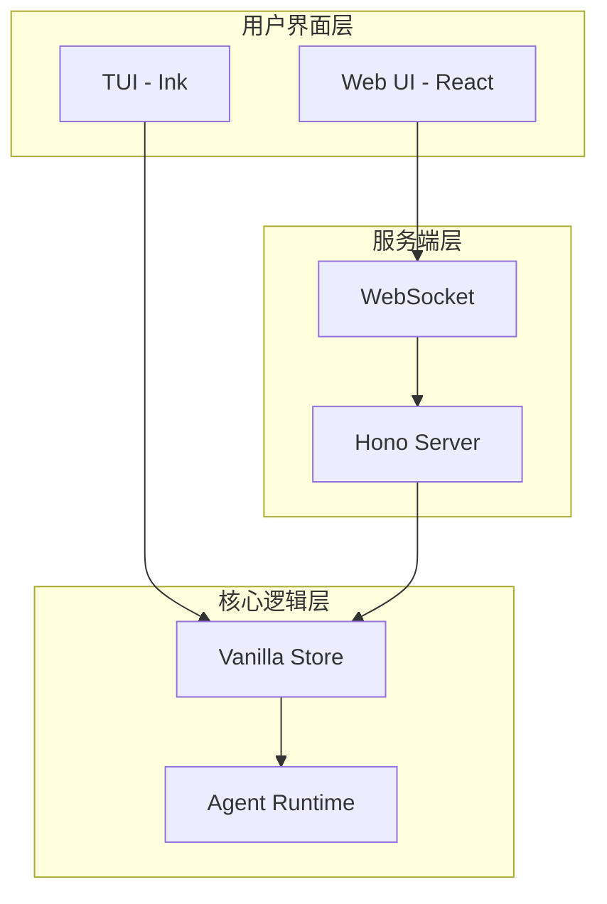
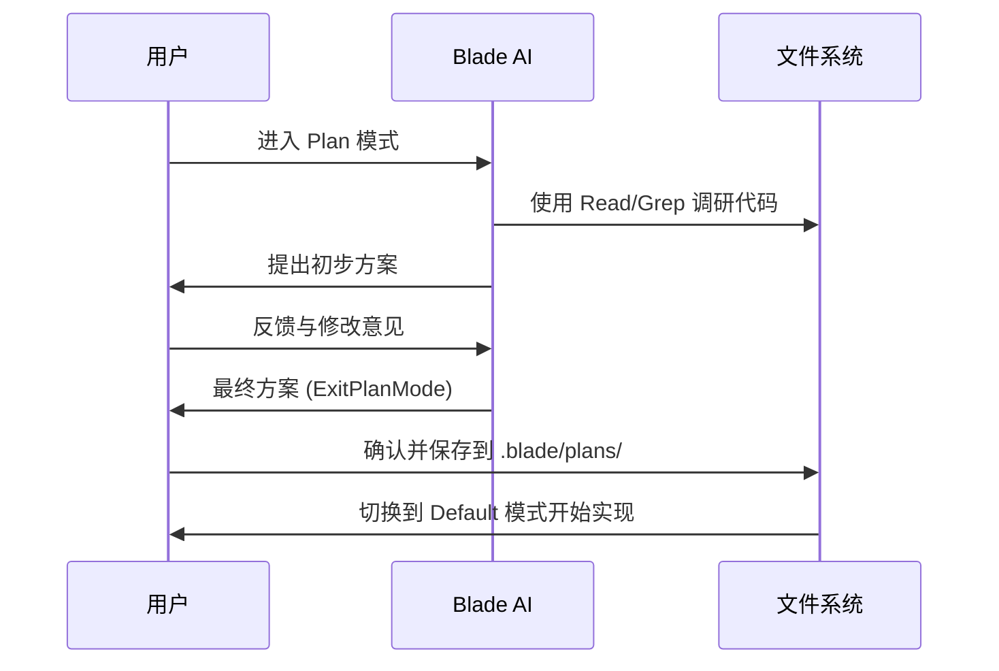
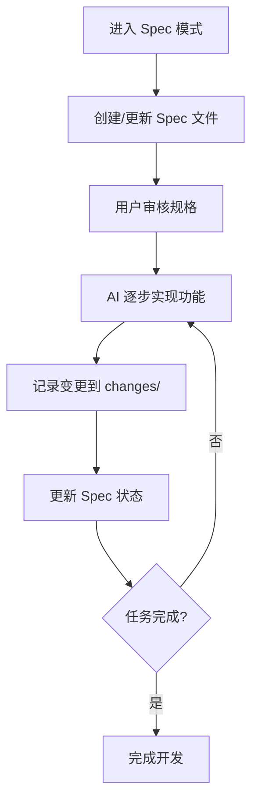
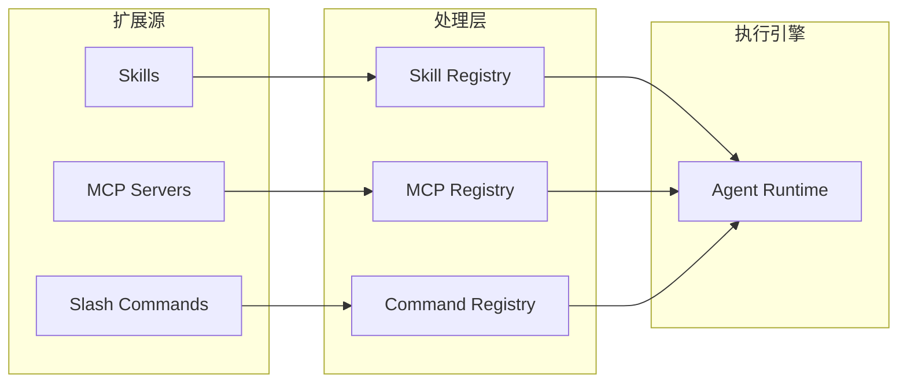
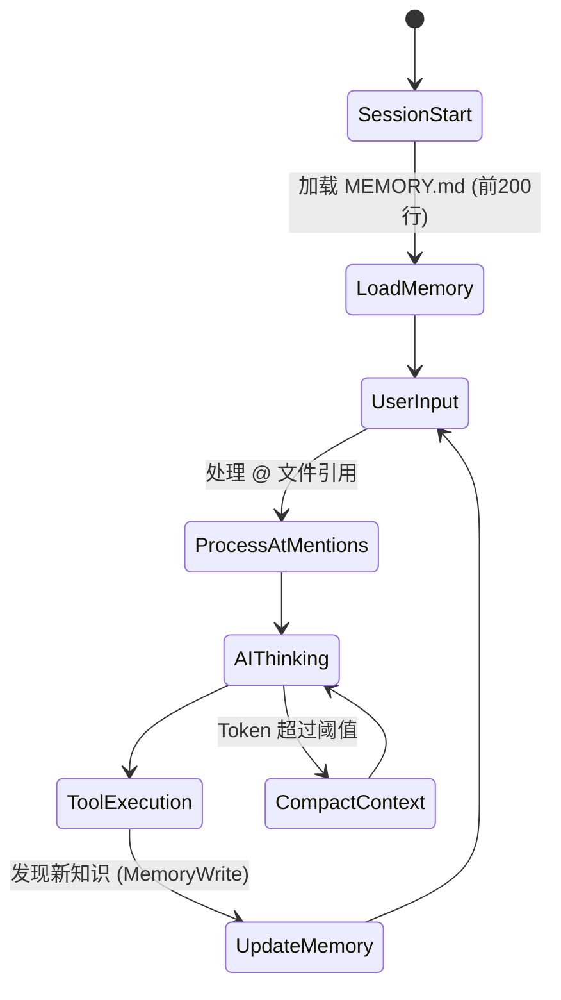
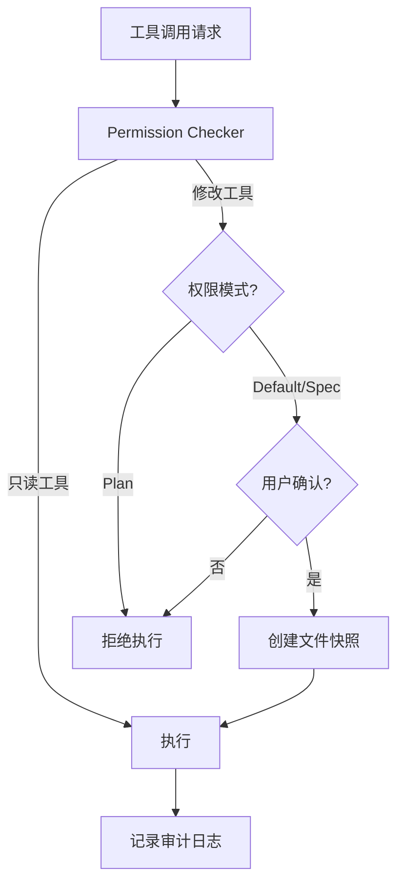

# 核心特性概览

## 目录
1. [模块概览](#模块概览)
2. [双模交互：TUI 与 Web UI](#双模交互tui-与-web-ui)
3. [结构化工作流：Plan 与 Spec 模式](#结构化工作流plan-与-spec-模式)
4. [扩展体系：Skills、MCP 与斜杠命令](#扩展体系skillsmcp-与斜杠命令)
5. [智能上下文：@-mentions 与自动记忆](#智能上下文-mentions-与自动记忆)
6. [安全机制：权限校验与审计](#安全机制权限校验与审计)
7. [核心组件实现](#核心组件实现)
8. [文件引用](#文件引用)

## 模块概览

Blade 是一个功能丰富的 AI 辅助开发工具，其核心设计目标是提供一个结构化、可扩展且安全的开发环境。通过对代码库的探索，我们识别出 Blade 的核心功能分布在 `docs/guides/`（文档指南）和 `packages/cli/src/tools/builtin/`（内置工具实现）中。

**项目规模评估**：
- **核心指南文件**：9 个 Markdown 文件，涵盖了从基础使用到高级特性的全景。
- **内置工具实现**：超过 50 个 TypeScript 文件，分布在 12 个子模块中（如 `plan`, `spec`, `memory`, `shell`, `file` 等）。
- **交互界面**：包含基于 Ink 的 TUI 实现和基于 React/Hono 的 Web UI 实现。

本页面将作为 Blade 核心特性的全景图，详细介绍其能力边界和技术实现方案。我们将深入探讨 Blade 如何通过双模交互、结构化工作流、强大的扩展体系以及智能上下文管理，为开发者提供极致的 AI 协作体验。

## 双模交互：TUI 与 Web UI

Blade 提供了两种主要的交互方式，以适应不同的开发场景和用户偏好。这种双模设计确保了工具在终端环境下的高效性，同时也提供了 Web 端更丰富的可视化能力。

### TUI (终端用户界面)
TUI 是 Blade 的默认交互方式，基于 [Ink](https://github.com/vadimdemedes/ink) 构建。它在命令行中提供了类 React 的声明式 UI 体验，支持实时流式输出、交互式组件（如模型选择器、任务面板）以及丰富的终端样式。

**适用场景**：
- 快速的代码修改和命令行操作。
- 习惯于在终端内完成所有工作的开发者。
- 资源占用极低，启动速度快。

### Web UI (Web 用户界面)
Web UI 提供了更直观的可视化体验，基于 **React** 前端框架和 **Hono** 后端服务器构建。它通过 WebSocket 与 CLI 进程通信，支持更复杂的 Markdown 渲染、代码高亮、差异对比以及多会话管理。

**适用场景**：
- 复杂的功能设计和长篇幅的方案讨论。
- 需要查看大范围代码差异或复杂任务进度时。
- 跨设备或远程协作场景。

下图展示了 Blade 双模交互的架构关系：



在架构上，`Vanilla Store` 作为状态中心，同时支持 TUI 的直接订阅和 Web UI 通过 Hono Server 的远程同步。这种设计保证了两种界面在状态上的一致性，用户可以随时在终端和浏览器之间切换。

**Section sources**:
- [packages/cli/src/blade.tsx](file:///Users/bytedance/Documents/GitHub/Blade/packages/cli/src/blade.tsx)
- [packages/cli/src/server/server.ts](file:///Users/bytedance/Documents/GitHub/Blade/packages/cli/src/server/server.ts)
- [packages/cli/web/src/main.tsx](file:///Users/bytedance/Documents/GitHub/Blade/packages/cli/web/src/main.tsx)

## 结构化工作流：Plan 与 Spec 模式

Blade 引入了两种独特的工作模式：**Plan 模式**和 **Spec 模式**，旨在将非结构化的 AI 对话转化为结构化的工程产出。

### Plan 模式：调研与规划
Plan 模式是一种**只读权限模式**，专门用于项目的初期调研和方案设计。在此模式下，AI 只能调用只读工具（如 `Read`, `Grep`, `WebSearch`），无法修改任何本地代码。

**核心价值**：
- **安全性**：防止 AI 在不了解项目背景的情况下盲目修改代码。
- **确定性**：要求 AI 在动手前先给出完整的实现方案。
- **产出物**：最终生成的方案会保存为 `.blade/plans/` 下的 Markdown 文档。



### Spec 模式：规格驱动开发
Spec 模式是 Blade 的高级工作流，通过**规格文件（Spec）**驱动复杂功能的迭代开发。它强调“规格先行”和“变更追踪”。

**核心特性**：
- **Spec 文件**：在 `.blade/specs/` 中定义功能需求、技术方案和实现状态。
- **变更记录**：每次代码修改都会在 `.blade/changes/` 中生成对应的记录，包含变更说明和 Diff 摘要。
- **迭代闭环**：AI 会根据 Spec 逐步拆解任务，并在完成后自动更新 Spec 状态。



**Section sources**:
- [docs/guides/plan-mode.md](file:///Users/bytedance/Documents/GitHub/Blade/docs/guides/plan-mode.md)
- [docs/guides/spec-mode.md](file:///Users/bytedance/Documents/GitHub/Blade/docs/guides/spec-mode.md)
- [packages/cli/src/tools/builtin/plan/index.ts](file:///Users/bytedance/Documents/GitHub/Blade/packages/cli/src/tools/builtin/plan/index.ts)
- [packages/cli/src/tools/builtin/spec/index.ts](file:///Users/bytedance/Documents/GitHub/Blade/packages/cli/src/tools/builtin/spec/index.ts)

## 扩展体系：Skills、MCP 与斜杠命令

Blade 拥有强大的扩展能力，允许用户自定义 AI 的行为和集成外部服务。

### Skills 系统
Skills 是 Blade 的动态 Prompt 扩展机制。每个 Skill 都是一个包含 `SKILL.md` 的目录，通过 YAML frontmatter 定义触发条件和工具限制。

**工作原理**：
1. **自动识别**：AI 会根据用户的请求描述，自动匹配并激活相关的 Skill。
2. **上下文注入**：激活后，Skill 的正文内容会被注入到当前对话的上下文中。
3. **工具约束**：Skill 可以通过 `allowedTools` 限制 AI 在执行该任务时可调用的工具集。

### MCP (Model Context Protocol) 支持
Blade 支持 Anthropic 提出的 **MCP 协议**，允许集成外部服务（如 GitHub, Google Search, Slack 等）作为 AI 的工具。通过 `mcp` 模块，Blade 可以动态加载并调用这些外部工具。

### 自定义斜杠命令
斜杠命令（Slash Commands）是用户在 `.blade/commands/` 目录下创建的 Markdown 文件。它们支持：
- **参数插值**：使用 `$ARGUMENTS`, `$1`, `$2` 等引用用户输入。
- **Bash 嵌入**：使用 `` !`command` `` 执行脚本并获取输出。
- **文件引用**：使用 `@path` 快速注入代码上下文。



**Section sources**:
- [docs/guides/skills.md](file:///Users/bytedance/Documents/GitHub/Blade/docs/guides/skills.md)
- [docs/guides/slash-commands.md](file:///Users/bytedance/Documents/GitHub/Blade/docs/guides/slash-commands.md)
- [packages/cli/src/mcp/McpRegistry.ts](file:///Users/bytedance/Documents/GitHub/Blade/packages/cli/src/mcp/McpRegistry.ts)

## 智能上下文：@-mentions 与自动记忆

管理 LLM 的上下文窗口是 Blade 的核心竞争力之一。它通过多种机制确保 AI 能够获得最精准、最相关的背景信息。

### @-mentions (精准上下文引用)
用户可以在对话中使用 `@` 语法直接引用文件或目录。Blade 会自动读取这些内容并将其结构化地注入到 Prompt 中。
- **语法**：`@src/index.ts#L10-20`（支持行号范围）、`@src/utils/`（目录引用）。
- **优化**：支持 60 秒缓存，避免重复读取大文件。

### Auto Memory (自动记忆)
Auto Memory 解决了 AI 在不同会话之间“失忆”的问题。
- **持久化**：记忆存储在项目专属的 `MEMORY.md` 及其关联的主题文件中。
- **自动加载**：每次会话启动时，`MEMORY.md` 的前 200 行会自动注入到 System Prompt。
- **主动学习**：AI 会在工作中发现有价值的知识（如构建命令、Bug 修复方案）并使用 `MemoryWrite` 工具主动记录。

### Token 预算控制
Blade 内置了 Token 预算管理机制，包括：
- **Reactive Compaction**：当上下文过长时，自动对历史对话进行压缩或摘要。
- **截断策略**：对 `Bash` 输出和 `Read` 结果进行智能截断，优先保留关键信息。



**Section sources**:
- [docs/guides/at-file-mentions.md](file:///Users/bytedance/Documents/GitHub/Blade/docs/guides/at-file-mentions.md)
- [docs/guides/memory.md](file:///Users/bytedance/Documents/GitHub/Blade/docs/guides/memory.md)
- [packages/cli/src/context/ReactiveCompaction.ts](file:///Users/bytedance/Documents/GitHub/Blade/packages/cli/src/context/ReactiveCompaction.ts)

## 安全机制：权限校验与审计

作为一款能够执行本地命令和修改代码的工具，安全性是 Blade 的基石。

### Permission Checker (权限校验器)
Blade 所有的工具执行都必须经过 `PermissionChecker`。它根据当前的权限模式（Default, Plan, Spec, Readonly）决定是否允许执行。
- **规则引擎**：支持基于正则表达式的命令白名单/黑名单。
- **用户确认**：对于高风险操作（如 `Write`, `Bash`），会弹出交互式确认框。

### 敏感操作审计
- **Snapshot Manager**：在执行 `Edit` 或 `Write` 之前，Blade 会自动创建文件快照，支持随时回滚。
- **File Access Tracker**：记录 AI 访问过的所有文件，防止越权访问敏感路径（如 `.env`, `.git`）。



**Section sources**:
- [packages/cli/src/config/PermissionChecker.ts](file:///Users/bytedance/Documents/GitHub/Blade/packages/cli/src/config/PermissionChecker.ts)
- [packages/cli/src/tools/builtin/file/SnapshotManager.ts](file:///Users/bytedance/Documents/GitHub/Blade/packages/cli/src/tools/builtin/file/SnapshotManager.ts)

## 核心组件实现

Blade 的核心逻辑由几个关键的类和接口定义，理解这些组件有助于深入掌握其运行机制。

### 工具定义 (Tool Definition)
所有的内置工具都遵循统一的 `createTool` 接口，使用 **Zod** 进行参数校验。

```typescript
// 示例：SlashCommand 工具定义片段
export const slashCommandTool = createTool({
  name: 'SlashCommand',
  kind: ToolKind.Execute,
  schema: z.object({
    command: z.string().describe('命令名称'),
    arguments: z.string().optional().describe('参数'),
  }),
  async execute(params, context) {
    // 逻辑实现...
  }
});
```

### 任务管理器 (Task Manager)
在 Spec 模式下，任务的拆解和追踪由 `TaskListManager` 负责。它维护了一个任务树结构，并持久化到磁盘。

### 内存管理 (Memory Manager)
`MemoryReadTool` 和 `MemoryWriteTool` 提供了对项目记忆库的读写接口，确保 AI 能够像人类一样积累经验。

**Section sources**:
- [packages/cli/src/tools/builtin/system/slashCommand.ts](file:///Users/bytedance/Documents/GitHub/Blade/packages/cli/src/tools/builtin/system/slashCommand.ts)
- [packages/cli/src/tools/builtin/task/TaskListManager.ts](file:///Users/bytedance/Documents/GitHub/Blade/packages/cli/src/tools/builtin/task/TaskListManager.ts)
- [packages/cli/src/tools/builtin/memory/index.ts](file:///Users/bytedance/Documents/GitHub/Blade/packages/cli/src/tools/builtin/memory/index.ts)

## 文件引用

以下是本章节涉及的关键源文件，建议在深入研究特定特性时参考：

- **核心架构与 UI**
  - [packages/cli/src/blade.tsx](file:///Users/bytedance/Documents/GitHub/Blade/packages/cli/src/blade.tsx) - TUI 入口
  - [packages/cli/src/server/server.ts](file:///Users/bytedance/Documents/GitHub/Blade/packages/cli/src/server/server.ts) - Web UI 后端
  - [packages/cli/web/src/main.tsx](file:///Users/bytedance/Documents/GitHub/Blade/packages/cli/web/src/main.tsx) - Web UI 前端

- **工作流模式**
  - [packages/cli/src/tools/builtin/plan/index.ts](file:///Users/bytedance/Documents/GitHub/Blade/packages/cli/src/tools/builtin/plan/index.ts) - Plan 模式工具
  - [packages/cli/src/tools/builtin/spec/index.ts](file:///Users/bytedance/Documents/GitHub/Blade/packages/cli/src/tools/builtin/spec/index.ts) - Spec 模式工具

- **扩展与上下文**
  - [packages/cli/src/tools/builtin/system/skill.ts](file:///Users/bytedance/Documents/GitHub/Blade/packages/cli/src/tools/builtin/system/skill.ts) - Skill 执行逻辑
  - [packages/cli/src/tools/builtin/system/slashCommand.ts](file:///Users/bytedance/Documents/GitHub/Blade/packages/cli/src/tools/builtin/system/slashCommand.ts) - 斜杠命令实现
  - [packages/cli/src/mcp/McpRegistry.ts](file:///Users/bytedance/Documents/GitHub/Blade/packages/cli/src/mcp/McpRegistry.ts) - MCP 注册表
  - [packages/cli/src/tools/builtin/memory/index.ts](file:///Users/bytedance/Documents/GitHub/Blade/packages/cli/src/tools/builtin/memory/index.ts) - Memory 工具

- **安全与配置**
  - [packages/cli/src/config/PermissionChecker.ts](file:///Users/bytedance/Documents/GitHub/Blade/packages/cli/src/config/PermissionChecker.ts) - 权限校验
  - [packages/cli/src/tools/builtin/file/SnapshotManager.ts](file:///Users/bytedance/Documents/GitHub/Blade/packages/cli/src/tools/builtin/file/SnapshotManager.ts) - 文件快照管理
