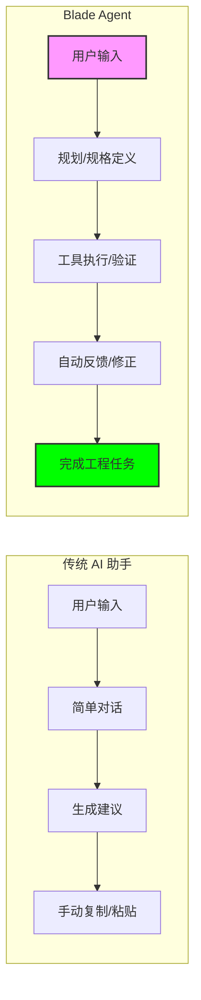
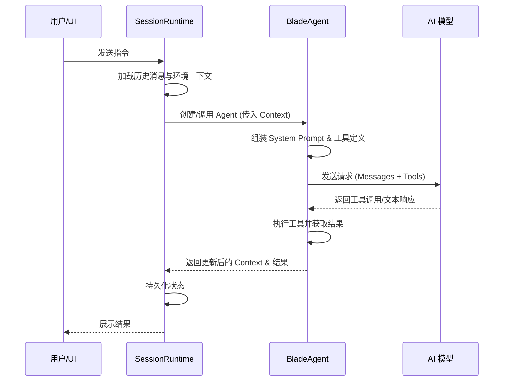
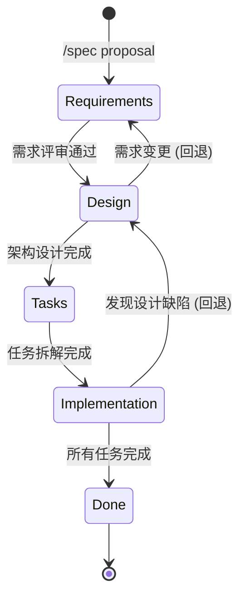
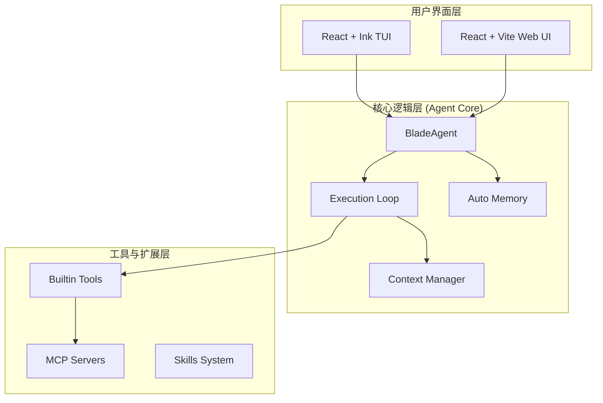

# 项目愿景与定位

## 目录
1. [模块概览](#模块概览)
2. [项目背景：为什么需要 Blade？](#项目背景为什么需要-blade)
   - [当前 AI 编程工具的痛点](#当前-ai-编程工具的痛点)
   - [Blade 的差异化定位](#blade-的差异化定位)
3. [核心愿景：构建“无状态 Agent”驱动的编程助手](#核心愿景构建无状态-agent-驱动的编程助手)
   - [什么是“无状态 Agent”？](#什么是无状态-agent)
   - [无状态设计的技术优势](#无状态设计的技术优势)
4. [设计哲学：规划优先与规格驱动](#设计哲学规划优先与规格驱动)
   - [规划优先 (Plan-first)](#规划优先-plan-first)
   - [规格驱动 (Spec-driven)](#规格驱动-spec-driven)
   - [安全可控 (Safe & Controllable)](#安全可控-safe--controllable)
5. [目标受众与应用场景](#目标受众与应用场景)
   - [目标受众](#目标受众)
   - [典型应用场景](#典型应用场景)
6. [核心组件与技术架构](#核心组件与技术架构)
7. [文件参考](#文件参考)

## 模块概览

本章节主要阐述 Blade 项目的愿景、定位以及其背后的设计哲学。作为新一代 AI 编程助手，Blade 不仅仅是一个聊天窗口，而是一个具备执行能力和结构化工作流的智能代理系统。

**统计信息**：
- **涉及核心文件**：约 15 个（包括 `Agent.ts`, `SpecManager.ts`, `ConversationState.ts` 等）
- **覆盖子模块**：`agent/`, `spec/`, `tools/`, `config/`
- **内容深度**：标准（侧重于设计理念与核心机制的深度解析）

本章节将深入探讨 Blade 如何通过“无状态”设计提升系统的健壮性，以及如何通过“规划优先”和“规格驱动”的工作流解决复杂工程任务中的上下文丢失和执行偏差问题。

## 项目背景：为什么需要 Blade？

在 AI 辅助编程领域，虽然已经出现了许多优秀的工具（如 GitHub Copilot, Cursor 等），但在处理复杂、多步骤的工程任务时，开发者仍然面临着显著的挑战。

### 当前 AI 编程工具的痛点

1. **上下文丢失与膨胀**：传统的 AI 聊天助手通常采用简单的消息队列管理上下文。随着对话轮次的增加，无关信息会迅速膨胀，导致 LLM 遗忘核心需求或产生幻觉。
2. **缺乏执行闭环**：大多数助手仅停留在“建议”层面，无法直接在本地环境中执行复杂的 Shell 命令、进行深度的代码搜索或管理长周期的重构任务。
3. **状态管理混乱**：传统的 Agent 往往在内部维护复杂的会话状态，这使得系统难以调试、难以复现错误，且在并发场景下表现不佳。
4. **安全性与透明度不足**：AI 自动执行代码往往让开发者感到“黑盒”操作的恐惧，缺乏细粒度的权限控制和明确的执行计划。

### Blade 的差异化定位

Blade 的定位是**“具备工程化思维的无状态 Agent”**。它通过将复杂的任务拆解为结构化的工作流，并引入强有力的执行工具集，旨在将 AI 从一个“代码生成器”提升为一个真正的“数字化配对编程伙伴”。

下图展示了 Blade 与传统 AI 助手的核心差异：

**图表说明**：
传统助手依赖于用户的反复对话和手动操作，而 Blade 将流程重心前移到“规划与规格”阶段，通过闭环的工具执行和自动验证，直接产出工程结果。这种模式极大地减少了人类在琐碎操作上的投入。

**Section sources**:
- [README.md](file:///Users/bytedance/Documents/GitHub/Blade/README.md)
- [BLADE.md](file:///Users/bytedance/Documents/GitHub/Blade/BLADE.md)

## 核心愿景：构建“无状态 Agent”驱动的编程助手

Blade 的核心技术特征在于其**无状态 (Stateless)** 的 Agent 设计。这一设计决定了系统的健壮性、可预测性和可扩展性。

### 什么是“无状态 Agent”？

在 Blade 中，`Agent` 类本身不存储任何会话状态（如 `sessionId`、`messages` 等）。所有的历史信息、当前进度和环境变量都通过 `context` 参数在每次请求时显式传入。

这意味着：
- **用完即弃**：Agent 实例可以根据每个命令临时创建，执行完任务后即可销毁。
- **显式状态流转**：状态的持久化由外部的 `SessionContext` 或数据库负责，Agent 仅负责逻辑计算和工具调度。
- **易于测试与复现**：只要给定相同的 `context`，Agent 的行为在逻辑上是高度可预测和可复现的。

### 无状态设计的技术优势

1. **健壮性**：由于不依赖内部持久化状态，Agent 不会因为内存泄漏或状态不同步而崩溃。
2. **可伸缩性**：可以轻松地在分布式环境中运行多个 Agent 实例，处理不同的会话，而无需担心复杂的分布式状态同步。
3. **精确的上下文控制**：通过 `ConversationState` 管理器，Blade 能够精细地控制哪些信息进入 LLM 的上下文窗口，哪些信息需要被压缩或丢弃。

**图表说明**：
该序列图展示了无状态请求的完整生命周期。`SessionRuntime` 负责状态的“存”与“取”，而 `BladeAgent` 作为一个纯粹的“处理器”，在接收到完整的 `Context` 后进行逻辑决策。这种职责分离确保了核心逻辑的清晰和稳定。

**Section sources**:
- [packages/cli/src/agent/Agent.ts](file:///Users/bytedance/Documents/GitHub/Blade/packages/cli/src/agent/Agent.ts)
- [packages/cli/src/agent/loop/ConversationState.ts](file:///Users/bytedance/Documents/GitHub/Blade/packages/cli/src/agent/loop/ConversationState.ts)

## 设计哲学：规划优先与规格驱动

Blade 的工作模式深受现代软件工程实践的启发，强调“谋定而后动”。

### 规划优先 (Plan-first)

在处理复杂任务时，Blade 会首先进入 `Plan` 模式。在此模式下，Agent 的主要任务是进行**调研和路径规划**，而不是直接修改代码。
- **只读调研**：通过搜索和阅读代码了解项目结构。
- **方案设计**：产出一个详细的实现计划（Implementation Plan）。
- **用户确认**：计划必须经过用户的审查和批准，才能进入执行阶段。

### 规格驱动 (Spec-driven)

对于长周期的功能开发，Blade 引入了 `Spec` 模式。它将开发过程划分为四个严格的阶段：
1. **Requirements (需求)**：定义“做什么”，使用结构化的格式（如 EARS）记录。
2. **Design (设计)**：定义“怎么做”，涵盖架构决策、接口定义等。
3. **Tasks (任务)**：将设计拆解为可执行的原子任务列表。
4. **Implementation (实现)**：逐个执行任务，并根据 Spec 进行验证。

**图表说明**：
`Spec` 模式的状态机展示了 Blade 如何引导开发者遵循规范的软件开发生命周期（SDLC）。这种强制性的阶段转换确保了复杂项目的每一阶段都有据可查，减少了“边写边改”带来的混乱。

### 安全可控 (Safe & Controllable)

安全是 Blade 的基石。它提供了多层级的权限管理：
- **Default 模式**：敏感操作（如写文件、执行 Shell）需逐一确认。
- **Plan 模式**：只读权限，确保 AI 不会在调研阶段意外修改环境。
- **YOLO 模式**：全自动执行，适合受信任的本地环境或沙箱。
- **工具黑白名单**：开发者可以精确限制 AI 能够使用的工具集。

**Section sources**:
- [packages/cli/src/spec/SpecManager.ts](file:///Users/bytedance/Documents/GitHub/Blade/packages/cli/src/spec/SpecManager.ts)
- [packages/cli/src/config/types.ts](file:///Users/bytedance/Documents/GitHub/Blade/packages/cli/src/config/types.ts)

## 目标受众与应用场景

Blade 并非为所有人设计，它专注于那些追求高效、高质量交付的专业开发者。

### 目标受众

- **高级工程师 & 架构师**：利用 `Spec` 模式进行系统设计和重构规划，确保 AI 遵循既定的架构规范。
- **全栈开发者**：利用 Blade 强大的工具集（20+ 内置工具）快速处理跨模块的业务逻辑。
- **DevOps 工程师**：通过 Headless 模式将 Blade 集成到 CI/CD 流水中，进行自动化的代码审查或环境诊断。

### 典型应用场景

1. **遗留系统重构**：通过 `Plan` 模式深入分析复杂的调用链路，产出安全的重构计划。
2. **新功能原型开发**：从 `Requirements` 出发，快速生成符合项目规范的代码框架。
3. **深度 Bug 调试**：利用 Shell 工具和文件搜索工具，在大型代码库中追踪难以发现的逻辑错误。
4. **自动化文档生成**：基于对代码库的深度理解，自动生成高质量的技术文档（如本项目正在使用的 Wiki 自动生成）。

**Section sources**:
- [README.md](file:///Users/bytedance/Documents/GitHub/Blade/README.md)
- [docs/guides/plan-mode.md](file:///Users/bytedance/Documents/GitHub/Blade/docs/guides/plan-mode.md)

## 核心组件与技术架构

为了支撑上述愿景，Blade 采用了现代化的技术栈和模块化架构。

**图表说明**：
Blade 的架构分为三层。最上层提供双模 UI；核心层负责 Agent 的逻辑循环和上下文管理；底层则是可扩展的工具生态系统。这种分层设计使得 Blade 能够轻松集成新的 AI 模型或外部工具协议（如 MCP）。

**技术栈概览**：
- **运行时**：Node.js >= 20 (开发使用 Bun)
- **UI 框架**：React 19 + Ink (终端) / React 19 + Vite (Web)
- **状态管理**：Zustand
- **通信协议**：Hono (Web Server) + MCP
- **代码质量**：TypeScript + Biome

**Section sources**:
- [BLADE.md](file:///Users/bytedance/Documents/GitHub/Blade/BLADE.md)
- [packages/cli/src/blade.tsx](file:///Users/bytedance/Documents/GitHub/Blade/packages/cli/src/blade.tsx)

## 文件参考

以下是本章节涉及的关键源码文件，建议深入阅读以理解其实现细节：

- [packages/cli/src/agent/Agent.ts](file:///Users/bytedance/Documents/GitHub/Blade/packages/cli/src/agent/Agent.ts): Agent 核心类，体现了无状态设计原则。
- [packages/cli/src/agent/loop/ConversationState.ts](file:///Users/bytedance/Documents/GitHub/Blade/packages/cli/src/agent/loop/ConversationState.ts): 会话状态管理器，负责上下文的隔离与回写。
- [packages/cli/src/spec/SpecManager.ts](file:///Users/bytedance/Documents/GitHub/Blade/packages/cli/src/spec/SpecManager.ts): Spec 模式的状态管理与流程控制。
- [README.md](file:///Users/bytedance/Documents/GitHub/Blade/README.md): 项目主入口，包含特性概览与快速开始。
- [BLADE.md](file:///Users/bytedance/Documents/GitHub/Blade/BLADE.md): 技术架构与开发规范文档。
- [packages/cli/src/config/types.ts](file:///Users/bytedance/Documents/GitHub/Blade/packages/cli/src/config/types.ts): 定义了权限模式和核心配置结构。
