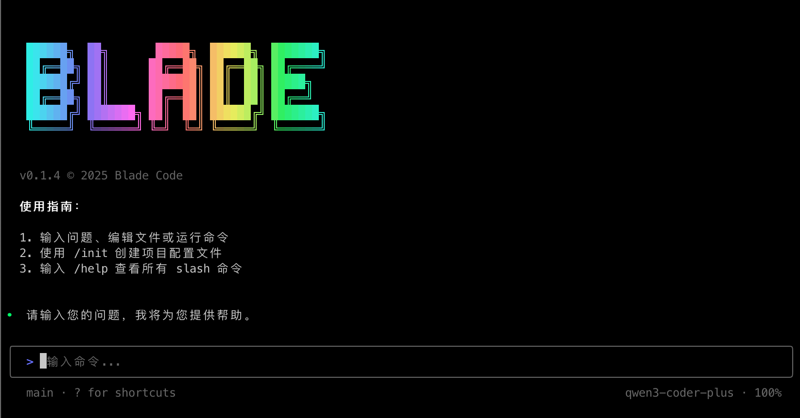

<div align="center">

# 🗡️ Blade Code

**Next-Generation AI Coding Assistant (CLI + Web UI)**

[](https://www.npmjs.com/package/blade-code)
[](LICENSE)
[](https://nodejs.org/)
[](CONTRIBUTING.md)

English | [简体中文](README.md)

</div>

---

## 📸 Screenshots

<div align="center">
  
  <p><em>CLI Terminal Interface</em></p>
</div>

<div align="center">
  
  <p><em>Web UI Interface (new in 0.2.0)</em></p>
</div>

---

## ✨ Key Features

- 🤖 **Smart Chat** - Context-aware, multi-turn collaboration with session continuity
- 🌐 **Dual Interface** - CLI terminal + Web UI, switch as you like
- 🛠️ **Rich Tooling** - 20+ built-in tools: file/search/shell/git/web and more
- 🔍 **Smart Search** - WebSearch with multi-provider fallback (Exa → DuckDuckGo → SearXNG)
- 🔗 **Extensible** - MCP, plugins, and Skills system
- 📋 **Structured Workflows** - Spec / Plan / Subagents
- 🔒 **Secure Control** - Permission modes: default/autoEdit/plan/yolo/spec + allow/deny lists
- 🎨 **Modern UI** - React + Ink TUI / React + Vite Web UI

---

## 🚀 Quick Start

```bash
# Quick try
npx blade-code

# Global install
npm install -g blade-code
# or
pnpm add -g blade-code

# CLI mode
blade
blade "Help me analyze this project"
blade --print "Write a quicksort"

# Web UI mode (new in 0.2.0)
blade web                    # Start and open browser
blade serve --port 3000      # Headless server mode
```

> Run `blade` and type `/model add` to configure your model on first launch.

---

## ⚙️ Optional Configuration

Config supports global and project scope: `~/.blade/config.json` or `.blade/config.json`.
See docs for the full schema.

```json
{
  "provider": "openai-compatible",
  "apiKey": "${BLADE_API_KEY}",
  "baseUrl": "https://api.openai.com/v1",
  "model": "gpt-4o-mini"
}
```

---

## 🧰 CLI At a Glance

**Common Commands**

- `blade` start interactive CLI
- `blade web` start Web UI (new in 0.2.0)
- `blade serve` start headless server (new in 0.2.0)
- `blade mcp` manage MCP servers
- `blade doctor` environment check
- `blade update` check for updates

**Common Options**

- `--print/-p` print mode (pipe-friendly)
- `--output-format` output: text/json/stream-json
- `--permission-mode` permission mode
- `--resume/-r` resume session / `--session-id` set session

---

## 📖 Documentation

- **[User Docs](https://echovic.github.io/blade-doc/#/)**
- **[Docs entry in repo](docs/README.md)**
- **[Contributing Guide](CONTRIBUTING.md)**

---

## 🤝 Contributing

```bash
git clone https://github.com/echoVic/blade-code.git
cd blade-code && pnpm install && pnpm dev
```

---

## 💬 Community

Add WeChat **VIc-Forever**, remark "Blade" to join the group.

---

## 🔗 Related Resources

- [NPM Package](https://www.npmjs.com/package/blade-code)
- [Discord Community](https://discord.gg/utXDVcv6) - Join our Discord server
- [Report Issues](https://github.com/echoVic/blade-code/issues)

---

## ⭐ Star History

<a href="https://star-history.com/#echoVic/blade-code&Date">
 <picture>
   <source media="(prefers-color-scheme: dark)" srcset="https://api.star-history.com/svg?repos=echoVic/blade-code&type=Date&theme=dark" />
   <source media="(prefers-color-scheme: light)" srcset="https://api.star-history.com/svg?repos=echoVic/blade-code&type=Date" />
   
 </picture>
</a>

---

## 📄 License

[MIT](LICENSE) - Made with ❤️ by [echoVic](https://github.com/echoVic)
