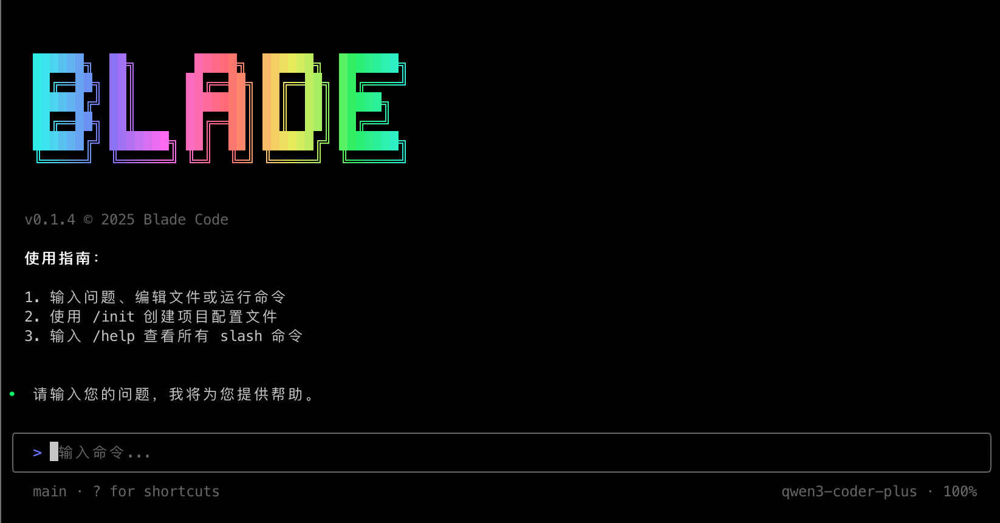

<div align="center">

# 🗡️ Blade Code

**Next-generation AI coding assistant — CLI + Web + Headless**

[](https://www.npmjs.com/package/blade-code)
[](LICENSE)
[](https://nodejs.org/)
[](CONTRIBUTING.md)

[简体中文](README.md) | English

</div>

---

## 📸 Screenshots

<div align="center">
  
  <p><em>CLI Terminal</em></p>
</div>

<div align="center">
  
  <p><em>Web UI</em></p>
</div>

---

## ✨ Key Features

- 🤖 **Unified Multi-Model Runtime** — Powered by [pi-ai](https://github.com/nicepkg/pi-ai), supports 38+ providers (OpenAI, Anthropic, DeepSeek, Google, Bedrock…) with auto-fetched model metadata
- 🧠 **Auto Memory** — Persistent project knowledge across sessions; learns build commands, code patterns, and debugging insights
- 🌐 **Three Runtime Modes** — CLI terminal / Web UI / Headless JSONL for flexible deployment
- 📊 **Multi-project Task Board** — Bind projects, auto-dispatch work, resolve blockers, and archive accepted tasks
- 🛠️ **20+ Built-in Tools** — File editing, code search, shell execution, git operations, web fetching, and more
- 🌍 **Native Browser Automation** — Session-isolated Chromium with ARIA snapshots
  and stale-safe ref interactions across CLI, Web, Headless, and ACP
- 📋 **Structured Workflows** — Task delegation, Goal mode, Spec/Plan, Subagent orchestration
- 🔗 **Extensible** — MCP protocol, plugin system, Skills, Hooks
- 🔒 **Secure & Controllable** — Four permission modes (default/autoEdit/plan/yolo) + tool allow/deny lists
- 💰 **Precise Cost Tracking** — Per-call token accumulation with cache pricing; check with `/cost`
- 🎨 **Modern UI** — React + Ink terminal / React + Vite web, with Thinking mode support

---

## 🚀 Quick Start

```bash
# Try instantly (requires Node.js >= 22.19.0)
npx blade-code

# Global install
npm install -g blade-code

# Optional: install the pinned Chromium used by the Agent Browser
blade browser install
blade browser status

# Start CLI
blade

# Start Web UI
blade web

# Headless mode (for CI / sandbox)
blade --headless --output-format jsonl "analyze this repo"
```

On first launch, a setup wizard guides you: **Pick Provider → Select Model → Enter API Key**.

---

## ⚙️ Configuration

Config file: `~/.blade/config.json` (global) or `.blade/config.json` (project-level).

```json
{
  "currentModelId": "primary",
  "models": [
    {
      "id": "primary",
      "provider": "deepseek",
      "model": "deepseek-v4-pro"
    }
  ]
}
```

- **Credentials stored separately**: `~/.blade/auth.json` (mode `0600`), never committed to version control
- **Model metadata** (contextWindow, maxTokens, pricing) fetched automatically from the pi-ai catalog
- Provider Base URL only needed in `overrides.baseUrl` when using a custom proxy

---

## 🧰 Commands

| Command | Description |
|---------|-------------|
| `blade` | Interactive CLI |
| `blade web` | Web UI (browser) |
| `blade serve` | Headless HTTP server |
| `blade browser install` | Install the pinned Chromium used by Browser tools |
| `blade browser status` | Check Playwright and Chromium runtime status |
| `blade mcp` | Manage MCP servers |
| `blade doctor` | Environment diagnostics |
| `blade --headless "..."` | Full agent loop (non-interactive) |
| `blade --print "..."` | Single-turn print mode |

**In-session commands**

| Command | Description |
|---------|-------------|
| `/model add` | Add a new model |
| `/model switch` | Switch active model |
| `/cost` | Show session cost |
| `/compact` | Manually compact context |
| `/memory list` | List memory files |
| `/tasks` | View task list |
| `/goal "..."` | Start Goal mode |

---

## 🏗️ Architecture

```
Blade/
├── packages/cli/          # blade-code core (npm package)
│   ├── src/
│   │   ├── agent/         # Stateless Agent core + execution loop
│   │   ├── services/pi/   # pi-ai runtime adapter layer
│   │   ├── tools/         # Tool system (TypeBox schemas)
│   │   ├── server/        # Web server (Hono)
│   │   ├── context/       # Context compaction & token management
│   │   ├── config/        # Configuration system
│   │   ├── store/         # State management (Zustand)
│   │   ├── ui/            # Terminal UI (React + Ink)
│   │   └── schema/        # TypeBox runtime wrapper
│   └── web/               # Web UI (React + Vite)
└── docs/                  # User documentation (Docsify)
```

---

## 📖 Documentation

- **[Online Docs](https://echovic.github.io/blade-doc/#/)**
- **[Configuration Guide](docs/configuration/config-system.md)**
- **[Quick Start](docs/getting-started/quick-start.md)**
- **[Contributing Guide](CONTRIBUTING.md)**

---

## 🤝 Contributing

```bash
git clone https://github.com/echoVic/blade-code.git
cd blade-code && bun install && bun run dev
```

---

## 💬 Community

- WeChat: Add **VIc-Forever**, note "Blade"
- [Discord](https://discord.gg/utXDVcv6)
- [Issues](https://github.com/echoVic/blade-code/issues)

---

## ⭐ Star History

<a href="https://star-history.com/#echoVic/blade-code&Date">
 <picture>
   <source media="(prefers-color-scheme: dark)" srcset="https://api.star-history.com/svg?repos=echoVic/blade-code&type=Date&theme=dark" />
   <source media="(prefers-color-scheme: light)" srcset="https://api.star-history.com/svg?repos=echoVic/blade-code&type=Date" />
   
 </picture>
</a>

---

## 📄 License

[MIT](LICENSE) — Made with ❤️ by [echoVic](https://github.com/echoVic)
