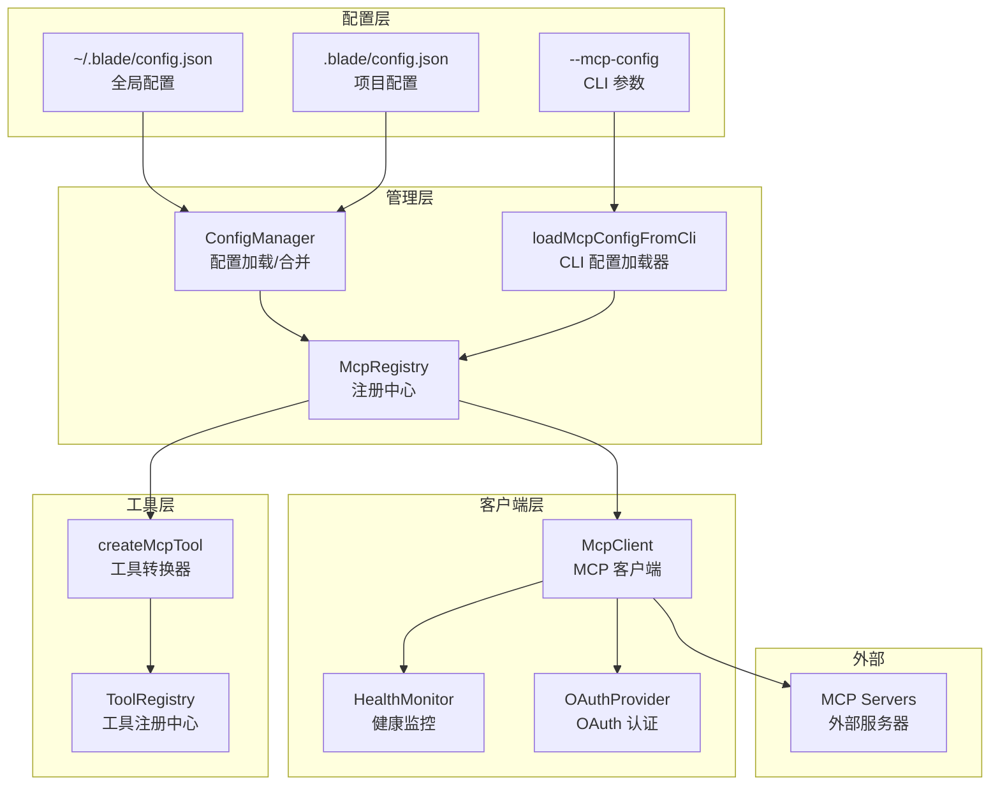

# MCP 架构图

## 配置加载顺序

1. **全局配置** `~/.blade/config.json` → 基础 mcpServers
2. **项目配置** `.blade/config.json` → 合并/覆盖同名服务器
3. **CLI 参数** `--mcp-config` → 运行时追加

## 合并策略

- 项目配置中的同名服务器 **覆盖** 全局配置
- 不同名的服务器 **合并** 到最终结果

核心文件
文件
职责
src/mcp/McpClient.ts
MCP 客户端，处理连接、重试、认证
src/mcp/McpRegistry.ts
服务器注册中心，管理多个 MCP 服务器
src/mcp/createMcpTool.ts
将 MCP 工具转换为 Blade Tool
src/mcp/loadProjectMcpConfig.ts
加载项目级 MCP 配置
src/mcp/types.ts
MCP 类型定义
src/mcp/HealthMonitor.ts
服务器健康监控
src/mcp/auth/
OAuth 认证支持
10.3 类型定义
连接状态
// src/mcp/types.ts
export enum McpConnectionStatus {
  DISCONNECTED = 'disconnected',  // 未连接
  CONNECTING = 'connecting',      // 连接中
  CONNECTED = 'connected',        // 已连接
  ERROR = 'error',                // 错误
}
工具定义
export interface McpToolDefinition {
  name: string;
  description: string;
  inputSchema: {
    type: 'object';
    properties: Record<string, any>;  // JSON Schema
    required?: string[];
  };
}
工具调用响应
export interface McpToolCallResponse {
  content: Array<{
    type: 'text' | 'image' | 'resource';
    text?: string;
    data?: string;       // base64 编码的图片数据
    mimeType?: string;
  }>;
  isError?: boolean;
}
服务器配置
// src/config/types.ts
export interface McpServerConfig {
  type: 'stdio' | 'sse' | 'http';

  // stdio 配置
  command?: string;        // 可执行命令
  args?: string[];         // 命令参数
  env?: Record<string, string>;  // 环境变量

  // sse/http 配置
  url?: string;            // 服务器 URL
  headers?: Record<string, string>;  // HTTP 头

  // OAuth 配置
  oauth?: {
    enabled: boolean;
    authorizationUrl: string;
    tokenUrl: string;
    clientId: string;
    clientSecret?: string;
    scopes?: string[];
  };

  // 健康检查配置
  healthCheck?: {
    enabled: boolean;
    intervalMs: number;
    timeoutMs: number;
    maxFailures: number;
  };
}
10.4 McpClient - MCP 客户端
客户端实现
// src/mcp/McpClient.ts
import { Client } from '@modelcontextprotocol/sdk/client/index.js';
import { StdioClientTransport } from '@modelcontextprotocol/sdk/client/stdio.js';
import { SSEClientTransport } from '@modelcontextprotocol/sdk/client/sse.js';

export class McpClient extends EventEmitter {
  private status: McpConnectionStatus = McpConnectionStatus.DISCONNECTED;
  private sdkClient: Client | null = null;
  private tools = new Map<string, McpToolDefinition>();
  private serverInfo: { name: string; version: string } | null = null;

  // 重连配置
  private reconnectAttempts = 0;
  private readonly MAX_RECONNECT_ATTEMPTS = 5;
  private reconnectTimer: NodeJS.Timeout | null = null;

  // OAuth 支持
  private oauthProvider: OAuthProvider | null = null;

  // 健康监控
  private healthMonitor: HealthMonitor | null = null;

  constructor(
    private config: McpServerConfig,
    serverName?: string,
    healthCheckConfig?: HealthCheckConfig
  ) {
    super();
    this.serverName = serverName || 'default';

    // 初始化 OAuth
    if (config.oauth?.enabled) {
      this.oauthProvider = new OAuthProvider();
    }

    // 初始化健康监控
    if (healthCheckConfig?.enabled) {
      this.healthMonitor = new HealthMonitor(this, healthCheckConfig);
      this.healthMonitor.on('unhealthy', (failures, error) => {
        this.emit('unhealthy', failures, error);
      });
    }
  }

  get connectionStatus(): McpConnectionStatus {
    return this.status;
  }

  get availableTools(): McpToolDefinition[] {
    return Array.from(this.tools.values());
  }
}
连接流程
/**
 * 连接到 MCP 服务器（带重试）
 */
async connectWithRetry(maxRetries = 3, initialDelay = 1000): Promise<void> {
  if (this.status !== McpConnectionStatus.DISCONNECTED) {
    throw new Error('客户端已连接或正在连接中');
  }

  let lastError: Error | null = null;

  for (let attempt = 1; attempt <= maxRetries; attempt++) {
    try {
      await this.doConnect();
      this.reconnectAttempts = 0;
      return;
    } catch (error) {
      lastError = error as Error;
      const classified = classifyError(error);

      // 永久性错误不重试
      if (!classified.isRetryable) {
        console.error('[McpClient] 检测到永久性错误，放弃重试:', classified.type);
        throw error;
      }

      // 指数退避重试
      if (attempt < maxRetries) {
        const delay = initialDelay * Math.pow(2, attempt - 1);
        console.warn(`[McpClient] 连接失败（${attempt}/${maxRetries}），${delay}ms 后重试...`);
        await new Promise(resolve => setTimeout(resolve, delay));
      }
    }
  }

  throw lastError || new Error('连接失败');
}

/**
 * 实际连接逻辑
 */
private async doConnect(): Promise<void> {
  try {
    this.setStatus(McpConnectionStatus.CONNECTING);

    // 创建 SDK 客户端
    this.sdkClient = new Client(
      { name: getPackageName(), version: getVersion() },
      { capabilities: { roots: { listChanged: true }, sampling: {} } }
    );

    // 监听关闭事件
    this.sdkClient.onclose = () => this.handleUnexpectedClose();

    // 创建传输层
    const transport = await this.createTransport();

    // 连接
    await this.sdkClient.connect(transport);

    // 获取服务器信息
    const serverVersion = this.sdkClient.getServerVersion();
    this.serverInfo = {
      name: serverVersion?.name || 'Unknown',
      version: serverVersion?.version || '0.0.0',
    };

    // 加载工具列表
    await this.loadTools();

    this.setStatus(McpConnectionStatus.CONNECTED);
    this.emit('connected', this.serverInfo);

    // 启动健康监控
    if (this.healthMonitor) {
      this.healthMonitor.start();
    }
  } catch (error) {
    this.setStatus(McpConnectionStatus.ERROR);
    this.emit('error', error);
    throw error;
  }
}
传输层创建
/**
 * 创建传输层（支持 OAuth）
 */
private async createTransport(): Promise<Transport> {
  const { type, command, args, env, url, headers, oauth } = this.config;

  // 准备请求头（可能包含 OAuth 令牌）
  const finalHeaders = { ...headers };

  // OAuth 认证
  if (oauth?.enabled && this.oauthProvider && (type === 'sse' || type === 'http')) {
    const token = await this.oauthProvider.getValidToken(this.serverName, oauth);
    if (!token) {
      const newToken = await this.oauthProvider.authenticate(this.serverName, oauth);
      finalHeaders['Authorization'] = `Bearer ${newToken.accessToken}`;
    } else {
      finalHeaders['Authorization'] = `Bearer ${token}`;
    }
  }

  if (type === 'stdio') {
    if (!command) throw new Error('stdio 传输需要 command 参数');

    return new StdioClientTransport({
      command,
      args: args || [],
      env: { ...process.env, ...env },
      stderr: 'ignore',
    });
  }

  if (type === 'sse') {
    if (!url) throw new Error('sse 传输需要 url 参数');

    return new SSEClientTransport(new URL(url), {
      requestInit: { headers: finalHeaders },
    });
  }

  if (type === 'http') {
    if (!url) throw new Error('http 传输需要 url 参数');

    const { StreamableHTTPClientTransport } = await import(
      '@modelcontextprotocol/sdk/client/streamableHttp.js'
    );
    return new StreamableHTTPClientTransport(new URL(url), {
      requestInit: { headers: finalHeaders },
    });
  }

  throw new Error(`不支持的传输类型: ${type}`);
}
工具调用
/**
 * 调用 MCP 工具
 */
async callTool(name: string, arguments_: Record<string, any> = {}): Promise<McpToolCallResponse> {
  if (!this.sdkClient) {
    throw new Error('客户端未连接到服务器');
  }

  if (!this.tools.has(name)) {
    throw new Error(`工具 "${name}" 不存在`);
  }

  try {
    const result = await this.sdkClient.callTool({
      name,
      arguments: arguments_,
    });

    return result as McpToolCallResponse;
  } catch (error) {
    console.error(`[McpClient] 调用工具 "${name}" 失败:`, error);
    throw error;
  }
}
错误分类
/**
 * 错误类型
 */
export enum ErrorType {
  NETWORK_TEMPORARY = 'network_temporary',  // 临时网络错误（可重试）
  NETWORK_PERMANENT = 'network_permanent',  // 永久网络错误
  CONFIG_ERROR = 'config_error',            // 配置错误
  AUTH_ERROR = 'auth_error',                // 认证错误
  PROTOCOL_ERROR = 'protocol_error',        // 协议错误
  UNKNOWN = 'unknown',                      // 未知错误
}

/**
 * 错误分类函数
 */
function classifyError(error: unknown): ClassifiedError {
  if (!(error instanceof Error)) {
    return { type: ErrorType.UNKNOWN, isRetryable: false, originalError: new Error(String(error)) };
  }

  const msg = error.message.toLowerCase();

  // 永久性配置错误（不重试）
  const permanentErrors = ['command not found', 'no such file', 'permission denied', 'invalid configuration'];
  if (permanentErrors.some(p => msg.includes(p))) {
    return { type: ErrorType.CONFIG_ERROR, isRetryable: false, originalError: error };
  }

  // 认证错误（需要用户介入）
  if (msg.includes('unauthorized') || msg.includes('401') || msg.includes('authentication failed')) {
    return { type: ErrorType.AUTH_ERROR, isRetryable: false, originalError: error };
  }

  // 临时网络错误（可重试）
  const temporaryErrors = ['timeout', 'connection refused', 'network error', 'rate limit', '503', '429'];
  if (temporaryErrors.some(t => msg.includes(t))) {
    return { type: ErrorType.NETWORK_TEMPORARY, isRetryable: true, originalError: error };
  }

  // 默认允许重试
  return { type: ErrorType.UNKNOWN, isRetryable: true, originalError: error };
}
自动重连
/**
 * 处理意外断连
 */
private handleUnexpectedClose(): void {
  if (this.isManualDisconnect) return;

  if (this.status === McpConnectionStatus.CONNECTED) {
    console.warn('[McpClient] 检测到意外断连，准备重连...');
    this.setStatus(McpConnectionStatus.ERROR);
    this.emit('error', new Error('MCP服务器连接意外关闭'));
    this.scheduleReconnect();
  }
}

/**
 * 调度自动重连
 */
private scheduleReconnect(): void {
  if (this.reconnectTimer) {
    clearTimeout(this.reconnectTimer);
    this.reconnectTimer = null;
  }

  if (this.reconnectAttempts >= this.MAX_RECONNECT_ATTEMPTS) {
    console.error('[McpClient] 达到最大重连次数，放弃重连');
    this.emit('reconnectFailed');
    return;
  }

  // 指数退避：1s, 2s, 4s, 8s, 16s（最大30s）
  const delay = Math.min(1000 * Math.pow(2, this.reconnectAttempts), 30000);
  this.reconnectAttempts++;

  console.log(`[McpClient] 将在 ${delay}ms 后进行第 ${this.reconnectAttempts} 次重连...`);

  this.reconnectTimer = setTimeout(async () => {
    try {
      if (this.sdkClient) {
        await this.sdkClient.close().catch(() => {});
        this.sdkClient = null;
      }

      this.setStatus(McpConnectionStatus.DISCONNECTED);
      await this.doConnect();
      console.log('[McpClient] 重连成功');
      this.reconnectAttempts = 0;
      this.emit('reconnected');
    } catch (error) {
      const classified = classifyError(error);
      if (classified.isRetryable) {
        this.scheduleReconnect();
      } else {
        console.error('[McpClient] 检测到永久性错误，停止重连');
        this.emit('reconnectFailed');
      }
    }
  }, delay);
}
10.5 McpRegistry - 服务器注册中心
注册中心实现
// src/mcp/McpRegistry.ts
export class McpRegistry extends EventEmitter {
  private static instance: McpRegistry | null = null;
  private servers: Map<string, McpServerInfo> = new Map();

  private constructor() {
    super();
  }

  /**
   * 单例模式
   */
  static getInstance(): McpRegistry {
    if (!McpRegistry.instance) {
      McpRegistry.instance = new McpRegistry();
    }
    return McpRegistry.instance;
  }

  /**
   * 注册 MCP 服务器
   */
  async registerServer(name: string, config: McpServerConfig): Promise<void> {
    if (this.servers.has(name)) {
      throw new Error(`MCP服务器 "${name}" 已经注册`);
    }

    const client = new McpClient(config, name, config.healthCheck);
    const serverInfo: McpServerInfo = {
      config,
      client,
      status: McpConnectionStatus.DISCONNECTED,
      tools: [],
    };

    // 设置事件处理器
    this.setupClientEventHandlers(client, serverInfo, name);

    this.servers.set(name, serverInfo);
    this.emit('serverRegistered', name, serverInfo);

    // 尝试连接
    try {
      await this.connectServer(name);
    } catch (error) {
      console.warn(`MCP服务器 "${name}" 连接失败:`, error);
    }
  }

  /**
   * 批量注册服务器
   */
  async registerServers(servers: Record<string, McpServerConfig>): Promise<void> {
    const promises = Object.entries(servers).map(([name, config]) =>
      this.registerServer(name, config).catch(error => {
        console.warn(`注册MCP服务器 "${name}" 失败:`, error);
        return error;
      })
    );

    await Promise.allSettled(promises);
  }
}
工具获取与冲突处理
/**
 * 获取所有可用工具（包含冲突处理）
 *
 * 工具命名策略：
 * - 无冲突: toolName
 * - 有冲突: serverName__toolName
 */
async getAvailableTools(): Promise<Tool[]> {
  const tools: Tool[] = [];
  const nameConflicts = new Map<string, number>();

  // 第一遍：检测冲突
  for (const [serverName, serverInfo] of this.servers) {
    if (serverInfo.status === McpConnectionStatus.CONNECTED) {
      for (const mcpTool of serverInfo.tools) {
        const count = nameConflicts.get(mcpTool.name) || 0;
        nameConflicts.set(mcpTool.name, count + 1);
      }
    }
  }

  // 第二遍：创建工具（冲突时添加前缀）
  for (const [serverName, serverInfo] of this.servers) {
    if (serverInfo.status === McpConnectionStatus.CONNECTED) {
      for (const mcpTool of serverInfo.tools) {
        const hasConflict = (nameConflicts.get(mcpTool.name) || 0) > 1;
        const toolName = hasConflict
          ? `${serverName}__${mcpTool.name}`  // 冲突时: github__create_issue
          : mcpTool.name;                     // 无冲突: create_issue

        const tool = createMcpTool(serverInfo.client, serverName, mcpTool, toolName);
        tools.push(tool);
      }
    }
  }

  return tools;
}
事件处理
/**
 * 设置客户端事件处理器
 */
private setupClientEventHandlers(
  client: McpClient,
  serverInfo: McpServerInfo,
  name: string
): void {
  client.on('connected', (server) => {
    serverInfo.status = McpConnectionStatus.CONNECTED;
    serverInfo.connectedAt = new Date();
    serverInfo.tools = client.availableTools;
    this.emit('serverConnected', name, server);
  });

  client.on('disconnected', () => {
    serverInfo.status = McpConnectionStatus.DISCONNECTED;
    serverInfo.connectedAt = undefined;
    serverInfo.tools = [];
    this.emit('serverDisconnected', name);
  });

  client.on('error', (error) => {
    serverInfo.status = McpConnectionStatus.ERROR;
    serverInfo.lastError = error;
    this.emit('serverError', name, error);
  });

  client.on('toolsUpdated', (tools) => {
    const oldCount = serverInfo.tools.length;
    serverInfo.tools = tools;
    this.emit('toolsUpdated', name, tools, oldCount);
  });
}
10.6 MCP Tool 转换器
JSON Schema → Zod 转换
MCP 工具使用 JSON Schema 定义参数，但 Blade 使用 Zod。需要转换：
// src/mcp/createMcpTool.ts
import { z } from 'zod';

/**
 * 将 MCP 工具定义转换为 Blade Tool
 */
export function createMcpTool(
  mcpClient: McpClient,
  serverName: string,
  toolDef: McpToolDefinition,
  customName?: string
) {
  // 1. JSON Schema → Zod Schema
  let zodSchema: z.ZodSchema;
  try {
    zodSchema = convertJsonSchemaToZod(toolDef.inputSchema);
  } catch (error) {
    console.warn(`[createMcpTool] Schema 转换失败，使用降级 schema: ${toolDef.name}`);
    zodSchema = z.any();  // 降级方案
  }

  // 2. 决定工具名称
  const toolName = customName || toolDef.name;

  // 3. 创建 Blade Tool
  return createTool({
    name: toolName,
    displayName: `${serverName}: ${toolDef.name}`,
    kind: ToolKind.Execute,  // MCP 工具视为 Execute 类型
    schema: zodSchema,
    description: {
      short: toolDef.description || `MCP Tool: ${toolDef.name}`,
      important: [
        `From MCP server: ${serverName}`,
        'Executes external tools; user confirmation required'
      ],
    },
    category: 'MCP tool',
    tags: ['mcp', 'external', serverName],

    async execute(params, context) {
      try {
        const result = await mcpClient.callTool(toolDef.name, params);

        // 处理响应内容
        let llmContent = '';
        let displayContent = '';

        if (result.content && Array.isArray(result.content)) {
          for (const item of result.content) {
            if (item.type === 'text' && item.text) {
              llmContent += item.text;
              displayContent += item.text;
            } else if (item.type === 'image') {
              displayContent += `[图片: ${item.mimeType || 'unknown'}]\n`;
              llmContent += `[image: ${item.mimeType || 'unknown'}]\n`;
            } else if (item.type === 'resource') {
              displayContent += `[资源: ${item.mimeType || 'unknown'}]\n`;
              llmContent += `[resource: ${item.mimeType || 'unknown'}]\n`;
            }
          }
        }

        if (result.isError) {
          return {
            success: false,
            llmContent: llmContent || 'MCP tool execution failed',
            displayContent: `❌ ${displayContent || 'MCP工具执行失败'}`,
            error: { type: ToolErrorType.EXECUTION_ERROR, message: llmContent },
          };
        }

        return {
          success: true,
          llmContent: llmContent || 'Execution succeeded',
          displayContent: `✅ MCP工具 ${toolDef.name} 执行成功\n${displayContent}`,
          metadata: { serverName, toolName: toolDef.name, mcpResult: result },
        };
      } catch (error) {
        return {
          success: false,
          llmContent: `MCP tool execution failed: ${(error as Error).message}`,
          displayContent: `❌ ${(error as Error).message}`,
          error: { type: ToolErrorType.EXECUTION_ERROR, message: (error as Error).message },
        };
      }
    },
  });
}
JSON Schema 转换逻辑
/**
 * JSON Schema → Zod 转换
 */
function convertJsonSchemaToZod(jsonSchema: JSONSchema7): z.ZodSchema {
  // object 类型
  if (jsonSchema.type === 'object' || jsonSchema.properties) {
    const shape: Record<string, z.ZodSchema> = {};
    const required = jsonSchema.required || [];

    if (jsonSchema.properties) {
      for (const [key, value] of Object.entries(jsonSchema.properties)) {
        if (typeof value === 'object' && value !== null) {
          let fieldSchema = convertJsonSchemaToZod(value as JSONSchema7);

          // 非必填字段标记为可选
          if (!required.includes(key)) {
            fieldSchema = fieldSchema.optional();
          }

          shape[key] = fieldSchema;
        }
      }
    }

    return z.object(shape);
  }

  // array 类型
  if (jsonSchema.type === 'array' && jsonSchema.items) {
    if (typeof jsonSchema.items === 'object' && !Array.isArray(jsonSchema.items)) {
      return z.array(convertJsonSchemaToZod(jsonSchema.items as JSONSchema7));
    }
    return z.array(z.any());
  }

  // string 类型
  if (jsonSchema.type === 'string') {
    let schema = z.string();
    if (jsonSchema.minLength) schema = schema.min(jsonSchema.minLength);
    if (jsonSchema.maxLength) schema = schema.max(jsonSchema.maxLength);
    if (jsonSchema.pattern) schema = schema.regex(new RegExp(jsonSchema.pattern));
    if (jsonSchema.enum) return z.enum(jsonSchema.enum as [string, ...string[]]);
    return schema;
  }

  // number 类型
  if (jsonSchema.type === 'number' || jsonSchema.type === 'integer') {
    let schema = z.number();
    if (jsonSchema.minimum !== undefined) schema = schema.min(jsonSchema.minimum);
    if (jsonSchema.maximum !== undefined) schema = schema.max(jsonSchema.maximum);
    return schema;
  }

  // boolean 类型
  if (jsonSchema.type === 'boolean') {
    return z.boolean();
  }

  // oneOf / anyOf
  if (jsonSchema.oneOf && jsonSchema.oneOf.length >= 2) {
    const schemas = jsonSchema.oneOf
      .filter((s): s is JSONSchema7 => typeof s === 'object')
      .map(s => convertJsonSchemaToZod(s));
    return z.union(schemas as [z.ZodSchema, z.ZodSchema, ...z.ZodSchema[]]);
  }

  // 默认 any
  return z.any();
}
10.7 配置加载
.mcp.json 格式
项目级 MCP 配置文件：
{
  "mcpServers": {
    "github": {
      "type": "stdio",
      "command": "npx",
      "args": ["-y", "@modelcontextprotocol/server-github"],
      "env": {
        "GITHUB_TOKEN": "${GITHUB_TOKEN}"
      }
    },
    "sqlite": {
      "type": "stdio",
      "command": "npx",
      "args": ["-y", "@modelcontextprotocol/server-sqlite", "--db", "./data.db"]
    },
    "slack": {
      "type": "sse",
      "url": "https://mcp.slack.com/v1",
      "oauth": {
        "enabled": true,
        "authorizationUrl": "https://slack.com/oauth/authorize",
        "tokenUrl": "https://slack.com/api/oauth.access",
        "clientId": "your-client-id",
        "scopes": ["channels:read", "chat:write"]
      }
    }
  }
}
配置加载器
// src/mcp/loadProjectMcpConfig.ts

/**
 * 加载 MCP 配置
 *
 * 工作流程：
 * 1. 如果提供了 --mcp-config 参数，优先加载
 * 2. 如果没有 --strict-mcp-config，继续加载 .mcp.json
 * 3. 对每个服务器：
 *    - 已批准：直接加载
 *    - 已拒绝：跳过
 *    - 未确认：交互式询问
 * 4. 保存确认记录
 */
export async function loadProjectMcpConfig(
  options: LoadMcpConfigOptions = {}
): Promise<number> {
  const {
    interactive = true,
    silent = false,
    mcpConfig,
    strictMcpConfig = false,
  } = options;

  let totalLoaded = 0;

  // 1. 优先处理 CLI 参数 --mcp-config
  if (mcpConfig && mcpConfig.length > 0) {
    if (!silent) console.log(`📦 加载来自 --mcp-config 的配置`);

    for (const configSource of mcpConfig) {
      const loaded = await loadMcpConfigFromSource(configSource, { interactive, silent, sourceType: 'cli-param' });
      totalLoaded += loaded;
    }
  }

  // 2. 严格模式跳过项目配置
  if (strictMcpConfig) {
    if (!silent) console.log('🔒 严格模式已启用，跳过项目级 .mcp.json');
    return totalLoaded;
  }

  // 3. 加载项目级 .mcp.json
  const mcpJsonPath = path.join(process.cwd(), '.mcp.json');

  try {
    await fs.access(mcpJsonPath);
  } catch {
    return totalLoaded;  // 文件不存在
  }

  try {
    const content = await fs.readFile(mcpJsonPath, 'utf-8');
    const mcpJsonConfig = JSON.parse(content);

    if (!mcpJsonConfig.mcpServers) {
      if (!silent) console.warn('⚠️  .mcp.json 格式不正确');
      return totalLoaded;
    }

    const projectConfig = getConfig();
    const enabledServers = projectConfig?.enabledMcpjsonServers || [];
    const disabledServers = projectConfig?.disabledMcpjsonServers || [];

    for (const [serverName, serverConfig] of Object.entries(mcpJsonConfig.mcpServers)) {
      // 已拒绝的跳过
      if (disabledServers.includes(serverName)) {
        if (!silent) console.log(`⏭️  跳过已拒绝的服务器: ${serverName}`);
        continue;
      }

      // 已批准的直接加载
      if (enabledServers.includes(serverName)) {
        await configActions().addMcpServer(serverName, serverConfig as McpServerConfig);
        totalLoaded++;
        continue;
      }

      // 未确认：交互式询问
      if (interactive) {
        const approved = await promptUserConfirmation(serverName, serverConfig as McpServerConfig);
        if (approved) {
          await configActions().addMcpServer(serverName, serverConfig as McpServerConfig);
          totalLoaded++;
        }
      }
    }

    return totalLoaded;
  } catch (error) {
    if (!silent) console.error(`❌ 加载 .mcp.json 失败:`, error);
    return totalLoaded;
  }
}
10.8 MCP 与 Agent 集成
工具注册流程
暂时无法在飞书文档外展示此内容
Agent 中使用 MCP 工具
// Agent 初始化时加载 MCP 工具
async function initializeTools(toolRegistry: ToolRegistry) {
  // 加载内置工具
  await toolRegistry.registerBuiltinTools();

  // 加载 MCP 工具
  const mcpRegistry = McpRegistry.getInstance();
  const mcpTools = await mcpRegistry.getAvailableTools();

  for (const tool of mcpTools) {
    toolRegistry.registerTool(tool);
  }

  console.log(`已注册 ${mcpTools.length} 个 MCP 工具`);
}
工具调用示例
暂时无法在飞书文档外展示此内容
当 LLM 调用 MCP 工具时：
用户: 用 Chrome-devtools 打开 github，总结最新的 blog

LLM 决定调用工具: Chrome-devtools

↓ ExecutionPipeline

1. Discovery: 找到工具 (McpTool)
2. Permission: 检查权限 (需要确认)
3. Confirmation: 用户确认
4. Execution:
   ↓
   createMcpTool.execute()
     ↓
     mcpClient.callTool('Chrome-devtools', params)
       ↓
       MCP Server 执行
       ↓
       返回结果
5. Formatting: 格式化输出

结果注入 LLM 上下文
10.9 /mcp 命令
Blade 提供 /mcp 命令查看 MCP 状态：
// src/slash-commands/builtinCommands.ts
export const mcpCommand: SlashCommand = {
  name: 'mcp',
  description: '显示 MCP 服务器状态和可用工具',

  async handler(args, context) {
    const mcpRegistry = McpRegistry.getInstance();
    const stats = mcpRegistry.getStatistics();
    const servers = mcpRegistry.getAllServers();

    let output = '## MCP 服务器状态\n\n';
    output += `总服务器: ${stats.totalServers}\n`;
    output += `已连接: ${stats.connectedServers}\n`;
    output += `错误: ${stats.errorServers}\n`;
    output += `总工具数: ${stats.totalTools}\n\n`;

    for (const [name, info] of servers) {
      const statusEmoji =
        info.status === McpConnectionStatus.CONNECTED ? '🟢' :
        info.status === McpConnectionStatus.ERROR ? '🔴' :
        info.status === McpConnectionStatus.CONNECTING ? '🟡' : '⚪';

      output += `### ${statusEmoji} ${name}\n`;
      output += `状态: ${info.status}\n`;

      if (info.status === McpConnectionStatus.CONNECTED) {
        output += `工具数: ${info.tools.length}\n`;
        output += `工具: ${info.tools.map(t => t.name).join(', ')}\n`;
      }

      if (info.lastError) {
        output += `错误: ${info.lastError.message}\n`;
      }

      output += '\n';
    }

    return { type: 'success', content: output };
  },
};
[图片]
10.10 常见 MCP Server
官方 MCP Server
Server
用途
配置示例
@modelcontextprotocol/server-github
GitHub 操作
npx -y @modelcontextprotocol/server-github
@modelcontextprotocol/server-sqlite
SQLite 数据库
npx -y @modelcontextprotocol/server-sqlite
@modelcontextprotocol/server-filesystem
文件系统
npx -y @modelcontextprotocol/server-filesystem
@modelcontextprotocol/server-slack
Slack 消息
npx -y @modelcontextprotocol/server-slack
配置示例
{
  "mcpServers": {
    "github": {
      "type": "stdio",
      "command": "npx",
      "args": ["-y", "@modelcontextprotocol/server-github"],
      "env": {
        "GITHUB_TOKEN": "${GITHUB_TOKEN}"
      }
    },
    "sqlite": {
      "type": "stdio",
      "command": "npx",
      "args": [
        "-y",
        "@modelcontextprotocol/server-sqlite",
        "--db",
        "./database.db"
      ]
    },
    "filesystem": {
      "type": "stdio",
      "command": "npx",
      "args": [
        "-y",
        "@modelcontextprotocol/server-filesystem",
        "--root",
        "/path/to/allowed/directory"
      ]
    }
  }
}