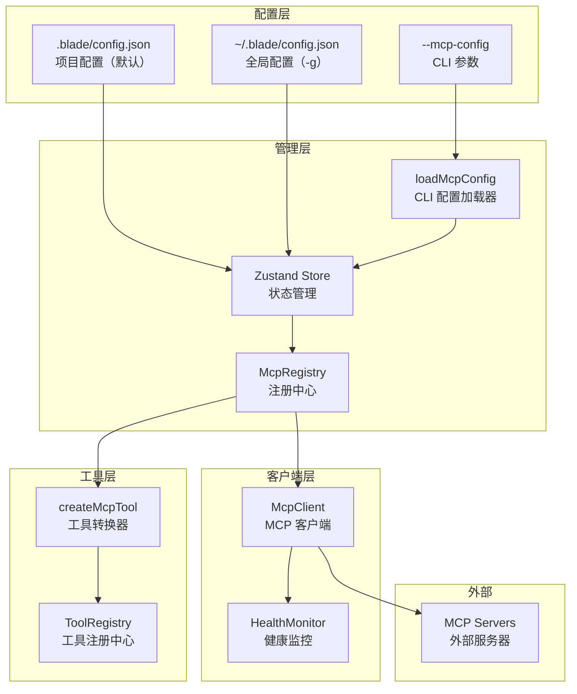

# Blade MCP 实现计划

## 概述

基于对 gemini-cli、neovate-code 和 Claude Code 的深入分析，制定 Blade MCP 完整实现方案。

## 核心架构

### 配置结构

MCP 服务器配置存储在 `config.json` 中（不是 `settings.json`）。

**项目级配置（默认）** - `.blade/config.json`:
```json
{
  "mcpServers": {
    "project-server": {
      "type": "stdio",
      "command": "npx",
      "args": ["-y", "@example/mcp-server"],
      "env": {}
    }
  }
}
```

**全局配置（-g/--global）** - `~/.blade/config.json`:
```json
{
  "mcpServers": {
    "global-server": {
      "type": "http",
      "url": "http://localhost:3000/mcp",
      "headers": {}
    }
  }
}
```

### 加载顺序与合并策略

1. 加载全局配置 `~/.blade/config.json`
2. 加载项目配置 `.blade/config.json`
3. **合并 mcpServers**：项目服务器补充/覆盖全局服务器

```
全局: { serverA: {...}, serverB: {...} }
项目: { serverB: {...新配置}, serverC: {...} }
结果: { serverA: {...}, serverB: {...新配置}, serverC: {...} }
```

## 实施阶段

### Phase 1: 配置管理器重构（已完成）

#### 1.1 类型定义 (`src/config/types.ts`)

```typescript
export interface McpServerConfig {
  type: 'stdio' | 'sse' | 'http';

  // stdio
  command?: string;
  args?: string[];
  env?: Record<string, string>;

  // http/sse
  url?: string;
  headers?: Record<string, string>;

  // 通用
  timeout?: number;
}
```

#### 1.2 配置管理 (`src/store/vanilla.ts`)

MCP 配置通过 Store actions 管理，存储在全局 `~/.blade/settings.json`：

```typescript
// 通过 Store actions 管理 MCP 配置
import { configActions, getMcpServers } from '../store/vanilla.js';

// 获取所有 MCP 服务器
const servers = getMcpServers();

// 添加 MCP 服务器
await configActions().addMcpServer('server-name', {
  type: 'stdio',
  command: 'npx',
  args: ['-y', '@example/server'],
});

// 删除 MCP 服务器
await configActions().removeMcpServer('server-name');
```

### Phase 2: CLI 命令实现（已完成）

#### 2.1 命令集

```bash
blade mcp add <name> <commandOrUrl> [args...]
  --transport stdio|sse|http (默认: stdio)
  --env KEY=value (可多次使用)
  --header "Key: Value" (可多次使用)
  --timeout <ms>
  -g, --global  存储到全局配置（默认: 项目配置）

blade mcp remove <name>
  -g, --global  从全局配置删除（默认: 项目配置）

blade mcp list

blade mcp get <name>

blade mcp add-json <name> <json>
  -g, --global  存储到全局配置（默认: 项目配置）
```

#### 2.2 实现 (`src/commands/mcp.ts`)

```typescript
import type { Argv } from 'yargs';
import { ConfigManager } from '../config/ConfigManager.js';
import type { McpServerConfig } from '../config/types.js';

export function registerMcpCommand(yargs: Argv) {
  return yargs.command('mcp', '管理 MCP 服务器', (yargs) => {
    return yargs
      // add: 添加服务器
      .command('add <name> <commandOrUrl> [args...]', '添加 MCP 服务器',
        (yargs) => {
          return yargs
            .positional('name', { type: 'string', demandOption: true })
            .positional('commandOrUrl', { type: 'string', demandOption: true })
            .option('transport', {
              alias: 't',
              choices: ['stdio', 'sse', 'http'] as const,
              default: 'stdio'
            })
            .option('env', {
              alias: 'e',
              type: 'array',
              description: '环境变量 (KEY=value)'
            })
            .option('header', {
              alias: 'H',
              type: 'array',
              description: 'HTTP 头 (Key: Value)'
            })
            .option('timeout', { type: 'number' });
        },
        async (argv) => {
          const { name, commandOrUrl, args, transport, env, header, timeout } = argv;
          const configManager = ConfigManager.getInstance();

          const config: McpServerConfig = { type: transport };

          if (transport === 'stdio') {
            config.command = commandOrUrl;
            config.args = args || [];
            if (env) config.env = parseEnvArray(env);
          } else {
            config.url = commandOrUrl;
            if (header) config.headers = parseHeaderArray(header);
          }

          if (timeout) config.timeout = timeout;

          await configManager.addMcpServer(name, config);
          console.log(`✅ MCP 服务器 "${name}" 已添加到当前项目`);
          console.log(`   项目路径: ${process.cwd()}`);
        }
      )

      // remove: 删除服务器
      .command('remove <name>', '删除 MCP 服务器',
        (yargs) => yargs.positional('name', { type: 'string', demandOption: true }),
        async (argv) => {
          const configManager = ConfigManager.getInstance();
          const servers = configManager.getMcpServers();

          if (!servers[argv.name]) {
            console.error(`❌ 服务器 "${argv.name}" 不存在`);
            process.exit(1);
          }

          await configManager.removeMcpServer(argv.name);
          console.log(`✅ MCP 服务器 "${argv.name}" 已删除`);
        }
      )

      // list: 列出服务器
      .command('list', '列出所有 MCP 服务器',
        async () => {
          const configManager = ConfigManager.getInstance();
          const servers = configManager.getMcpServers();

          console.log(`\n当前项目: ${process.cwd()}\n`);

          if (Object.keys(servers).length === 0) {
            console.log('暂无配置的 MCP 服务器');
            return;
          }

          console.log('MCP 服务器列表:\n');
          for (const [name, config] of Object.entries(servers)) {
            console.log(`📦 ${name}`);
            console.log(`  类型: ${config.type}`);

            if (config.type === 'stdio') {
              console.log(`  命令: ${config.command} ${config.args?.join(' ') || ''}`);
              if (config.env && Object.keys(config.env).length > 0) {
                console.log(`  环境变量: ${Object.keys(config.env).join(', ')}`);
              }
            } else {
              console.log(`  URL: ${config.url}`);
              if (config.headers) {
                console.log(`  Headers: ${Object.keys(config.headers).length} 个`);
              }
            }
            console.log('');
          }
        }
      )

      // get: 获取服务器详情
      .command('get <name>', '获取服务器详情',
        (yargs) => yargs.positional('name', { type: 'string', demandOption: true }),
        async (argv) => {
          const configManager = ConfigManager.getInstance();
          const servers = configManager.getMcpServers();
          const config = servers[argv.name];

          if (!config) {
            console.error(`❌ 服务器 "${argv.name}" 不存在`);
            process.exit(1);
          }

          console.log(`\n服务器: ${argv.name}\n`);
          console.log(JSON.stringify(config, null, 2));
        }
      )

      // add-json: 从 JSON 添加
      .command('add-json <name> <json>', '从 JSON 字符串添加服务器',
        (yargs) => {
          return yargs
            .positional('name', { type: 'string', demandOption: true })
            .positional('json', { type: 'string', demandOption: true });
        },
        async (argv) => {
          const configManager = ConfigManager.getInstance();

          try {
            const serverConfig = JSON.parse(argv.json) as McpServerConfig;

            if (!serverConfig.type) {
              throw new Error('配置必须包含 "type" 字段');
            }

            await configManager.addMcpServer(argv.name, serverConfig);
            console.log(`✅ MCP 服务器 "${argv.name}" 已添加`);
          } catch (error) {
            console.error(`❌ 添加失败: ${(error as Error).message}`);
            process.exit(1);
          }
        }
      )

      // reset-project-choices: 重置确认记录
      .command('reset-project-choices', '重置项目级 .mcp.json 确认记录',
        async () => {
          const configManager = ConfigManager.getInstance();
          await configManager.resetProjectChoices();
          console.log(`✅ 已重置当前项目的 .mcp.json 确认记录`);
          console.log(`   项目路径: ${process.cwd()}`);
        }
      )

      .demandCommand(1, '请指定子命令');
  });
}

// 工具函数
function parseEnvArray(envArray: string[]): Record<string, string> {
  return envArray.reduce((acc, item) => {
    const [key, ...valueParts] = item.split('=');
    acc[key] = valueParts.join('=');
    return acc;
  }, {} as Record<string, string>);
}

function parseHeaderArray(headerArray: string[]): Record<string, string> {
  return headerArray.reduce((acc, item) => {
    const [key, ...valueParts] = item.split(':');
    acc[key.trim()] = valueParts.join(':').trim();
    return acc;
  }, {} as Record<string, string>);
}
```

### Phase 3: CLI 参数支持（已完成）

#### 3.1 加载 CLI 配置 (`src/mcp/loadMcpConfig.ts`)

支持通过 `--mcp-config` CLI 参数加载 MCP 配置：

```typescript
import fs from 'fs/promises';
import path from 'path';
import type { McpServerConfig } from '../config/types.js';
import { getMcpServers, getState } from '../store/vanilla.js';

/**
 * 从 CLI --mcp-config 参数加载 MCP 配置
 * 支持：
 * - JSON 文件路径: "./mcp-config.json"
 * - JSON 字符串 (单个服务器): '{"name": "xxx", "type": "stdio", ...}'
 * - JSON 字符串 (多个服务器): '{"server1": {...}, "server2": {...}}'
 */
export async function loadMcpConfigFromCli(mcpConfigs: string[]): Promise<void> {
  for (const configArg of mcpConfigs) {
    let configData: Record<string, McpServerConfig>;

    if (configArg.trim().startsWith('{')) {
      // JSON 字符串
      const parsed = JSON.parse(configArg);
      if (parsed.name && parsed.type) {
        const { name, ...serverConfig } = parsed;
        configData = { [name]: serverConfig };
      } else {
        configData = parsed;
      }
    } else {
      // 文件路径
      const filePath = path.resolve(process.cwd(), configArg);
      const content = await fs.readFile(filePath, 'utf-8');
      const parsed = JSON.parse(content);
      configData = parsed.mcpServers || parsed;
    }

    // 临时注入到 Store（不持久化）
    const currentServers = getMcpServers();
    const updatedServers = { ...currentServers, ...configData };
    getState().config.actions.updateConfig({ mcpServers: updatedServers });
  }
}
```

### Phase 4: 传输层扩展（2-3天）

#### 4.1 传输抽象 (`src/mcp/transports/types.ts`)

```typescript
export interface McpTransport {
  connect(): Promise<void>;
  disconnect(): Promise<void>;
  send(message: any): Promise<void>;
  onMessage(handler: (message: any) => void): void;
  onError(handler: (error: Error) => void): void;
  onClose(handler: () => void): void;
}
```

#### 4.2 Stdio 传输 (`src/mcp/transports/StdioTransport.ts`)

从现有 `McpClient.ts` 中提取 stdio 相关代码。

#### 4.3 SSE 传输 (`src/mcp/transports/SSETransport.ts`)

```typescript
import { EventEmitter } from 'events';
import type { McpTransport } from './types.js';

export class SSETransport extends EventEmitter implements McpTransport {
  private eventSource: EventSource | null = null;

  constructor(
    private url: string,
    private headers?: Record<string, string>
  ) {
    super();
  }

  async connect(): Promise<void> {
    // 实现 SSE 连接
  }

  async disconnect(): Promise<void> {
    if (this.eventSource) {
      this.eventSource.close();
      this.eventSource = null;
    }
  }

  async send(message: any): Promise<void> {
    // SSE 通常需要配合 HTTP POST
  }

  onMessage(handler: (message: any) => void): void {
    this.on('message', handler);
  }

  onError(handler: (error: Error) => void): void {
    this.on('error', handler);
  }

  onClose(handler: () => void): void {
    this.on('close', handler);
  }
}
```

#### 4.4 HTTP 传输 (`src/mcp/transports/HttpTransport.ts`)

```typescript
import { EventEmitter } from 'events';
import type { McpTransport } from './types.js';

export class HttpTransport extends EventEmitter implements McpTransport {
  constructor(
    private url: string,
    private headers?: Record<string, string>
  ) {
    super();
  }

  async connect(): Promise<void> {
    // 测试端点可达性
  }

  async disconnect(): Promise<void> {
    // HTTP 无需显式断开
  }

  async send(message: any): Promise<void> {
    const response = await fetch(this.url, {
      method: 'POST',
      headers: {
        'Content-Type': 'application/json',
        ...this.headers
      },
      body: JSON.stringify(message)
    });

    if (!response.ok) {
      throw new Error(`HTTP 请求失败: ${response.statusText}`);
    }

    const result = await response.json();
    this.emit('message', result);
  }

  onMessage(handler: (message: any) => void): void {
    this.on('message', handler);
  }

  onError(handler: (error: Error) => void): void {
    this.on('error', handler);
  }

  onClose(handler: () => void): void {
    this.on('close', handler);
  }
}
```

#### 4.5 重构 McpClient (`src/mcp/McpClient.ts`)

```typescript
import type { McpTransport } from './transports/types.js';
import { StdioTransport } from './transports/StdioTransport.js';
import { SSETransport } from './transports/SSETransport.js';
import { HttpTransport } from './transports/HttpTransport.js';

export class McpClient extends EventEmitter {
  private transport: McpTransport;

  constructor(private config: McpServerConfig) {
    super();
    this.transport = this.createTransport();
  }

  private createTransport(): McpTransport {
    switch (this.config.type) {
      case 'stdio':
        return new StdioTransport(
          this.config.command!,
          this.config.args,
          this.config.env
        );
      case 'http':
        return new HttpTransport(this.config.url!, this.config.headers);
      case 'sse':
        return new SSETransport(this.config.url!, this.config.headers);
      default:
        throw new Error(`不支持的传输类型: ${this.config.type}`);
    }
  }

  async connect(): Promise<void> {
    // 设置事件处理
    this.transport.onMessage((msg) => this.handleMessage(msg));
    this.transport.onError((err) => this.emit('error', err));
    this.transport.onClose(() => this.handleDisconnect());

    // 连接
    await this.transport.connect();

    // 初始化协议
    await this.sendInitializeRequest();
    await this.loadTools();
  }

  async disconnect(): Promise<void> {
    await this.transport.disconnect();
  }

  async sendRequest(method: string, params?: any): Promise<any> {
    const id = this.nextId++;
    const message = { jsonrpc: '2.0', id, method, params };

    return new Promise((resolve, reject) => {
      this.pendingRequests.set(id, { resolve, reject });
      this.transport.send(message);
    });
  }

  // ... 其他方法保持不变
}
```

### Phase 5: Agent 集成（1-2天）

#### 5.1 启动时加载 MCP

在 Agent 初始化时：

```typescript
// src/agent/Agent.ts 或类似入口
export class Agent {
  async initialize() {
    // 1. 加载 .mcp.json
    await loadProjectMcpConfig();

    // 2. 连接所有 MCP 服务器
    const configManager = ConfigManager.getInstance();
    const mcpServers = configManager.getMcpServers();

    const registry = McpRegistry.getInstance();

    for (const [name, config] of Object.entries(mcpServers)) {
      try {
        await registry.registerServer(name, config);
        console.log(`✅ MCP 服务器 "${name}" 已连接`);
      } catch (error) {
        console.warn(`⚠️  MCP 服务器 "${name}" 连接失败:`, error);
      }
    }

    // 3. 获取所有工具并注册
    const mcpTools = await registry.getAvailableTools();
    for (const tool of mcpTools) {
      this.toolRegistry.registerTool(tool);
    }
  }
}
```

#### 5.2 工具名称冲突处理 (`src/mcp/McpRegistry.ts`)

```typescript
export class McpRegistry extends EventEmitter {
  private servers = new Map<string, McpClient>();

  async registerServer(name: string, config: McpServerConfig): Promise<void> {
    const client = new McpClient(config);
    await client.connect();
    this.servers.set(name, client);
  }

  async getAvailableTools(): Promise<Tool[]> {
    const tools: Tool[] = [];
    const nameConflicts = new Map<string, number>();

    // 第一遍：检测冲突
    for (const [serverName, client] of this.servers) {
      for (const mcpTool of client.availableTools) {
        const count = nameConflicts.get(mcpTool.name) || 0;
        nameConflicts.set(mcpTool.name, count + 1);
      }
    }

    // 第二遍：创建工具（冲突时添加前缀）
    for (const [serverName, client] of this.servers) {
      for (const mcpTool of client.availableTools) {
        const hasConflict = (nameConflicts.get(mcpTool.name) || 0) > 1;
        const toolName = hasConflict
          ? `${serverName}__${mcpTool.name}`
          : mcpTool.name;

        const tool = createMcpTool(client, serverName, mcpTool, toolName);
        tools.push(tool);
      }
    }

    return tools;
  }
}
```

## 使用示例

### 添加服务器

```bash
# stdio 服务器
blade mcp add github npx -y @modelcontextprotocol/server-github \
  -e GITHUB_TOKEN=ghp_xxx

# HTTP 服务器
blade mcp add api --transport http http://localhost:3000 \
  -H "Authorization: Bearer token"

# SSE 服务器
blade mcp add events --transport sse http://localhost:3000/events

# 从 JSON 添加
blade mcp add-json my-server '{"type":"stdio","command":"npx","args":["-y","@example/server"]}'
```

### 管理服务器

```bash
# 列出所有 MCP 服务器
blade mcp list

# 获取服务器详情
blade mcp get github

# 删除服务器
blade mcp remove github
```

### 使用 CLI 参数加载临时配置

```bash
# 从 JSON 文件加载
blade --mcp-config ./my-mcp-servers.json

# 从 JSON 字符串加载
blade --mcp-config '{"name":"temp","type":"stdio","command":"npx","args":["-y","@example/server"]}'
```

## 文件结构

```
src/
├── commands/
│   └── mcp.ts                    # CLI 命令
├── config/
│   ├── ConfigService.ts          # 配置持久化服务
│   └── types.ts                  # 类型定义
├── store/
│   └── vanilla.ts                # Store actions (MCP 配置管理)
├── mcp/
│   ├── McpClient.ts              # MCP 客户端
│   ├── McpRegistry.ts            # 服务器注册中心
│   ├── createMcpTool.ts          # 工具转换器
│   ├── loadMcpConfig.ts          # CLI 参数配置加载
│   ├── types.ts                  # MCP 类型定义
│   └── transports/               # 传输层
│       ├── types.ts
│       ├── StdioTransport.ts
│       ├── SSETransport.ts
│       └── HttpTransport.ts
└── agent/
    └── Agent.ts                  # Agent 集成 MCP 加载
```

## 预计工作量

- **Phase 1**: 配置管理器重构 - 2天
- **Phase 2**: CLI 命令实现 - 2-3天
- **Phase 3**: .mcp.json 支持 - 2天
- **Phase 4**: 传输层扩展 - 2-3天
- **Phase 5**: Agent 集成 - 1-2天
- **总计**: 9-12天

## 关键设计决策

1. ✅ **项目级配置优先**：默认存储在 `.blade/config.json`，使用 `-g` 存储到全局
2. ✅ **三种传输**：stdio/sse/http 完整支持
3. ✅ **工具冲突处理**：仅在冲突时添加服务器名前缀
4. ✅ **CLI 参数支持**：`--mcp-config` 临时加载配置（不持久化）
5. ✅ **Store 统一管理**：MCP 配置通过 Zustand Store 管理

## 架构图



## 参考资源

- **gemini-cli**: 完整的 MCP 实现参考
- **neovate-code**: AI SDK 集成模式
- **Claude Code**: 配置结构和命令设计
- **MCP 规范**: https://modelcontextprotocol.io/specification
