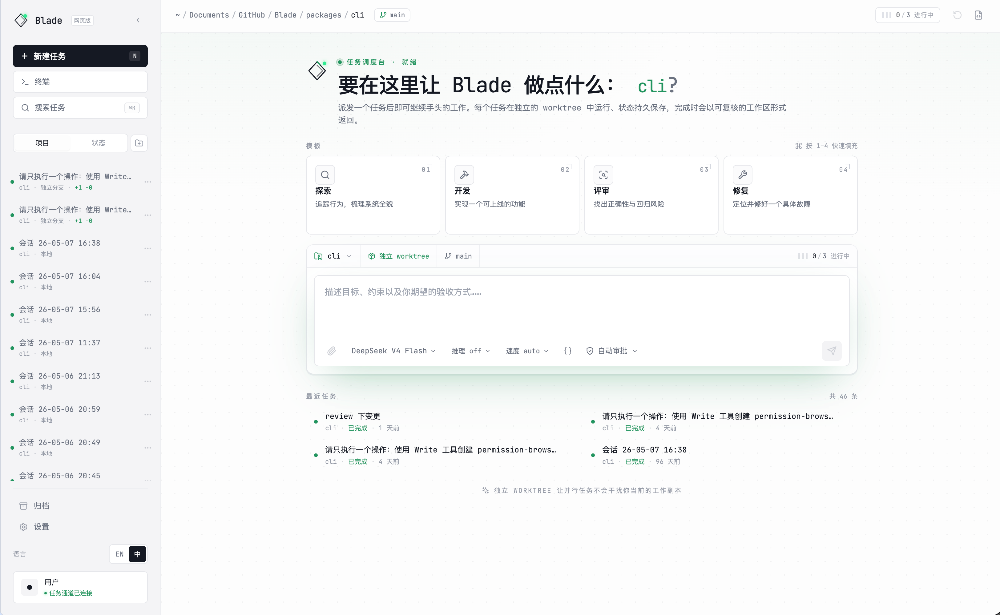

# 🌐 Web UI

Blade Code 提供与 CLI 共用 Session Runtime 的 Web UI，可在浏览器中派发任务、
查看执行状态并管理会话。

<div align="center">
  
</div>

## 启动 Web UI

### 快速启动

```bash
blade web
```

这将启动 Web 服务器并自动打开浏览器。

### 无头服务器模式

如果你需要远程访问或不想自动打开浏览器：

```bash
blade serve --port 3000 --hostname 0.0.0.0
```

## 命令选项

| 选项 | 说明 | 默认值 |
|------|------|--------|
| `--port <port>` | 监听端口（0 为自动选择） | `0` |
| `--hostname <host>` | 监听主机名 | `127.0.0.1` |
| `--cors <domains>` | 额外允许的 CORS 域名 | `[]` |

## 安全配置

### Basic Auth 认证

设置 `BLADE_SERVER_PASSWORD` 环境变量可启用 Basic Auth 认证：

```bash
# Linux/macOS
export BLADE_SERVER_PASSWORD=your-secret-password
blade serve --port 3000

# Windows
set BLADE_SERVER_PASSWORD=your-secret-password
blade serve --port 3000
```

启用后，访问 Web UI 时需要输入：
- 用户名：`blade`
- 密码：你设置的密码

### 局域网访问

默认情况下，服务器只监听 `127.0.0.1`（本机）。要允许局域网访问：

```bash
blade serve --hostname 0.0.0.0 --port 3000
```

⚠️ **安全提示**：在局域网或公网环境中使用时，强烈建议启用 Basic Auth 认证。

## Web UI 功能

Web UI 支持 Blade Code 的所有核心功能：

- 💬 **智能对话** - 与 AI 进行多轮对话
- 📊 **任务看板** - 绑定多个项目，派发任务并按执行阶段集中管理
- 📁 **文件操作** - 读取、编辑、搜索文件
- 🧭 **内嵌浏览器** - 在右侧预览区查看并刷新本地开发页面
- 🖥️ **终端** - 执行命令并查看输出
- 📋 **会话管理** - 创建、切换、恢复会话
- ⚙️ **模型配置** - 添加和切换模型
- 🔒 **权限控制** - 切换权限模式
- 🌍 **多语言** - 中英文界面切换

## 任务看板

从左侧导航打开“任务看板”。看板只显示通过 Web、Headless 或 ACP 派发的顶层
任务，不会混入 Agent 在单个会话中维护的 `TaskCreate`/`TaskList` 待办清单。

任务按运行时状态自动进入四个阶段：

| 看板阶段 | 运行时状态 |
|----------|------------|
| 等待认领 | 等待进程级执行槽位的 `queued` 任务 |
| 处理中 | 正在执行且不需要人工输入的 `running` 任务 |
| 遇到阻碍 | 等待授权/回答的任务，以及 `failed`、`interrupted`、`cancelled` 任务 |
| 等你确认 | 已完成、等待查看或归档的 `completed` 任务 |

看板支持：

- 绑定本地项目，并按单个项目或全部项目筛选；
- 以 `local` 模式直接在目标项目中派发任务；
- 设置和编辑任务标题、类型、优先级与截止时间；
- 通过全局 SSE 实时接收状态和人工交互提醒；
- 打开任务、处理中止、失败后重试、查看变更并验收归档；
- 暂停或恢复自动认领。暂停后，运行中的任务继续执行，新任务进入有界队列；
  恢复后按 FIFO 顺序继续调度。

看板地址使用 `?view=board`，可与 `project` 参数组合形成项目级深链。

## Browser 面板

任务详情右侧预览区的“浏览器”标签提供统一地址栏、后退、前进、刷新和三种运行模式：

- **预览**：在 sandbox iframe 中快速打开本地开发服务器或可嵌入的 HTTP(S) 页面；
- **测试**：在服务端独立 Chromium `BrowserContext` 中打开顶层页面，显示实时 PNG
  截图和 ARIA/DOM 快照，并支持 ref 点击、表单填入、滚动以及 console、network、
  page error 检查；
- **外部**：通过明确的用户操作把当前 HTTP(S) 地址交给系统浏览器。

预览区展开后可通过右上角控制切换为工作区全屏，再次点击即可还原原有分栏宽度。
全屏模式保留左侧导航与顶部全局栏，并将当前会话输入框悬浮在预览内容底部；输入框
上方的状态条可展开查看会话记录、上下文用量、缓存命中率与当前运行阶段。

预览历史仅保留在当前面板生命周期内，最多 50 项。Blade 仅接受 HTTP(S) 地址并拒绝
包含凭据的 URL。预览页面使用无 referrer 的 sandbox iframe，Blade 不代理页面或移除
目标站点的 `X-Frame-Options` / CSP；拒绝嵌入时切换到“测试”或“外部”。

测试模式要求当前存在持久化 Session，并使用与 Agent Browser Tool 不同的
`BrowserContext`、快照 authority、Cookie 和页面状态。显式 reset、删除 Session 或
关闭 server 会释放该上下文。测试模式继续复用 Browser Runtime 的 origin 校验、
跨 origin 导航阻断、credential 控件保护、下载取消、弹窗限制、诊断脱敏与资源上限。
首次使用前仍需运行 `blade browser install`。当前版本使用按操作刷新的高质量 PNG；
实时 WebRTC 画面和 Agent/用户控制权切换尚未启用。

## 与 CLI 的区别

| 功能 | CLI | Web UI |
|------|-----|--------|
| 启动方式 | `blade` | `blade web` |
| 界面 | 终端 | 浏览器 |
| 远程访问 | 需要 SSH | 直接访问 |
| 会话共享 | 同一目录 | 同一目录 |
| 文件操作 | ✅ | ✅ |
| Browser 面板（预览 / 测试 / 外部） | ❌ | ✅ |
| 终端执行 | ✅ | ✅ |

## 常见问题

### 端口被占用

如果默认端口被占用，可以指定其他端口：

```bash
blade web --port 8080
```

或使用 `--port 0` 让系统自动选择可用端口。

### 无法访问

1. 检查防火墙设置
2. 确认 `--hostname` 设置正确
3. 如果是远程访问，确保使用 `--hostname 0.0.0.0`

### 认证失败

确保 `BLADE_SERVER_PASSWORD` 环境变量设置正确，且浏览器中输入的密码与之匹配。
